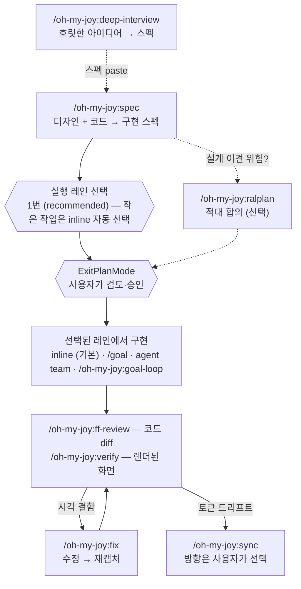

# oh-my-joy (OMJ)

[English](README.md) | 한국어

[](https://github.com/S-jooyoung/oh-my-joy/actions/workflows/ci.yml)
[](LICENSE)
[](package.json)

> 코드 ↔ Figma 프론트엔드 루프 전체를 하나로 잇는 프론트엔드 플러그인.

**FE는 무조건 `/oh-my-joy:spec`로 시작 — 이 커맨드가 쓴 스펙이 곧 당신이 승인할 Plan이다.**
_"거의 항상 Plan 모드"인 습관과 충돌하지 않는 Plan 네이티브 프라이머._

`Plan-first` · `Figma 2-트랙` · `대화형 토큰 sync` · `graceful degradation` · `zero runtime deps`

[왜 만들었나](#왜-만들었나) • [Quick Start](#quick-start) • [권장 워크플로](#권장-워크플로) • [워크스루](#한-세션-처음부터-끝까지) • [커맨드](#커맨드) • [설계 근거](#이-레포가-보여주는-것) • [트러블슈팅](#트러블슈팅)

---

## 왜 만들었나

Figma 프레임을 AI 에이전트에 던지고 "이대로 만들어줘"라고 하면 특정한 방식으로 반복해서 실패한다. 결과물은 비슷해 보이는데 토큰이 raw hex로 인라인되고, 없던 반응형 분기가 창작되고, 접근성은 그날 모델 기분대로다. **매번 다른 곳이 빠지기 때문에** 예방이 아니라 리뷰에서 뒤늦게 잡게 된다.

그래서 OMJ는 당연한 해법을 뒤집는다. `/oh-my-joy:spec`은 구현 커맨드가 **아니다** — 디자인을 읽고, 고정된 품질 기준으로 평가한 구현 스펙을 쓰고, **멈추는** read-only 프라이머다. 그 스펙이 곧 사용자가 승인할 네이티브 Plan이고, Plan 모드의 쓰기 차단은 극복할 장애물이 아니라 검토 게이트가 된다.

---

## Quick Start

```
# 1. 설치 (한 줄씩 입력)
/plugin marketplace add S-jooyoung/oh-my-joy
/plugin install oh-my-joy@omj

# 2. 의존성 점검 (첫 사용 전 권장)
/oh-my-joy:setup

# 3. 시작 — 명세를 구현 스펙(Plan)으로 뽑고 멈춤 → 승인 → 구현
/oh-my-joy:spec "검색 입력 폼 — React Hook Form + Zod, 모바일 우선" /search

#    …디자인에서 시작한다면 — 같은 커맨드에 Figma 링크를 붙이면 됩니다
/oh-my-joy:spec https://figma.com/design/abc?node-id=1-2 /search
```

> **업데이트**는 릴리스(버전 범프)가 `main`에 머지될 때 배포됩니다 — 기능이 머지돼도 버전 문자열이 바뀌기 전에는 기존 설치에 도달하지 않습니다. `/plugin update oh-my-joy@omj`로 최신을 받고, `/reload-plugins`(또는 새 세션)로 로드하세요.
>
> **v0.6에서 업그레이드하셨나요?** v0.7.0에서 모든 커맨드가 단일 `/oh-my-joy:` 네임스페이스로 이동했습니다:
>
> | 구 커맨드 | 현재 |
> | --- | --- |
> | `omj` (동사 없는 루트 커맨드) | `/oh-my-joy:spec` |
> | `omj-verify` | `/oh-my-joy:verify` |
> | `omj-fix` | `/oh-my-joy:fix` |
> | `omj-sync` | `/oh-my-joy:sync` |
> | `omj-setup` | `/oh-my-joy:setup` |
> | `omj-start` | 제거 — 스펙의 실행 레인 섹션이 실행할 한 줄을 출력합니다 |
>
> 그 외는 그대로입니다: `.omj/` 상태 디렉토리, `oh-my-joy@omj` 설치 문자열, 훅 출력. 함정 하나 — 예고됐던 `omj-spec`(디자인 시스템 스펙, v1.1)은 `spec`이 아니라 `/oh-my-joy:ds-spec`으로 예정명이 바뀌었습니다. 전체 매핑과 경위: [CHANGELOG](CHANGELOG.md)의 0.7.0 절.

---

## 권장 워크플로

처음이라면 `/oh-my-joy:setup`을 한 번 실행하세요 — 선택 의존성을 점검하고 `.omj/fe-context.md`를 스캐폴딩합니다.

1. `/oh-my-joy:spec <figma-url | 작업> [route]` — 모든 FE 작업은 여기서 시작합니다. 디자인과 코드를 읽고 구현 스펙을 작성한 뒤 멈춥니다. 요청이나 경계가 아직 모호하면 `/oh-my-joy:deep-interview`를 먼저 돌리고 그것이 출력한 플랜 텍스트를 `spec`에 붙여넣으세요.
2. **Plan 승인** (ExitPlanMode) — 구현은 오직 여기서, 스펙에 기록된 실행 레인으로 시작됩니다. 설계 결정에 이견 위험이 있으면 승인 전에 `/oh-my-joy:ralplan`으로 스펙을 합의 리뷰하세요.
3. **선택된 레인에서 구현** — 기본은 inline. `/goal`·`/oh-my-joy:goal-loop`이 필요한 경우는 아래 레인 규칙 참고.
4. **검증 — diff는 한 번에, 화면은 라우트 단위로.** `/oh-my-joy:ff-review`가 코드 diff 전체를 한 패스로 리뷰합니다(무인자 = 미커밋 변경 전체, `--base main` = 브랜치 전체). 이어서 바뀐 라우트마다 `/oh-my-joy:verify <route>` — 렌더된 화면은 라우트 하나씩 점검합니다. 리포트가 특정 시각 결함을 짚으면 `/oh-my-joy:fix <route> "불만"`이 그 결함만 고치고 재캡처하며, 토큰 드리프트가 보고되면 `/oh-my-joy:sync`로 정리합니다.



_육각형 = 두 개의 결정 지점 — 레인 선택(작은 작업은 자동 해소)과 승인. 실선 spine = 권장 경로, 점선 = 선택 경로._

**저절로 일어나지 않는 것.** `/oh-my-joy:spec`은 코드를 쓰지 않습니다 — 스펙을 만들고 멈추는 것이 이 커맨드의 전부입니다. Plan을 승인(ExitPlanMode)하기 전에는 아무것도 구현·빌드·커밋되지 않습니다: 승인이 스펙과 코드 사이의 유일한 관문이고, 이 플러그인의 어떤 커맨드도 그 관문을 대신 넘지 않습니다. 검증도 암묵적으로 돌지 않습니다 — `verify`·`ff-review`·`sync`는 직접 호출할 때만 실행됩니다.

**실행 레인 고르기.** 스펙 말미에 레인 선택이 붙습니다. 1번이 항상 추천이며 `(recommended)`가 붙고, 작고 명확한 작업은 질문 없이 `(auto)`로 기록됩니다(승인이 곧 동의).

- **inline** — 기본값. 작고 구체적인 작업: 승인 후 현재 세션이 그대로 스펙을 구현합니다. 항상 사용 가능.
- **`/goal`** — **세션 안**의 끈기: 이 세션이 조건을 만족할 때까지 계속 반복하게 합니다. Claude Code 훅 시스템의 일부라 훅이 비활성인 환경에서는 사용할 수 없습니다.
- **agent team** — 독립 병렬 레인 2개 이상으로 쪼개지는 작업(화면 여러 장·문서·검증): 승인된 스펙을 병렬 Claude 서브에이전트에 분배합니다(코디네이트되는 에이전트 팀은 Claude Code의 실험적 opt-in). 기동은 평문 요청으로 — 스펙의 독립 레인을 병렬 에이전트에 나눠 달라고 말하면 됩니다.
- **`/oh-my-joy:goal-loop`** — **세션을 넘어서는** 끈기: goal이 디스크(`.omj/goals/`)에 영속되어 끊긴 작업을 `--slug` 하나로 재개하고, 완료는 기록된 증거가 있어야만 성립합니다. 어디서나 동작하며 Plan 모드 밖에서 실행합니다.

요약하면: `/goal`은 "포기하지 않는 세션", `goal-loop`은 "세션이 죽어도 살아남는 작업" — 내일 이어서 해야 하거나 "완료"에 증거가 필요하면 goal-loop입니다. 전체 라우팅 규칙과 임계값은 [docs/EXECUTION-HANDOFF.md](docs/EXECUTION-HANDOFF.md)에만 있습니다 — 이 섹션은 선택 감각만 담고 숫자는 담지 않습니다.

---

## Figma 링크는 무엇이 되나

섹션/프레임 링크만 붙이면 `spec`이 노드를 하나씩 순회하며(5개 초과 시 분할 제안) 프레임마다 이렇게 처리합니다:

1. **픽셀이 아니라 데이터로 읽는다** — 공식 Dev Mode MCP로 레이아웃 구조, 그 뒤의 디자인 변수, 그리고 나중에 `verify`가 비교 기준으로 쓸 baseline 스크린샷을 수집합니다.
2. **색·타이포·radius·shadow를 프로젝트의 시맨틱 토큰으로 매핑한다** — 토큰 시스템을 감지 순서(fe-context → tokens.json → Tailwind 설정 → CSS 변수)대로 찾고, tokens.json이 없는 프로젝트라도 raw hex는 선택지가 아닙니다.
3. **fidelity 규칙이 항상 켜져 있다** — 원문 텍스트 유지, Figma에 없는 변형 창작 금지, 고정 px 대신 `w-full` + 부모 padding.
4. **스펙을 보여주기 전에 먼저 채점한다** — uSpec 6섹션(Uber의 디자인 스펙 분류 체계: Anatomy / Structure / Color·Tokens / Props·Variants / A11y / Motion)을 FF 기준(Toss frontend-fundamentals: 가독성·예측 가능성·응집도·결합도) + 접근성으로 항목마다 평가합니다.

그래서 "이 프레임 만들어줘" 프롬프트처럼 드리프트하지 않습니다: 모델이 스크린샷을 눈대중하는 게 아니라 구조화된 디자인 데이터로 고정 골격을 당신의 토큰 어휘로 채우고, 기록된 baseline이 그대로 `verify`의 비교 기준이 됩니다.

---

## 한 세션 처음부터 끝까지

작업: 검색 입력 폼 — React Hook Form + Zod, 모바일 우선, `/search`에 마운트.

디자인에서 시작한다면? 같은 커맨드에 링크만 붙이면 됩니다 — `/oh-my-joy:spec https://figma.com/design/abc?node-id=1-2 /search` — 위 섹션의 figma primer로 읽기 단계만 달라지고, 스펙 이후 흐름은 동일합니다.

    /oh-my-joy:spec "검색 입력 폼 — React Hook Form + Zod, 모바일 우선" /search

`spec`이 `/search`를 검증 라우트로 분리하고, Figma URL이 없으니 dev primer로 기존 폼 컴포넌트·훅·토큰 설정을 읽은 뒤 구현 스펙을 작성합니다 — FF 기준으로 채점된 uSpec 6섹션 + 대상 파일·재사용 후보. 스펙 말미에 실행 레인 섹션이 붙는데, 작고 구체적인 작업이라 레인 줄은 `(auto)` — inline, 질문 없음.

**여기서 당신이 결정합니다.** 스펙이 곧 승인 화면의 Plan입니다 — 수정하거나, 반려하거나, 승인(ExitPlanMode)하세요. 아직 아무것도 쓰이지 않았습니다.

승인하면 세션이 스펙을 inline으로 구현합니다. 그 다음:

    /oh-my-joy:ff-review

미커밋 diff를 FF 기준 + a11y로 리뷰하고 보고합니다 — 리포트만, 아무것도 바꾸지 않습니다.

    /oh-my-joy:verify /search

실제 브라우저로 `/search`를 열어 렌더된 페이지를 스펙(그리고 baseline이 있으면 baseline) 대비 점검합니다. 가령 결함이 보고됐다고 합시다 — 360px에서 submit 버튼 라벨이 잘립니다. 그러면 fix 루프로 갑니다:

    /oh-my-joy:fix /search "360px에서 submit 버튼 라벨 잘림"

`fix`가 수정하고, 재캡처해서, 결함이 사라졌는지 확인합니다. 작업이 디자인 토큰을 건드렸다면 `/oh-my-joy:sync`가 Figma와의 드리프트를 정리합니다 — 충돌마다 방향을 물어보면서.

---

## 커맨드

| 커맨드 | 하는 일 | 언제 | 예시 |
| --- | --- | --- | --- |
| **`/oh-my-joy:spec`** | 명세 수집 + 구현 스펙(Plan) author + 실행 레인 추천 후 멈춤 (read-only 프라이머). route 미지정 시 추론 기록, 다중 Figma 노드+텍스트 작업 혼합 지원 | 모든 FE 작업의 시작점 | `/oh-my-joy:spec https://figma.com/design/abc?node-id=1-2 /settings/profile` |
| **`/oh-my-joy:deep-interview`** | 모호한 아이디어를 라운드당 1문항 소크라테스식 인터뷰로 파고들어 가중 모호도 점수가 임계(`--threshold N`%, 기본 20) 이하로 떨어지면 스펙(**네이티브 Plan — 파일 아님**)을 제시 — 토폴로지 고정, 최약 차원 타겟팅, 온톨로지 수렴 추적, Restate/Closure 이중 종료 (read-only). 적합성 게이트: FE 구현 신호(Figma URL 등)는 발동 거부 후 `/oh-my-joy:spec`으로 안내, 이미 구체적인 입력은 즉시 종료 | 목표 자체가 아직 흐릿할 때 — `/oh-my-joy:spec`이나 구현보다 앞 단계 | `/oh-my-joy:deep-interview "사내 지식 베이스 — 아직 흐릿함"` |
| **`/oh-my-joy:ralplan`** | *이미 존재하는* 스펙/플랜(경로 **또는 paste**)의 적대 합의 리뷰: Planner 정규화(Drivers·Viable Options ≥2·ADR) → 독립 `plan-critic` 1패스 → 최대 2회 → 수렴하면 pending-approval, 미수렴이면 미해소 쟁점과 함께 PLANNING-STUCK 선언 (read-only). 작고 명확한 플랜은 "리뷰 없이 진행 권장"으로 조기 종료 | 플랜이 이미 있고 설계 결정에 이견 위험이 있을 때 — 요구가 흐릿하면 `/oh-my-joy:deep-interview`가 먼저 | `/oh-my-joy:ralplan ./approved-spec.md` |
| **`/oh-my-joy:ff-review`** | 변경 FE diff를 FF 4기준+a11y·Figma 충실도·vercel·Next.js로 통합 리뷰 (리포트만). 무인자 = 미커밋+staged 변경(HEAD 대비), `--base <ref>` = `<ref>` 이후 브랜치 전체 | 구현 직후 PR 전 코드 품질 점검 | `/oh-my-joy:ff-review --base main` |
| **`/oh-my-joy:verify`** | 라우트를 실제 브라우저(playwright-cli, 부재 시 playwright MCP 폴백)로 열어 시각/구조 점검 + Figma baseline(`.omj/baselines/`) 대비. 캡처가 요청한 라우트에 실제 도달했는지 항상 검증(인증 리다이렉트는 비교하지 않고 실패로 보고). `--base <url>`로 dev 서버 지정 | PR 전 시각 회귀 확인 | `/oh-my-joy:verify /settings/profile` |
| **`/oh-my-joy:fix`** | route(필수)의 결함을 붙인 스크린샷·불만(둘 중 하나 이상)으로 짚어 고치고 재캡처로 확인 (능동 루프). `--base <url>`(dev 서버)·`--commit`(확인된 수정 커밋) 지원 | 픽셀/시각 결함 빠른 수정 | `/oh-my-joy:fix /pricing "배너 z-index 낮음"` |
| **`/oh-my-joy:sync`** | 토큰 스토어(`tokens.json` **또는 CSS custom properties**) ↔ Figma 드리프트를 **방향 물어** 해소. `extract`로 Figma 변수를 CSS로 부트스트랩, `--tokens <path>`로 스토어 경로 지정 | 코드/Figma 토큰 정렬·최초 추출 | `/oh-my-joy:sync` · `check` · `push` · `extract <figma-url>` |
| **`/oh-my-joy:setup`** | 의존성 점검 + 일괄 multiSelect 선택 설치 + `.omj/fe-context.md` 스캐폴딩(`AGENTS.md`/`.claude/rules/` 같은 기존 규칙 문서는 복제 대신 `contextDocs:`로 채택) + 토큰 가드 훅(opt-in, Story 훅은 Storybook 감지 시에만 제안). 마무리에 GitHub star를 선택적으로 제안(이미 star면 조용히 스킵, 셋업을 막지 않음) + OMJ HUD statusline(opt-in, `~/.claude/omj-hud/`로 복사되는 사용자 전역 설치) | 첫 사용 전 — 셋업 흔적이 없으면 `spec`이 1회 제안 | `/oh-my-joy:setup` · `--check`(점검만) |
| **`/oh-my-joy:goal-loop`** | 승인된 스펙(경로 **또는 paste** — paste가 1급 입력)을 골 단위로 `.omj/goals/`에 영속시켜 하나씩 완주하는 단일 owner durable 루프 — 완료는 validator 스크립트의 증거 객체(명령 · exit code `0` · 요약) 검사를 통과해야만 성립(불법 전이·잘린 ledger·증거 없는 완료는 non-zero 거부, Plan 해제 후 실행) | 중단을 견디고 완료를 증명해야 하는 여러 턴 작업 | `/oh-my-joy:goal-loop ./approved-spec.md --slug search-form` · 재개: `/oh-my-joy:goal-loop --slug search-form` |

> **read-only vs 능동 op.** `/oh-my-joy:spec`·`/oh-my-joy:ff-review`·`/oh-my-joy:deep-interview`·`/oh-my-joy:ralplan`은 read-only(리포트/스펙만) — `spec`은 스펙 뒤 실행 레인 질문을 **최대 1회** 할 수 있고(inline 추천이면 질문 없이 `(auto)` 기록만 — Plan 승인이 곧 레인 동의), 인터뷰는 자체 라운드 상한 아래 라운드당 1문항을 물으며, 전부 Write/Edit/build/test는 못 합니다. `/oh-my-joy:verify`·`/oh-my-joy:fix`·`/oh-my-joy:sync`(sync/push/extract)·`/oh-my-joy:goal-loop`(validator Bash + 구현)은 Figma write·`Edit`/`Write`·Bash를 쓰는 능동 op라, 환경이 Plan 모드에서 이를 막으면 Plan을 해제한 뒤 실행하세요. 각 커맨드의 구문·인자·단계는 `commands/<name>.md`가 정본입니다.
>
> **자동 발동.** 커맨드 description은 가장 빈발하는 실사용 패턴 2가지에 맞춰 작성돼 있어, 슬래시 커맨드를 직접 타이핑하지 않아도 에이전트가 라우팅할 수 있습니다: Figma Dev Mode 링크 붙여넣기("이 디자인을 구현하세요…")는 `/oh-my-joy:spec`으로, 스크린샷+시각 불만("정렬이 안 맞아", "잘려 보여", "간격/색이 이상해")은 `/oh-my-joy:fix`로 갑니다.

### 번들 에이전트 & opt-in 훅

- **`figma-implementer`** (에이전트) — **승인된 OMJ 스펙**을 Clarify→Context→Plan→Generate→Evaluate 5단계로 구현하는 inline 레인 실행자. 스펙 없는 bare Figma URL은 구현을 거부하고 `/oh-my-joy:spec`부터 안내(plan-gate 우회 차단). 더 무거운 레인이 선택됐으면 그 레인이 우선.
- **`design-qa`** (에이전트) — 타입체크·린트·토큰 하드코딩·Figma 충실도·a11y 기본(+fe-context 선언 시 Story·i18n)을 **검사만** 하는 기계 게이트. 쓰기 도구(`Write`/`Edit`) 미선언(불변식 테스트로 고정)이되, 검사 명령 실행용 Bash는 있어 순수 read-only는 아님.
- **`plan-critic`** (에이전트) — `/oh-my-joy:ralplan`의 합의 패스가 소집하는 적대 플랜 리뷰어. read-only 계약(`Read, Grep, Glob` — 불변식 테스트로 고정), ralplan 밖에서는 소집되지 않음.
- **토큰 가드 훅** — `templates/hooks/`의 `check-design-tokens.mjs`(하드코딩 색상 경고)·`check-story-exists.mjs`(Story 누락 경고). **플러그인이 자동 발화시키지 않습니다** — `/oh-my-joy:setup`이 소비 프로젝트 `.claude/hooks/`로 복사·등록할 때만(opt-in) 동작하고, `.omj/fe-context.md` 선언이 없으면 no-op입니다. 두 훅 모두 **컨벤션상 advisory — fail-open**입니다: 예기치 못한 크래시도 exit 0으로 끝나 훅 결함이 세션을 막을 수 없습니다([`tests/hooks/hook-conventions.test.mjs`](tests/hooks/hook-conventions.test.mjs)로 고정).
- **OMJ HUD statusline** — `hud/`에 vendor된 statusLine HUD(어트리뷰션·라이선스는 [`NOTICE.md`](NOTICE.md), 구조·알려진 제약·번들 재생성은 [`hud/README.md`](hud/README.md)). **훅과 같은 opt-in 방식**: `/oh-my-joy:setup`이 동의 시에만 `hud/`를 `~/.claude/omj-hud/`로 복사(프로젝트별이 아닌 사용자 전역)하고 `~/.claude/settings.json`에 `statusLine`을 등록합니다. 재실행 시 플러그인 정본과 복사본이 다르면 업데이트를 안내합니다.

### `/oh-my-joy:sync` — 방향을 사용자가 고른다

`/oh-my-joy:sync`는 "코드가 무조건 이김"을 강요하지 않습니다. **코드가 기본 SoT**이되, 드리프트가 있으면 클래스별(값 불일치 / 코드에만 / Figma에만)로 묶어 `AskUserQuestion`으로 방향을 묻습니다. 각 질문의 1번(기본) 선택지는 코드 권위를 따릅니다 — 값 불일치·코드에만은 `코드→Figma`, Figma에만은 보수적 `건너뛰기` — 라 무심코 엔터만 쳐도 안전합니다.

- `/oh-my-joy:sync` (기본 `sync`) — 방향을 물어 대화형 해소.
- `/oh-my-joy:sync check` — 읽기 전용 드리프트 리포트 + Figma에만 있는 토큰의 "추가할 코드 제안" 블록.
- `/oh-my-joy:sync push` — 질문 없이 코드→Figma 일괄 반영(명시적 code-wins).
- `/oh-my-joy:sync extract <figma-url>` — Figma 변수 전체를 CSS custom properties로 추출(`/`→`-` 변환, primitive→semantic `var()` 참조 유지, 매핑 테이블은 **여러분 프로젝트의** `docs/design-tokens.md`에 생성). 토큰 스토어가 없는 프로젝트의 부트스트랩.

> 토큰 스토어는 `tokens.json`(DTCG)과 CSS custom properties(`*.css`) 둘 다 지원합니다. Figma 변수 접근은 **편집 권한**이 필요합니다 — 뷰어로 공유받은 파일은 사본(Duplicate)을 떠서 사용하세요.

---

## 의존성 (모두 선택 · graceful degradation)

부재해도 에러로 죽지 않고 **스킵 + 안내**합니다.

| 의존성 | 쓰이는 곳 | 없을 때 |
| --- | --- | --- |
| 공식 Figma Dev Mode MCP | `/oh-my-joy:spec`(디자인 읽기), `/oh-my-joy:sync`(Variables 읽기/쓰기) | "Figma 미연결 — 수동 명세로 진행" 후 계속 |
| `playwright-cli` **또는** playwright MCP | `/oh-my-joy:verify` · `/oh-my-joy:fix` (cli 우선, MCP 폴백) | 둘 다 없으면 "캡처 백엔드 없음 — 검증 건너뜀" 후 종료 |
| Context7 | `/oh-my-joy:spec`·`/oh-my-joy:ff-review`·`/oh-my-joy:fix`(Next.js 최신 문서 조회) | 해당 단계만 생략 |

> Figma write(`/oh-my-joy:sync`의 push/pull, 디자인 읽기)는 **Figma 데스크톱 앱이 켜져 있고 대상 파일이 활성 탭**이어야 합니다. MCP 도구명은 환경마다 다를 수 있으니 `/mcp`로 확인하세요. 네이티브 지원이 없는 레인(`/goal`·agent team)도 같은 방식으로 inline으로 내려앉습니다.

---

## OMJ가 여러분 레포에 쓰는 것들

- `.omj/fe-context.md` — 프로젝트 선언(수용 축·토큰 경로·verify 설정). **커밋 대상입니다.**
- `.omj/baselines/`·`.omj/goals/` — 캡처 baseline과 goal-loop 상태. **이 둘만 gitignore하세요** — `.omj/`를 통째로 ignore하면 커밋 대상인 fe-context까지 잃습니다.
- `.claude/hooks/`의 토큰 가드 훅 복사본 — `/oh-my-joy:setup`에서 동의했을 때만.
- `~/.claude/omj-hud/`(그리고 `~/.claude/settings.json`의 `statusLine` 항목) — 사용자 전역, `/oh-my-joy:setup`에서 OMJ HUD에 동의했을 때만.
- 필요 시 생성: 여러분 프로젝트의 `docs/design-tokens.md`(`sync extract` 매핑 테이블)와 `docs/DESIGN.md`(setup 스캐폴드).

무엇이 어디에, 왜 놓이는지의 정본은 [`commands/setup.md`](commands/setup.md)입니다.

---

## 이 레포가 보여주는 것

아래 주장은 전부 이 레포에서 확인할 수 있다 — 근거 아티팩트와 **버린 대안**을 함께 적는다.

- **최소권한을 관례가 아니라 매니페스트에 선언한다.** `/oh-my-joy:spec`은 `allowed-tools: Read, Grep, Glob, Skill, AskUserQuestion` + 읽기 전용 Figma/Context7 MCP만 싣고 배포된다([`commands/spec.md`](commands/spec.md)). 쓰기 도구가 하나도 사전승인돼 있지 않으니 쓰기가 **조용히** 일어날 수 없다 — 시도하면 권한 프롬프트로 드러나고, Plan 모드에서는 `Write`/`Edit`가 아예 차단된다. 버린 대안: "도구는 주고 쓰지 말라고 지시" — 산문은 강제층이 아니며, 그게 이 레포가 실제로 겪은 결함 클래스다(본문이 금지한 인자를 `Bash(...)` 와일드카드가 전부 사전승인 — 지금은 제거된 handoff 커맨드에서 발견·수정).
- **한 사실에 하나의 SoT, 그리고 문서 사실은 CI가 검사한다.** 실행 레인 **임계값**은 [`docs/EXECUTION-HANDOFF.md`](docs/EXECUTION-HANDOFF.md)에만 있고, 커맨드는 링크만 하거나 그 파일에 도달할 수 없을 때의 임계값 없는 fallback만 갖는다. 무의존성 테스트가 양 언어 README의 커맨드 목록·설치 문자열 일치, 영문 페이지의 한국어 잔재, 전 상대 링크 도달성, CHANGELOG 릴리스 링크의 compare 범위를 검사한다([`tests/docs-consistency.test.mjs`](tests/docs-consistency.test.mjs)). 버린 대안: 레인 규칙을 필요한 곳마다 재기술 — 0.3.0 이전 커맨드 본문 사본이 한 릴리스 만에 드리프트했다.
- **모든 의존성이 선택적이다.** Figma MCP·playwright·Context7 중 무엇이 없어도 에러가 아니라 "스킵 + 안내"로 내려앉는다. 어떤 환경에서도 첫날부터 쓸 수 있다. 버린 대안: hard requirement — 플러그인을 설치 프로젝트로 만든다.
- **플러그인은 스스로 훅을 발화시키지 않는다.** `hooks/hooks.json`을 두면 플러그인을 켠 **모든 레포**에서 검사가 돈다. 대신 스크립트는 템플릿이고 `/oh-my-joy:setup`이 동의한 프로젝트에만 복사하며, 선언이 없으면 no-op이다. 이 불변식은 주석이 아니라 테스트가 못 박는다([`tests/plugin-manifest.test.mjs`](tests/plugin-manifest.test.mjs)).
- **마크다운으로 쓰인 동작도 테스트한다.** 훅 스크립트 2개를 실제 자식 프로세스로 띄워 PostToolUse 계약대로 검증한다 — 이전 버전이 신호 대신 노이즈를 보고하게 만들었던 오탐 케이스를 포함해서([`tests/hooks/`](tests/hooks)).

각 결정의 "왜"는 문제 → 결정 → 근거 → 결과 + 버린 대안 구조로 [`docs/PRINCIPLES.md`](docs/PRINCIPLES.md)(영어, 서두에 11행 결정 요약표)에 있다.

---

## 설계 원리 · Figma 2-트랙

- **Plan 네이티브 프라이머**: `/oh-my-joy:spec`은 read-only — 스펙을 만들고 실행 레인 selector를 최대 1회 물은 뒤(inline 추천이면 질문 없이 `(auto)`) 멈추며, 승인(ExitPlanMode)해야 구현이 시작됩니다.
- **스펙 포맷**: uSpec 섹션(Anatomy/Structure/Color·Tokens/Props·Variants/A11y/Motion) + 각 항목 FF 4기준 + a11y + Figma 충실도([`figma-fidelity.md`](skills/frontend-fundamentals/references/figma-fidelity.md)).
- **토큰 sync**: 코드가 기본 SoT, 충돌은 사용자가 방향 선택(대화형). 스토어는 DTCG json·CSS custom properties 양쪽.
- **Figma 2-트랙**: (A) 앱 화면 design→code = 공식 Dev Mode MCP, (B) 디자인 시스템 스펙·토큰 = figma-console-mcp + uSpec(v1.1+).
- **번들 최소화**: 외부가 관리하는 지식은 참조만(vercel 스킬 — `npx skills add/update`), OMJ가 소유한 자작물(FF 스킬·에이전트 3종·훅 템플릿)만 번들. 플러그인 자체는 훅을 발화시키지 않는 zero-hook 유지(훅은 opt-in 복사-설치).

각 결정의 "왜"는 **[docs/PRINCIPLES.md](docs/PRINCIPLES.md)** 참고.

---

## 트러블슈팅

- **`/oh-my-joy:spec`이 코드를 안 고침** — 정상입니다. read-only 프라이머라 스펙과 선택된 실행 레인만 남기고 멈춥니다. 승인(ExitPlanMode) 후 구현이 시작되며, 무거운 레인이면 스펙의 레인 섹션이 실행할 한 줄을 이미 출력해 뒀습니다.
- **`/oh-my-joy:verify`/`/oh-my-joy:fix`가 아무것도 안 함** — 캡처 백엔드 없음(playwright-cli도 playwright MCP도 부재), dev 서버 미기동(`yarn dev`), 인증 라우트, 또는 환경 Plan 모드가 Bash를 막았을 수 있습니다. dev 서버 URL은 `--base <url>` > export된 `JOY_BASE_URL` > `http://localhost:3000` 순으로 해석됩니다 — 변수는 미리 export하세요; 인라인 `JOY_BASE_URL=… /oh-my-joy:verify` 접두는 적용되지 않습니다(슬래시 커맨드는 셸이 아님). 인증 라우트는 `.omj/fe-context.md`의 `verifySetup` 선언(권장) 또는 실행 전 `export JOY_TEST_EMAIL=… JOY_TEST_PASSWORD=…` — **테스트 전용 계정만** 쓰고, 로그인 후 스크린샷에는 세션·개인정보가 담길 수 있으므로 `.omj/baselines/`는 반드시 gitignore한다.
- **Figma 미연결 / 권한 없음** — `This figma file could not be accessed` 류는 graceful 처리 대상. Figma 데스크톱을 켜고 대상 파일을 활성 탭으로 둔 뒤 다시 실행하세요. **변수/노드 접근은 편집 권한이 필요** — 뷰어로 공유받은 파일(튜토리얼 등)은 사본(Duplicate)을 떠서 사본 URL로 사용하세요.
- **baseline 비교가 안 됨** — Figma 에셋 URL은 약 7일 후 만료됩니다. `/oh-my-joy:spec`을 재실행해 스펙의 baseline provenance를 갱신하세요. 크로스세션 비교는 `.omj/baselines/`의 PNG가 담당합니다(gitignore 권장). 단 PNG의 **최초 생성**은 `spec`과 같은 세션에서 `/oh-my-joy:verify`를 한 번 실행해야 일어납니다(세션이 완전히 분리되면 URL 출처가 없어 생성 불가 — 스펙 기반 재조회는 v1.1 예정).
- **`/oh-my-joy:deep-interview`가 바로 끝남** — 실패가 아니라 적합성 게이트입니다: 입력이 이미 충분히 구체적이거나, FE 구현 신호(Figma URL 등)라 `/oh-my-joy:spec`으로 안내된 경우입니다.
- **`/oh-my-joy:goal-loop`이 검증 명령마다 권한을 물음** — 의도된 동작입니다. 검증 명령을 일부러 사전승인하지 않아, 그 권한 프롬프트가 기록된 증거의 신뢰 근거가 됩니다. `.omj/goals/`는 gitignore하세요(명령 요약·경로가 누적되는 운영 상태).
- **설치본이 예전 것 같을 때** — 릴리즈마다 태그 트리의 콘텐츠 해시가 GitHub Release 노트에 기록되고, 발행 후 CI가 태그를 그 해시로 재검증합니다. 로컬 복사본은 `node scripts/generate-inventory.mjs --dir <플러그인 캐시 경로>`로 해시를 재계산해 비교하세요 — `sha256`이 일치하면 설치본이 릴리즈 그대로라는 뜻입니다.
- **MCP 도구명이 다름** — Figma/Context7 도구명은 환경마다 다를 수 있습니다. `/mcp`로 실제 등록된 도구명을 확인하세요.
- **커밋된 스킬 사본과 중복** — 어떤 프로젝트가 `frontend-fundamentals`를 자기 `.claude/skills/`에 커밋해 뒀다면 OMJ 번들과 동시 로드될 수 있습니다(무해). 그 사본은 삭제하지 마세요(삭제하면 OMJ 미설치로 클론한 동료의 환경이 깨집니다) — 편집(SoT)은 한쪽에서만 하면 됩니다.

---

## 기여

이슈와 PR 환영합니다. 이 레포는 Markdown 우선이라 빌드 단계도, 설치할 것도 없습니다:

```bash
git clone https://github.com/S-jooyoung/oh-my-joy.git
cd oh-my-joy
npm test                 # Node 20+ 내장 모듈만 사용, npm install 불필요
npm run validate-plugin  # 매니페스트 + frontmatter 규격 검증
```

변경분을 실제 플러그인으로 시험하려면 `/plugin marketplace add <클론 경로>` 후 `/plugin install oh-my-joy@omj`.

첫 PR 전에 알아둘 두 가지 — 기능은 **README(양 언어), CHANGELOG, 그리고 원칙이 바뀌었다면 `docs/PRINCIPLES.md`** 가 같은 커밋에서 함께 바뀌어야 완성이고, `allowed-tools`에는 커맨드 본문이 실제로 호출하지 않는 도구를 절대 선언하지 않습니다. 둘 다 테스트로 강제됩니다. 전체 가이드는 [CONTRIBUTING.md](CONTRIBUTING.md).

보안 문제를 발견했다면 이슈로 열지 마세요 — [SECURITY.md](SECURITY.md) 참고.

## 라이선스

[MIT](LICENSE). 다른 프로젝트에서 빌려온 방법론의 출처는 [NOTICE.md](NOTICE.md)에 있습니다.
