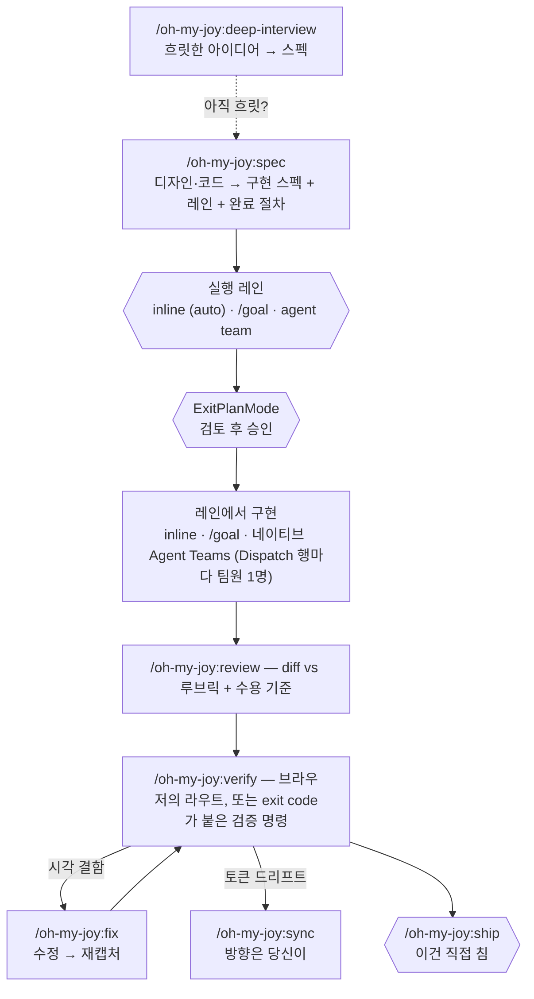

# oh-my-joy (OMJ)

[English](README.md) | 한국어

[](https://github.com/S-jooyoung/oh-my-joy/actions/workflows/ci.yml)
[](LICENSE)
[](package.json)

> 흐릿한 아이디어에서 PR까지, 루프 전체를 하나로 잇는 플러그인 — 코드 ↔ Figma 프론트엔드 루프는 1급 모드로 내장.

**한 번 진입하고(`/oh-my-joy:spec` 또는 `/oh-my-joy:deep-interview`), 플랜을 승인하면, 플랜에 적힌 완료 절차가 review와 verify를 대신 돌립니다. 마지막에 직접 치는 건 `/oh-my-joy:ship` 하나입니다.**
_"거의 항상 Plan 모드"인 습관과 충돌하지 않는 Plan 네이티브 워크플로._

`Plan-first` · `증거 없이 완료 없음` · `Figma 섹션 워크` · `네이티브 Agent Teams` · `graceful degradation` · `zero runtime deps`

[왜 만들었나](#왜-만들었나) • [Quick Start](#quick-start) • [OMJ 사용법](#omj-사용법) • [권장 워크플로](#권장-워크플로) • [커맨드](#커맨드) • [OMJ는 어떻게 발전하나](#omj는-어떻게-발전하나) • [트러블슈팅](#트러블슈팅)

---

## 왜 만들었나

AI 에이전트에게 작업을 던지고 "이대로 만들어줘"라고 하면 특정한 방식으로 반복해서 실패합니다. 결과물은 비슷해 보이는데 토큰이 raw hex로 인라인되고, 아무도 시키지 않은 분기가 생기고, 테스트 한 번 안 돌리고 "완료"라고 말하고, 다음 단계는 이전 단계가 결정한 걸 보지 못합니다. **매번 다른 곳이 빠지기 때문에** 예방이 아니라 리뷰에서 뒤늦게 잡게 됩니다.

그래서 OMJ는 당연한 해법을 뒤집습니다. 진입 커맨드는 구현 커맨드가 **아닙니다** — 디자인이나 코드를 읽고, 고정된 기준으로 평가한 구현 스펙을 쓰고, 어떻게 실행하고 어떻게 검증할지를 적고, **멈추는** read-only 프라이머입니다. 그 스펙이 곧 사용자가 승인할 네이티브 Plan입니다. 승인 뒤에는 세션이 플랜의 완료 절차(구현 → review → verify)를 따르고, 증거(명령·exit code·요약) 없이는 아무것도 완료로 치지 않습니다. Plan 모드의 쓰기 차단은 극복할 장애물이 아니라 검토 게이트가 됩니다.

---

## Quick Start

```
# 1. 설치 (한 줄씩 입력)
/plugin marketplace add S-jooyoung/oh-my-joy
/plugin install oh-my-joy@omj

# 2. 의존성 점검 + 원하는 부가 기능 opt-in (첫 사용 전 권장)
/oh-my-joy:setup

# 3. 시작 — 구체적인 작업이 구현 스펙(Plan)이 되고 멈춤 → 승인 → 플랜이 실행됨
/oh-my-joy:spec "검색 입력 폼 — React Hook Form + Zod, 모바일 우선" /search

#    …디자인에서 시작한다면 — 같은 커맨드에 Figma 링크를 붙이면 됩니다
/oh-my-joy:spec https://figma.com/design/abc?node-id=1-2 /search

#    …프론트엔드가 아니어도 됩니다
/oh-my-joy:spec "공개 API rate-limit 미들웨어 — 키당 분당 100회"

# 4. review와 verify가 통과하면 내보내기
/oh-my-joy:ship "feat: search form"
```

> **업데이트**는 릴리스(버전 범프)가 `main`에 머지될 때 배포됩니다 — 기능이 머지돼도 버전 문자열이 바뀌기 전에는 기존 설치에 도달하지 않습니다. `/plugin update oh-my-joy@omj`로 최신을 받고, `/reload-plugins`(또는 새 세션)로 로드하세요.
>
> **v0.7에서 업그레이드하셨나요?** v0.8.0은 척추를 범용화하고 표면을 줄였습니다:
>
> | 구 커맨드 | 현재 |
> | --- | --- |
> | `ff-review` | `/oh-my-joy:review` — 같은 프론트엔드 루브릭에, 그 외 파일을 위한 범용 모드 추가 |
> | `ralplan` | 제거 — 요구가 흐릿하면 스펙 전에 `/oh-my-joy:deep-interview`를 실행하세요 |
> | `goal-loop` | 제거 — 증거 규칙은 `/oh-my-joy:verify`(증거 모드)와 `/oh-my-joy:ship`에 남았고, `.omj/goals/`는 더 이상 쓰지 않습니다 |
>
> 나머지는 그대로입니다: `.omj/` 상태 디렉토리, `oh-my-joy@omj` 설치 문자열, 훅 출력.
>
> **v0.6에서 업그레이드하셨나요?** v0.7.0에서 모든 커맨드가 단일 `/oh-my-joy:` 네임스페이스로 이동했습니다:
>
> | 구 커맨드 | 현재 |
> | --- | --- |
> | `omj` (동사 없는 루트 커맨드) | `/oh-my-joy:spec` |
> | `omj-verify` | `/oh-my-joy:verify` |
> | `omj-fix` | `/oh-my-joy:fix` |
> | `omj-sync` | `/oh-my-joy:sync` |
> | `omj-setup` | `/oh-my-joy:setup` |
> | `omj-start` | 제거 — 스펙의 실행 레인 섹션이 실행할 한 줄을 출력합니다 |
>
> 함정 하나: 한때 예고했던 `omj-spec`(디자인 시스템 스펙, v1.1)은 `spec`이 아니라 `/oh-my-joy:ds-spec`으로 계획돼 있습니다. 전체 매핑과 근거: [CHANGELOG](CHANGELOG.md) 0.8.0·0.7.0 섹션.

---

## OMJ 사용법

여섯 가지 상황이 대부분의 하루를 덮습니다. 각각은 실제로 치는 순서 그대로이고, 승인과 ship 사이의 일은 승인한 플랜에 적혀 있으므로 알아서 진행됩니다.

**1. Figma 화면 하나**

```
/oh-my-joy:spec https://figma.com/design/abc?node-id=1-2 /checkout
  → 플랜 승인  → 구현 → /oh-my-joy:review → /oh-my-joy:verify /checkout → fix 루프 → 보고 (자동)
/oh-my-joy:ship "feat(checkout): summary panel"
```

**2. 큰 Figma 프레임 (섹션 여러 개)**

```
/oh-my-joy:spec https://figma.com/design/abc?node-id=1-2 /checkout
  → spec이 프레임을 섹션별로 읽고 Dispatch 표로 끝냄; agent-team 레인이 추천되면 레인 질문 하나에 답함
  → 플랜 승인
  → spec이 출력한 한 줄을 붙여넣기: 섹션마다 figma-implementer 팀원이 생성됨 (CLAUDE_CODE_EXPERIMENTAL_AGENT_TEAMS=1 필요; 없으면 순차 실행)
  → 팀원들이 증거와 함께 완료 → /oh-my-joy:verify /checkout이 barrier → /oh-my-joy:review → 보고 (자동)
/oh-my-joy:ship "feat(checkout): all sections"
```

**3. 말로 설명한 프론트엔드 기능**

```
/oh-my-joy:spec "검색 입력 폼 — React Hook Form + Zod, 모바일 우선" /search
  → 승인 → 구현 → review → verify /search → fix 루프 → 보고 (자동)
/oh-my-joy:ship "feat: search form"
```

**4. 프론트엔드가 아닌 모든 것 (백엔드, 스크립트, 이 플러그인)**

```
/oh-my-joy:spec "공개 API rate-limit 미들웨어 — 키당 분당 100회"
  → 스펙에 수용 기준과 찾아낸 검증 명령(verifyCommands 또는 package.json scripts)이 적힘
  → 승인 → 구현 → /oh-my-joy:review (범용 모드) → /oh-my-joy:verify (증거 모드: 명령을 돌리고 exit code를 기록) → 보고 (자동)
/oh-my-joy:ship "feat(api): rate limiter"
```

**5. 뭘 만들지 아직 흐릿할 때**

```
/oh-my-joy:deep-interview "알림 시스템 개편 — 어디서 시작할지 모르겠음"
  → 모호도 점수가 통과할 때까지 한 라운드에 한 질문 → 스펙이 곧 플랜 → 승인 → 같은 완료 절차
/oh-my-joy:ship
```

**6. 시각 결함, 또는 어긋난 디자인 토큰**

```
/oh-my-joy:fix /pricing "배너 z-index가 낮아요"          수정 → 재캡처 → 확인
/oh-my-joy:sync                                         드리프트 클래스별로 방향을 직접 선택
```

모든 커맨드는 단독으로도 씁니다 — 동료의 diff(`/oh-my-joy:review --base main`), 재확인(`/oh-my-joy:verify /checkout`), 토큰만(`/oh-my-joy:sync check`).

---

## 권장 워크플로

처음이라면 `/oh-my-joy:setup`을 한 번 실행하세요 — 선택 의존성을 점검하고, Agent Teams 플래그와 OMJ 답변 스타일을 제안하고, `.omj/fe-context.md`를 스캐폴딩합니다.

1. **진입** — 구체적인 것(Figma, 프론트엔드 텍스트, 범용 텍스트)은 `/oh-my-joy:spec <figma-url | task> [route]`; 목표 자체가 흐릿하면 `/oh-my-joy:deep-interview`. 둘 다 스펙을 쓰고, 실행 레인과 완료 절차를 기록하고, 멈춥니다.
2. **플랜 승인**(ExitPlanMode) — 구현은 여기서만 시작되고, 스펙이 기록한 레인에서 돕니다. 작은 작업은 inline을 자동 선택하고, 무거운 레인은 딱 한 번 묻습니다.
3. **플랜이 실행됨** — 레인에서 구현하고, `/oh-my-joy:review`(diff를 루브릭과 스펙의 수용 기준에 대조), `/oh-my-joy:verify`(라우트를 실제 브라우저에서, 또는 검증 명령을 exit code와 함께), 프론트엔드 결함이면 `/oh-my-joy:fix` 루프, 그리고 증거가 붙은 보고.
4. **Ship** — `/oh-my-joy:ship "<title>"`이 검증 명령을 다시 돌리고, 프로젝트 컨벤션으로 커밋하고, push하고, 증거를 붙인 PR을 엽니다. 이 단계는 절대 자동으로 돌지 않습니다.



_육각형은 사람이 결정하는 세 지점 — 레인(작은 작업은 자동), 승인, ship. 실선 척추는 승인 뒤 알아서 돌고, 점선은 옆길._

**저절로 일어나지 않는 것.** 플랜을 승인하기 전에는 아무것도 구현·빌드·커밋되지 않습니다. 승인이 스펙과 코드 사이의 유일한 문입니다. 승인 뒤 review와 verify가 도는 것은 승인한 플랜에 그렇게 적혀 있기 때문이지, 암묵적으로 도는 것이 아닙니다. 내보내기(push, PR)는 언제나 당신의 키 입력입니다.

**실행 레인 고르기.** 스펙은 레인 선택으로 끝납니다. 1번은 항상 추천이고 `(recommended)`가 붙으며, 작고 구체적인 작업은 질문을 건너뜁니다(`(auto)`).

- **inline** — 기본. 승인 뒤 현재 세션이 스펙을 구현합니다. `figma-implementer`가 프론트엔드 실행자. 항상 가능.
- **`/goal`** — 세션 *안*의 지속: 명시한 조건이 만족될 때까지 이 세션이 반복합니다. Claude Code 훅 시스템의 일부라 훅이 꺼진 곳에서는 불가.
- **agent team** — 파일이 겹치지 않는 독립 단위 3개 이상(큰 프레임의 섹션들, 별개 모듈들): 스펙의 Dispatch 표가 공유 태스크 목록이 되고, 행마다 `figma-implementer` 팀원 하나, `verify`가 barrier. Claude Code 네이티브 Agent Teams(`CLAUDE_CODE_EXPERIMENTAL_AGENT_TEAMS=1`, 실험 기능) 위에서 돌며, 플래그가 없으면 서브에이전트로, 그다음 inline으로 강등됩니다.

전체 라우팅 규칙, dispatch 계약, 완료 절차는 [docs/EXECUTION-HANDOFF.md](docs/EXECUTION-HANDOFF.md)에 있습니다 — 이 섹션은 선택의 감만 전하고 숫자는 싣지 않습니다.

---

## Figma 링크는 무엇이 되나

섹션이나 프레임 링크를 붙이면 `spec`이 데이터로 읽고, 프레임마다:

1. **픽셀이 아니라 데이터로 읽습니다** — 공식 Dev Mode MCP로 레이아웃 구조, 그 뒤의 디자인 변수, 그리고 나중에 `verify`가 비교할 베이스라인 스크린샷을 가져옵니다.
2. **큰 프레임은 섹션별로 걷습니다** — 최상위 섹션이 3개 이상인 프레임은 한 번에 읽지 않고(한 번에 읽으면 뭉개져 돌아옵니다) 메타데이터 먼저, 그다음 섹션마다 design-context 호출 하나로 읽습니다. 스펙에는 섹션별 분해와, 각 섹션이 어느 파일을 소유할지 적은 Dispatch 표가 붙습니다. 8개를 넘으면 링크 분할을 제안합니다.
3. **색·타이포·radius·shadow 전부를 시맨틱 토큰에 매핑합니다** — 토큰 시스템을 감지하고(fe-context → tokens.json → Tailwind config → CSS 변수) tokens.json이 없는 프로젝트에서도 raw hex는 선택지가 아닙니다.
4. **fidelity 규칙을 켜둡니다** — 원문 텍스트 유지, Figma에 없는 variant 창작 금지, 고정 px 대신 `w-full` + 부모 padding.
5. **보기 전에 스펙을 채점합니다** — uSpec 6 섹션(Uber의 디자인 스펙 분류: Anatomy / Structure / Color·Tokens / Props·Variants / A11y / Motion)을 각각 FF 기준(Toss frontend-fundamentals: 가독성·예측 가능성·응집도·결합도) + 접근성으로 평가합니다.

그래서 "이 프레임 만들어줘" 프롬프트처럼 결과가 표류하지 않습니다. 모델이 스크린샷을 눈대중하는 게 아니라, 구조화된 디자인 데이터로 고정된 골격을, 당신의 토큰 어휘로, 알맞은 입도에서 채우고, 기록한 베이스라인이 `verify`가 빌드와 비교할 대상이 됩니다.

---

## 한 세션 처음부터 끝까지

작업: 검색 입력 폼 — React Hook Form + Zod, 모바일 우선, `/search`에 마운트.

디자인에서 시작한다면 같은 커맨드에 링크를 붙이면 됩니다 — `/oh-my-joy:spec https://figma.com/design/abc?node-id=1-2 /search` — 위에서 설명한 Figma 트랙이 돌고, 스펙 이후는 동일합니다. 백엔드 작업이라면 같은 커맨드이고, 스펙 골격이 목표 / 제약 / 수용 기준 / 검증 명령으로 바뀝니다.

    /oh-my-joy:spec "검색 입력 폼 — React Hook Form + Zod, 모바일 우선" /search

`spec`은 `/search`를 검증 라우트로 떼어내고, Figma URL이 없으니 프론트엔드 작업으로 인식해 기존 폼 컴포넌트·훅·토큰 설정을 읽고, 구현 스펙을 씁니다 — FF 기준으로 채점된 uSpec 6 섹션, 대상 파일과 재사용 후보까지. 스펙은 실행 레인 섹션(이 작업은 작아서 레인 줄이 `(auto)` — inline, 질문 없음)과 완료 절차로 끝납니다.

**여기서 당신이 결정합니다.** 스펙은 승인 화면의 플랜입니다 — 고치거나, 거절하거나, 승인(ExitPlanMode)하세요. 아직 아무것도 쓰이지 않았습니다.

승인하면 세션이 스펙을 inline으로 구현한 뒤, 승인한 절차를 돌립니다:

    /oh-my-joy:review        diff를 FF 기준 + a11y와 스펙의 수용 기준에 대조 — 보고만
    /oh-my-joy:verify /search   실제 브라우저에서 /search를 열고 스펙과 Figma 베이스라인에 대조

verify가 결함을 보고했다고 합시다 — 제출 버튼 라벨이 360px에서 잘립니다. 절차는 이를 fix 루프로 보냅니다:

    /oh-my-joy:fix /search "제출 버튼 라벨이 360px에서 잘림"

`fix`가 고치고, 재캡처하고, 결함이 사라졌음을 확인하면 세션이 증거와 함께 보고합니다. 그리고 당신 몫인 한 줄:

    /oh-my-joy:ship "feat: search form"

`ship`은 검증 명령을 다시 돌리고, 프로젝트 컨벤션으로 커밋하고, push하고, 증거 표를 본문에 붙인 PR을 엽니다. 작업이 디자인 토큰을 건드렸다면 `/oh-my-joy:sync`가 Figma와 맞춥니다 — 충돌마다 방향을 당신에게 물으면서.

---

## 커맨드

| 커맨드 | 하는 일 | 언제 | 예시 |
| --- | --- | --- | --- |
| **`/oh-my-joy:spec`** | 입력(큰 프레임은 섹션 워크로 읽는 Figma 링크, 프론트엔드 텍스트, 범용 텍스트)을 읽고, 실행 레인과 완료 절차가 붙은 구현 스펙(Plan)을 쓰고 멈춤(read-only). 생략된 verify 라우트는 추론; 검증 가능한 목표가 없는 텍스트는 인터뷰로 안내 | 구체적인 모든 작업의 시작점 | `/oh-my-joy:spec https://figma.com/design/abc?node-id=1-2 /settings/profile` |
| **`/oh-my-joy:deep-interview`** | 모호한 아이디어를 한 라운드 한 질문의 소크라테스식 인터뷰로 스펙(네이티브 Plan)으로 만듦. 가중 모호도 점수(`--threshold N`%, 기본 20) — 토폴로지 고정, 최약 차원 타깃, 온톨로지 추적, 재진술/클로저 이중 게이트(read-only); `spec`과 같은 레인·완료 절차 섹션으로 끝남. 이미 구체적인 입력은 즉시 종료, Figma 링크는 `spec`으로 | 목표 자체가 아직 흐릿할 때 | `/oh-my-joy:deep-interview "사내 지식 베이스 — 아직 흐릿함"` |
| **`/oh-my-joy:review`** | 변경 diff를 리뷰하고 보고만 — 프론트엔드 파일은 FF 4기준 + a11y · Figma fidelity · vercel · Next.js(Context7); 그 외 파일은 정확성·단순함·일관성·테스트 커버리지; 승인된 스펙의 수용 기준을 diff에 대조. 인자 없음 = 미커밋 + 스테이징 vs HEAD; `--base <ref>` = 브랜치 전체 | 구현 직후(플랜이 실행), 또는 누구의 diff든 | `/oh-my-joy:review --base main` |
| **`/oh-my-joy:verify`** | 작업을 증명. 라우트가 있으면 실제 브라우저(playwright-cli, MCP 폴백)로 열어 Figma 베이스라인(`.omj/baselines/`)에 대조하고 요청한 라우트에 실제로 도달했는지 항상 확인. 라우트가 없으면 프로젝트의 검증 명령을 돌려 `명령 · exit code · 요약`을 기록. `--base <url>`은 dev 서버 | review 뒤 플랜이 실행; 팀원 완료 뒤 barrier | `/oh-my-joy:verify /settings/profile` · `/oh-my-joy:verify` |
| **`/oh-my-joy:fix`** | 붙여넣은 스크린샷·불평으로 라우트(필수)의 결함을 고치고 재캡처로 확인(능동 루프). `--base <url>`, `--commit` | verify가 찾은 시각 결함 | `/oh-my-joy:fix /pricing "배너 z-index가 낮음"` |
| **`/oh-my-joy:sync`** | 토큰 저장소(`tokens.json` 또는 CSS 커스텀 프로퍼티) ↔ Figma 드리프트를 방향을 물어 해소; `extract`는 Figma 변수에서 CSS 토큰을 부트스트랩; `--tokens <path>`로 저장소 경로 지정 | 코드/Figma 토큰 맞추기 · 최초 추출 | `/oh-my-joy:sync` · `check` · `push` · `extract <figma-url>` |
| **`/oh-my-joy:ship`** | 검증 명령 실행(전부 exit 0이어야 함), 브랜치에서 프로젝트 컨벤션으로 커밋, push, 증거 표를 본문에 붙인 PR 생성. `--base <ref>`로 PR base 지정. git/gh/typecheck만 사전 승인 — 테스트 러너는 일부러 권한 프롬프트를 거침 | 마지막 단계, 항상 당신이 침 | `/oh-my-joy:ship "feat(checkout): summary panel"` |
| **`/oh-my-joy:setup`** | 의존성 진단 + 빠진 항목의 다중 선택 설치 + 스캐폴딩: `.omj/fe-context.md`(기존 규칙 문서를 `contextDocs:`로 채택, `verifyCommands:`를 package.json에서 주석으로 스캐폴드), opt-in 토큰 가드 훅, opt-in OMJ HUD, Agent Teams 플래그, OMJ 답변 스타일; 끝에 GitHub star 제안(막지 않음) | 첫 사용 전 — 설정 흔적이 없으면 `spec`이 한 번 제안 | `/oh-my-joy:setup` · `--check` (보고만) |

> **read-only vs 능동 op.** `/oh-my-joy:spec`과 `/oh-my-joy:deep-interview`는 쓰기 도구도 Bash도 선언하지 않습니다: Plan을 쓰고 멈춥니다(`spec`은 레인 질문을 최대 한 번, inline 추천이면 생략). `/oh-my-joy:review`와 `/oh-my-joy:verify`는 보고 전용(관찰 범위의 Bash, 쓰기 도구 없음). `/oh-my-joy:fix`, `/oh-my-joy:sync`(sync/push/extract), `/oh-my-joy:ship`은 능동 op이며, Plan 모드가 이를 막는 환경이면 먼저 Plan 모드를 나오세요. 검증 명령(`npm test` 등)은 어떤 커맨드도 사전 승인하지 않습니다 — 권한 프롬프트가 기록된 증거를 신뢰할 수 있게 만듭니다. 각 커맨드의 문법과 단계는 `commands/<name>.md`(소스 오브 트루스)에 있습니다.
>
> **자동 트리거.** 커맨드 description은 가장 흔한 실제 패턴에 맞춰 쓰여 있어 슬래시 커맨드를 치지 않아도 라우팅됩니다: Figma Dev Mode 링크를 붙이며 "이 디자인 구현해줘"는 `/oh-my-joy:spec`으로, 스크린샷을 붙이며 "정렬이 안 맞아", "잘려 보여"는 `/oh-my-joy:fix`로.

### 번들 에이전트, 답변 스타일, opt-in 부가 기능

- **`figma-implementer`** (에이전트) — **승인된 OMJ 스펙**을 5단계 루프(Clarify → Context → Plan → Generate → Evaluate)로 구현하는 inline 레인 실행자이자, agent-team 레인의 팀원 타입: Dispatch 행마다 인스턴스 하나, 그 행의 파일만 편집, 증거와 함께 완료 보고. 스펙 없는 Figma URL은 거절(플랜 게이트 우회 없음).
- **`design-qa`** (에이전트) — **검사만** 하는 기계적 게이트: 타입체크, 린트, 하드코딩 토큰, Figma fidelity, a11y 기본, 그리고 fe-context에 선언된 경우에만 Story/i18n 검사. 쓰기 도구 미선언(테스트로 고정).
- **OMJ 답변 스타일** (`output-styles/oh-my-joy.md`, opt-in) — 번역이 아니라 당신의 언어로 처음부터 작문된 답변(한국어: 조사·어미 완결, 존댓말 한 종류, 영어 기술 용어는 그대로 — [fluent-korean](https://github.com/snflkd/fluent-korean)의 규칙을 재작성, [`NOTICE.md`](NOTICE.md)에 크레딧), 초보 개발자가 따라올 수 있는 설명, 흐름의 다음 단계로 마무리. Claude Code의 코딩 지침은 유지하고 강제 적용은 하지 않습니다: `/oh-my-joy:setup`이나 `/config`의 **Output style**에서 고르면 다음 세션부터 메인 대화에 적용됩니다(서브에이전트는 자기 프롬프트 유지).
- **토큰 가드 훅** — `templates/hooks/`의 `check-design-tokens.mjs`(하드코딩 색상 경고)와 `check-story-exists.mjs`(Story 누락 경고). **플러그인은 절대 스스로 실행하지 않습니다** — `/oh-my-joy:setup`이 사용 프로젝트의 `.claude/hooks/`에 복사·등록해야만(opt-in) 돌고, `.omj/fe-context.md` 선언이 없으면 no-op. 둘 다 advisory이고 fail-open([`tests/hooks/hook-conventions.test.mjs`](tests/hooks/hook-conventions.test.mjs)로 고정).
- **OMJ HUD statusline** — `hud/`의 vendored statusLine HUD(출처와 라이선스는 [`NOTICE.md`](NOTICE.md), 상세는 [`hud/README.md`](hud/README.md)). 훅처럼 opt-in: `/oh-my-joy:setup`이 동의 시에만 `hud/`를 `~/.claude/omj-hud/`로 복사하고 `statusLine`을 등록.

### `/oh-my-joy:sync` — 방향은 당신이 고릅니다

`/oh-my-joy:sync`는 "코드가 항상 이긴다"를 강요하지 않습니다. **코드가 기본 소스 오브 트루스**지만, 드리프트가 있으면 충돌을 클래스(값 불일치 / 코드 전용 / Figma 전용)로 묶어 `AskUserQuestion`으로 방향을 묻습니다. 각 질문의 첫 선택지는 코드 권위를 따릅니다 — 값 불일치·코드 전용은 `code→Figma`, Figma 전용은 보수적인 `skip` — 그래서 엔터만 눌러도 안전합니다.

- `/oh-my-joy:sync` (기본 `sync`) — 대화형 조정, 방향을 물음.
- `/oh-my-joy:sync check` — read-only 드리프트 보고 + Figma 전용 토큰의 "제안 토큰 코드" 블록.
- `/oh-my-joy:sync push` — 질문 없이 code→Figma 일괄 적용(명시적 code-wins).
- `/oh-my-joy:sync extract <figma-url>` — Figma 변수 전부를 CSS 커스텀 프로퍼티로 추출(`/`→`-` 명명, primitive→semantic `var()` 참조 보존, 매핑 표는 프로젝트의 `docs/design-tokens.md`에).

> 두 저장소 형식을 모두 지원합니다: `tokens.json`(DTCG)과 CSS 커스텀 프로퍼티(`*.css`). Figma 변수 접근에는 **편집 권한**이 필요합니다 — viewer로 공유된 파일은 먼저 복제하세요.

---

## 의존성 (모두 선택 · graceful degradation)

없어도 죽지 않습니다 — OMJ는 **건너뛰고 안내**합니다.

| 의존성 | 사용처 | 없을 때 |
| --- | --- | --- |
| 공식 Figma Dev Mode MCP | `/oh-my-joy:spec`(디자인 읽기), `/oh-my-joy:sync`(Variables 읽기/쓰기) | "Figma 미연결 — 수동 스펙으로 진행" 후 계속 |
| `playwright-cli` **또는** playwright MCP | `/oh-my-joy:verify` 브라우저 모드 · `/oh-my-joy:fix`(cli 우선, MCP 폴백) | 둘 다 없으면: "캡처 백엔드 없음 — verify 건너뜀" 후 종료; 증거 모드는 계속 동작 |
| Context7 | `/oh-my-joy:spec` · `/oh-my-joy:review` · `/oh-my-joy:fix`(최신 Next.js 문서) | 그 단계만 건너뜀 |
| `CLAUDE_CODE_EXPERIMENTAL_AGENT_TEAMS=1` | agent-team 레인(네이티브 Agent Teams) | 레인이 서브에이전트, 그다음 inline으로 강등 |

> Figma 쓰기(`/oh-my-joy:sync` push/pull, 디자인 읽기)는 **Figma 데스크톱 앱이 실행 중이고 대상 파일이 활성 탭**이어야 합니다. MCP 도구 이름은 환경마다 다릅니다 — `/mcp`로 확인하세요.

---

## OMJ가 여러분 레포에 쓰는 것들

- `.omj/fe-context.md` — 프로젝트 선언(수용 축, 토큰 경로, verify 설정, `verifyCommands`). **커밋하는 파일입니다.**
- `.omj/baselines/` — 캡처 베이스라인. **이것만 gitignore하세요**: `.omj/` 통째로 무시하면 커밋해야 할 fe-context까지 사라집니다.
- `.claude/hooks/`의 토큰 가드 훅 복사본 — `/oh-my-joy:setup`에서 opt-in한 경우에만.
- `~/.claude/omj-hud/`(그리고 `statusLine` 항목), Agent Teams `env` 플래그, `~/.claude/settings.json`의 `outputStyle` 선택 — 사용자 전역이며 각각 `/oh-my-joy:setup`에서 opt-in한 경우에만.
- 요청 시: 프로젝트의 `docs/design-tokens.md`(`sync extract` 매핑 표)와 `docs/DESIGN.md`(setup 스캐폴드).

무엇이 어디로 가고 왜인지는 [`commands/setup.md`](commands/setup.md)가 소유합니다.

---

## 이 레포가 보여주는 것

아래 각 주장은 이 레포에서 확인할 수 있습니다 — 산출물의 이름과, 기각한 대안까지.

- **최소 권한은 관례가 아니라 매니페스트에 선언됩니다.** `/oh-my-joy:spec`은 `allowed-tools: Read, Grep, Glob, Skill, AskUserQuestion` + read-only Figma/Context7 MCP로 배포되고([`commands/spec.md`](commands/spec.md)), `/oh-my-joy:ship`은 git·gh·typecheck만 사전 승인하고 테스트 러너는 절대 승인하지 않습니다([`commands/ship.md`](commands/ship.md)). 호출하지 않는 곳에는 쓰기 도구가 사전 승인되지 않으므로 조용한 쓰기가 일어날 수 없습니다. 기각: "도구는 주되 쓰지 말라고 지시" — 산문은 강제 계층이 아닙니다.
- **사실 하나에 소스 하나, 그리고 문서 사실은 CI가 검사합니다.** 실행 레인 임계값과 완료 절차는 [`docs/EXECUTION-HANDOFF.md`](docs/EXECUTION-HANDOFF.md)에만 있습니다. 의존성 없는 스위트가 두 README의 커맨드 집합과 설치 문자열 일치, 영어 문서의 한국어 누출 없음, 상대 링크 유효성, 폐기된 커맨드 이름의 마이그레이션 표 잔류를 검사합니다([`tests/docs-consistency.test.mjs`](tests/docs-consistency.test.mjs)).
- **프롬프트 본문은 프롬프트 가이드를 따르고, 테스트가 그렇게 말합니다.** 모든 커맨드·에이전트·스킬·스타일 본문은 무엇을 왜 하는지를 서술하고, 고함치는 명령어·강조 남발·경고 글리프 없이, 예시는 `<example>` 태그 안에 둡니다([`tests/prompt-style.test.mjs`](tests/prompt-style.test.mjs)). 기각: 기여 가이드의 스타일 체크리스트 — 딱 한 릴리스 동안만 지켜졌습니다.
- **모든 의존성은 설계상 선택입니다.** Figma MCP, playwright, Context7, Agent Teams 플래그 — 각각 없으면 "건너뛰고 설명"이지 오류가 아닙니다.
- **플러그인은 스스로 훅을 실행하거나 스타일을 강제하지 않습니다.** `hooks/hooks.json` 없음, 답변 스타일에 `force-for-plugin` 없음; 둘 다 `/oh-my-joy:setup`의 opt-in 설치이며 [`tests/plugin-manifest.test.mjs`](tests/plugin-manifest.test.mjs)로 고정됩니다.
- **Markdown으로 쓰여 있어도 동작은 테스트됩니다.** 훅 스크립트는 PostToolUse 계약에 대해 실제 서브프로세스로 실행되고([`tests/hooks/`](tests/hooks)), 커맨드에는 행동 eval 케이스가 있습니다([`evals/`](evals)).

각 결정의 이유 — 문제 → 결정 → 근거 → 결과, 기각한 대안과 그 이유, 다른 프로젝트의 어떤 아이디어를 채택하고 어떤 것을 거절했는지 — 는 열두 행의 결정 표로 시작하는 [`docs/PRINCIPLES.md`](docs/PRINCIPLES.md)에 있습니다.

---

## 설계 원리 · Figma 2-트랙

- **Plan 네이티브 프라이머**: `/oh-my-joy:spec`과 `/oh-my-joy:deep-interview`는 read-only — 스펙을 쓰고, 레인과 완료 절차를 기록하고, 멈춥니다. 구현은 승인 뒤에만.
- **증거 규칙**: "완료"는 명령·exit code·요약을 뜻합니다 — `verify`(증거 모드), `ship`, agent-team 팀원이 기록합니다. 검증 명령은 절대 사전 승인되지 않습니다.
- **스펙 형식**: 프론트엔드는 uSpec 섹션 + FF 4기준 + a11y + Figma fidelity([`figma-fidelity.md`](skills/frontend-fundamentals/references/figma-fidelity.md)); 그 외는 목표 / 제약 / 수용 기준 / 검증 명령.
- **토큰 sync**: 코드가 기본 SoT, 충돌 시 방향은 당신이(대화형). DTCG json과 CSS 커스텀 프로퍼티 저장소 모두.
- **Figma 2-트랙**: (A) 앱 화면 design→code = 공식 Dev Mode MCP, 큰 프레임은 섹션별로; (B) 디자인 시스템 스펙/토큰 = figma-console-mcp + uSpec(v1.1+).
- **표면이 아니라 방법론을 빌린다**: 외부가 유지하는 지식은 참조만(vercel 스킬 — `npx skills add/update`); OMJ는 자기 것만 번들(FF 스킬, 에이전트 2, 훅 템플릿, 답변 스타일, evals); 다른 프로젝트의 방법론은 크레딧을 단 재작성으로 흡수하고, 거절한 아이디어는 이유와 함께 기록합니다.

각 결정의 "왜"는 **[docs/PRINCIPLES.md](docs/PRINCIPLES.md)**에 있습니다.

---

## OMJ는 어떻게 발전하나

커맨드 본문은 프롬프트라서 "사소한 문구 수정"도 동작 변경입니다. OMJ는 이를 측정합니다: `evals/`에 커맨드별 행동 케이스가 있고(조직에 활성화돼 있으면 네이티브 `claude plugin eval`, 아니면 같은 케이스 파일을 읽는 `claude -p` 폴백 러너), `npm run eval`이 임계값으로 채점하며, 커맨드 본문을 바꾸면 그것을 관찰하는 케이스를 추가하거나 갱신합니다. 매 PR에서는 [`tests/token-budget.test.mjs`](tests/token-budget.test.mjs)가 always-on description 비용을 래칫 예산 아래로 유지해 표면이 조용히 늘어나지 못하게 합니다. 이 루프는 [docs/EVALS.md](docs/EVALS.md)에 적혀 있습니다.

---

## 트러블슈팅

- **`/oh-my-joy:spec`이 코드를 하나도 안 바꿨어요** — 맞습니다. read-only 프라이머라 스펙을 쓰고, 레인과 완료 절차를 기록하고, 멈춥니다. 구현은 승인(ExitPlanMode) 뒤에 시작되고, 무거운 레인이면 스펙의 레인 섹션이 이미 실행할 한 줄을 출력했습니다.
- **승인 뒤 review와 verify가 제가 안 쳤는데 돌았어요** — 이것도 맞습니다. 승인한 플랜이 그것들을 이름 붙인 완료 절차로 끝나기 때문입니다. `/oh-my-joy:ship`은 절대 그 안에 없습니다.
- **`/oh-my-joy:verify` / `/oh-my-joy:fix`가 브라우저 모드에서 아무것도 안 해요** — 캡처 백엔드 없음(playwright-cli도 playwright MCP도), dev 서버 미실행, 인증이 필요한 라우트, 또는 Plan 모드가 Bash를 막음. dev 서버 URL은 `--base <url>` > export된 `JOY_BASE_URL` > `http://localhost:3000` 순으로 결정되고, 인라인 `JOY_BASE_URL=… /oh-my-joy:verify` 접두는 적용되지 않습니다(슬래시 커맨드는 셸이 아닙니다). 인증 라우트는 `.omj/fe-context.md`에 `verifySetup`을 선언하거나 실행 전에 `export JOY_TEST_EMAIL=… JOY_TEST_PASSWORD=…` — **테스트 전용 계정**을 쓰고 `.omj/baselines/`는 gitignore하세요.
- **`/oh-my-joy:verify`나 `/oh-my-joy:ship`이 테스트 명령마다 권한을 물어요** — 의도입니다. 검증 명령은 일부러 사전 승인하지 않습니다: 권한 프롬프트가 기록된 증거를 신뢰할 수 있게 만듭니다.
- **`/oh-my-joy:verify`나 `/oh-my-joy:ship`이 "검증 명령이 선언되지 않았다"고 해요** — `.omj/fe-context.md`에 `verifyCommands:`를(또는 `package.json`에 `test` 스크립트를) 추가하세요. OMJ는 돌릴 명령을 지어내지 않습니다.
- **agent-team 레인이 순차로 돌았어요** — `CLAUDE_CODE_EXPERIMENTAL_AGENT_TEAMS=1`이 설정되지 않았습니다(실험 기능, 기본 꺼짐). `/oh-my-joy:setup`이 추가를 제안하고, 없으면 레인은 서브에이전트, 그다음 inline으로 강등됩니다. 팀원은 리더의 권한 모드로 시작하므로 생성 전에 일상 명령을 사전 승인해 두세요.
- **답변 스타일이 아무것도 안 바꿨어요** — 다음 세션이나 `/clear` 뒤에, 메인 대화에만 적용됩니다. `/config`의 **Output style**에 `oh-my-joy`가 선택돼 있는지 확인하세요.
- **Figma 미연결 / 권한 없음** — `This figma file could not be accessed`는 graceful하게 처리됩니다. Figma 데스크톱 앱을 열고 대상 파일을 활성 탭에 두고 재시도하세요. 변수/노드 접근에는 편집 권한이 필요합니다 — viewer 공유 파일은 복제해서 사본 URL을 쓰세요.
- **베이스라인 비교가 안 돼요** — Figma asset URL은 약 7일 뒤 만료됩니다. `/oh-my-joy:spec`을 다시 돌려 스펙의 베이스라인 출처를 갱신하세요. 세션 간 비교는 `.omj/baselines/`의 PNG에 의존하고(gitignore 권장), PNG는 `spec`과 같은 세션에서 `/oh-my-joy:verify`가 돌 때 처음 생성됩니다.
- **`/oh-my-joy:deep-interview`가 바로 끝났어요** — 실패가 아니라 적합성 게이트입니다. 입력이 이미 구체적이었거나(`/oh-my-joy:spec`을 쓰세요), `spec`으로 라우팅되는 Figma URL이 있었습니다.
- **설치가 오래된 것 같아요?** 모든 릴리스는 태그된 트리의 콘텐츠 해시를 GitHub Release 노트에 기록하고, CI가 태그를 그 해시에 대해 재검증합니다. 로컬 사본의 해시는 `node scripts/generate-inventory.mjs --dir <plugin cache dir>`로 다시 계산할 수 있습니다.
- **MCP 도구 이름이 달라요** — Figma/Context7 도구 이름은 환경마다 다릅니다. `/mcp`로 실제 이름을 확인하세요.
- **커밋된 스킬 사본 중복** — 프로젝트가 `frontend-fundamentals`를 자체 `.claude/skills/`에 커밋했다면 OMJ 번들과 함께 로드될 수 있습니다(무해). 그 사본을 지우지 말고 — 소스 오브 트루스 한 곳만 편집하세요.

---

## 기여

이슈와 PR을 환영합니다. 이 레포는 Markdown 우선입니다 — 빌드 단계도, 설치할 것도 없습니다:

```bash
git clone https://github.com/S-jooyoung/oh-my-joy.git
cd oh-my-joy
npm test                 # Node 20+ 내장 모듈만, npm install 불필요
npm run validate-plugin  # 매니페스트 + frontmatter 적합성
npm run eval             # 행동 eval 케이스 (토큰 비용 발생; 로그인된 claude 필요)
```

변경을 실제 플러그인으로 써 보려면 `/plugin marketplace add <클론 경로>` 후 `/plugin install oh-my-joy@omj`.

첫 PR 전에 알아둘 세 가지: 기능은 **README(두 언어), CHANGELOG, 그리고 원칙이 움직였다면 `docs/PRINCIPLES.md`**가 같은 커밋에서 바뀌기 전까지 미완성이고, `allowed-tools`는 커맨드 본문이 호출하지 않는 도구를 절대 선언하지 않으며, 커맨드가 약속하는 것이 바뀌면 그 eval 케이스를 추가하거나 갱신합니다. 셋 다 테스트나 체크리스트로 강제됩니다. 전체 가이드는 [CONTRIBUTING.md](CONTRIBUTING.md).

보안 문제를 찾으셨나요? 이슈를 열지 마세요 — [SECURITY.md](SECURITY.md)를 보세요.

## 라이선스

[MIT](LICENSE). 다른 프로젝트에서 빌린 방법론은 [NOTICE.md](NOTICE.md)에 크레딧합니다.
