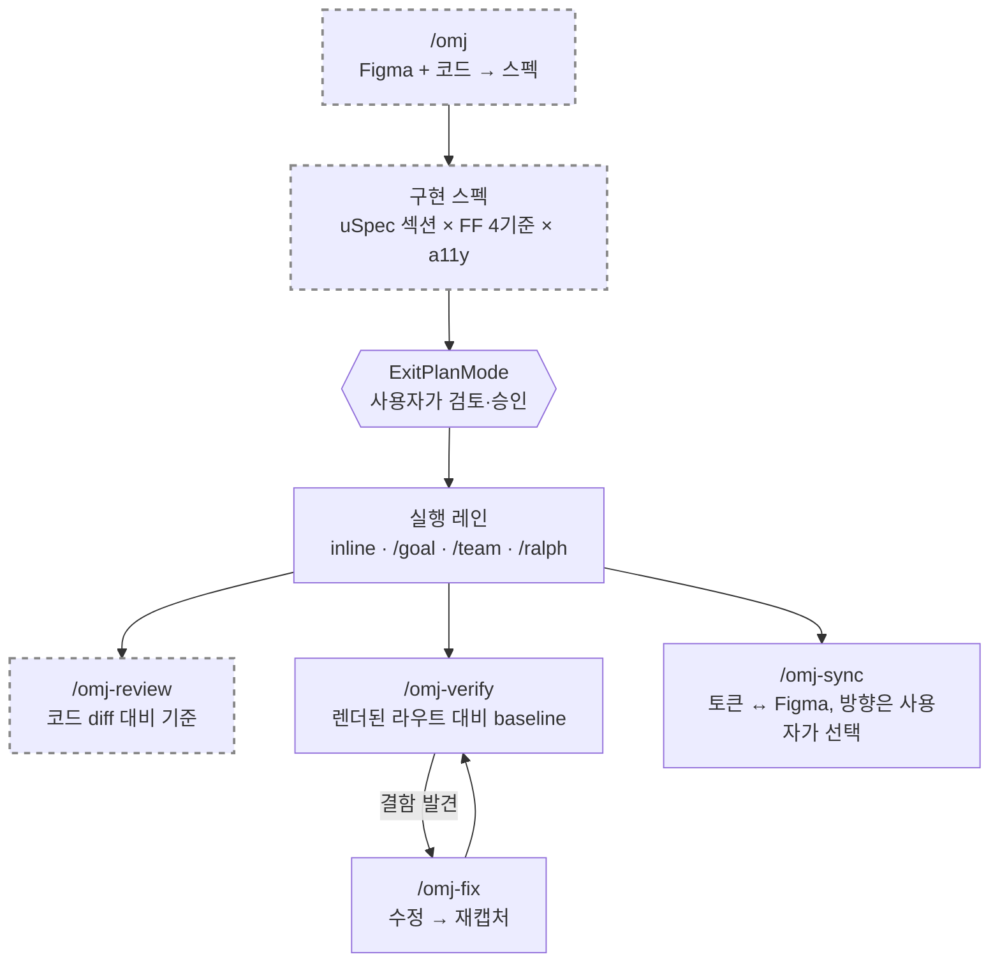

# oh-my-joy (OMJ)

[English](README.md) | 한국어

[](https://github.com/S-jooyoung/oh-my-joy/actions/workflows/ci.yml)
[](LICENSE)
[](package.json)

> 코드 ↔ Figma 프론트엔드 루프 전체를 하나로 잇는 프론트엔드 플러그인.

**FE는 무조건 `/omj`로 시작 — 스펙을 뽑고, 검증하고, 토큰을 맞춘다.**
_"거의 항상 Plan 모드"인 습관과 충돌하지 않는 Plan 네이티브 프라이머._

`Plan-first` · `Figma 2-트랙` · `대화형 토큰 sync` · `graceful degradation` · `OMC/OMX와 무충돌 공존`

[왜 만들었나](#왜-만들었나) • [Quick Start](#quick-start) • [커맨드](#커맨드) • [설계 근거](#이-레포가-보여주는-것) • [OMJ × OMC/OMX](#omj--omcomx) • [트러블슈팅](#트러블슈팅)

---

## 왜 만들었나

Figma 프레임을 AI 에이전트에 던지고 "이대로 만들어줘"라고 하면 특정한 방식으로 반복해서 실패한다. 결과물은 비슷해 보이는데 토큰이 raw hex로 인라인되고, 없던 반응형 분기가 창작되고, 접근성은 그날 모델 기분대로다. **매번 다른 곳이 빠지기 때문에** 예방이 아니라 리뷰에서 뒤늦게 잡게 된다.

당연한 해법 — Figma를 읽고 코드까지 쓰는 단일 커맨드 — 은 Claude Code의 실제 동작과 충돌한다. **Plan 모드는 설계상 `Write`/`Edit`를 차단**하는데, 많은 사람이 바로 그 모드에서 산다(`git diff` 같은 읽기 전용 Bash는 동작하고, 부작용 있는 Bash·MCP 쓰기 도구의 차단 여부는 환경에 따라 다르다). 한 방에 구현하는 커맨드는 가장 많이 호출되는 자리에서 정확히 절반만 동작한다.

그래서 OMJ는 방향을 뒤집는다. `/omj`는 구현 커맨드가 **아니다** — 도구의 제약을 설계 축으로 삼은 read-only 프라이머다. 디자인을 읽고, 고정된 품질 기준으로 평가한 구현 스펙을 쓰고, **멈춘다**. 그 스펙이 곧 사용자가 승인할 네이티브 Plan이다. Plan 모드의 쓰기 차단은 극복할 장애물이 아니라 검토 게이트가 된다.



_점선 = read-only, 소스 부작용 없음. 승인 게이트를 사용자 없이 넘는 경로는 없다._

---

## 이 레포가 보여주는 것

아래 주장은 전부 이 레포에서 확인할 수 있다 — 근거 아티팩트와 **버린 대안**을 함께 적는다.

- **최소권한을 관례가 아니라 매니페스트에 선언한다.** `/omj`의 `allowed-tools`는 `Read, Grep, Glob, Skill, AskUserQuestion` + 읽기 전용 Figma/Context7 MCP뿐이다([`commands/omj.md`](commands/omj.md)). 쓰기 도구가 하나도 사전승인돼 있지 않으니 쓰기가 **조용히** 일어날 수 없다 — 시도하면 권한 프롬프트로 드러나고, Plan 모드에서는 `Write`/`Edit`가 아예 차단된다. 버린 대안: "도구는 주고 쓰지 말라고 지시" — 산문은 강제층이 아니며, 그게 [`commands/omj-start.md`](commands/omj-start.md)에서 실제로 고친 결함이다(본문이 금지한 인자를 `Bash(...)` 와일드카드가 전부 사전승인하고 있었다).
- **한 사실에 하나의 SoT, 그리고 문서 사실은 CI가 검사한다.** 실행 레인 **임계값**은 [`docs/EXECUTION-HANDOFF.md`](docs/EXECUTION-HANDOFF.md)에만 있고, 커맨드는 링크만 하거나 그 파일에 도달할 수 없을 때의 임계값 없는 fallback만 갖는다. 무의존성 테스트가 양 언어 README의 커맨드 목록·설치 문자열 일치, 영문 페이지의 한국어 잔재, 전 상대 링크 도달성, CHANGELOG 릴리스 링크의 compare 범위를 검사한다([`tests/docs-consistency.test.mjs`](tests/docs-consistency.test.mjs)). 버린 대안: 레인 규칙을 필요한 곳마다 재기술 — 0.3.0 이전 `commands/omj.md`·`docs/OMC-INTEGRATION.md` 사본이 한 릴리스 만에 드리프트했다.
- **모든 의존성이 선택적이다.** Figma MCP·playwright·Context7·OMC/OMX 중 무엇이 없어도 에러가 아니라 "스킵 + 안내"로 내려앉는다. 어떤 환경에서도 첫날부터 쓸 수 있다. 버린 대안: hard requirement — 플러그인을 설치 프로젝트로 만든다.
- **플러그인은 스스로 훅을 발화시키지 않는다.** `hooks/hooks.json`을 두면 플러그인을 켠 **모든 레포**에서 검사가 돈다. 대신 스크립트는 템플릿이고 `/omj-setup`이 동의한 프로젝트에만 복사하며, 선언이 없으면 no-op이다. 이 불변식은 주석이 아니라 테스트가 못 박는다([`tests/plugin-manifest.test.mjs`](tests/plugin-manifest.test.mjs)).
- **마크다운으로 쓰인 동작도 테스트한다.** 훅 스크립트 2개를 실제 자식 프로세스로 띄워 PostToolUse 계약대로 검증한다 — 이전 버전이 신호 대신 노이즈를 보고하게 만들었던 오탐 케이스를 포함해서([`tests/hooks/`](tests/hooks)).

각 결정의 "왜"는 문제 → 결정 → 근거 → 결과 + 버린 대안 구조로 [`docs/PRINCIPLES.md`](docs/PRINCIPLES.md)에 있다(영문 요약표: [`docs/PRINCIPLES.en.md`](docs/PRINCIPLES.en.md)).

---

## Quick Start

```
# 1. 설치 (한 줄씩 입력)
/plugin marketplace add S-jooyoung/oh-my-joy
/plugin install oh-my-joy@omj

# 2. 의존성 점검 (첫 사용 전 권장)
/omj-setup

# 3. 시작 — 명세를 구현 스펙(Plan)으로 뽑고 실행 레인을 고른 뒤 멈춤 → 승인 → 구현
/omj "검색 입력 폼 — React Hook Form + Zod, 모바일 우선" /search
```

> `/omj`는 read-only 프라이머라 코드를 직접 쓰지 않습니다 — 스펙을 만들고, 1번에 `(추천)`이 붙은 실행 레인을 제안한 뒤 멈춥니다. 어디서 시작할지 모르겠으면 `/omj-setup`부터 실행하세요.

---

## 커맨드

| 커맨드 | 하는 일 | 언제 | 예시 |
| --- | --- | --- | --- |
| **`/omj`** | 명세 수집 + 구현 스펙(Plan) author + 실행 레인 추천 후 멈춤 (read-only 프라이머). route 미지정 시 추론 기록, 다중 Figma 노드+텍스트 작업 혼합 지원 | 모든 FE 작업의 시작점 | `/omj https://figma.com/design/abc?node-id=1-2 /settings/profile` |
| **`/omj-start`** | 승인된 OMJ 스펙을 선택된 OMC/OMX 실행 레인으로 handoff | 승인 후 자동 시작이 불가할 때 (`(auto)` inline 스펙은 불필요) | `/omj-start ./omj-search-spec.md` |
| **`/omj-review`** | 변경 FE diff를 FF 4기준+a11y·Figma 충실도·vercel·Next.js로 통합 리뷰 (리포트만) | 구현 직후 PR 전 코드 품질 점검 | `/omj-review --base main` |
| **`/omj-verify`** | 라우트를 실제 브라우저(playwright-cli, 부재 시 playwright MCP 폴백)로 열어 시각/구조 점검 + Figma baseline(`.omj/baselines/`) 대비. 캡처가 요청한 라우트에 실제 도달했는지 항상 검증(인증 리다이렉트는 비교하지 않고 실패로 보고) | PR 전 시각 회귀 확인 | `/omj-verify /settings/profile` |
| **`/omj-fix`** | 붙인 스크린샷+route 결함을 고치고 재캡처로 확인 (능동 루프) | 픽셀/시각 결함 빠른 수정 | `/omj-fix /pricing "배너 z-index 낮음"` |
| **`/omj-sync`** | 토큰 스토어(`tokens.json` **또는 CSS custom properties**) ↔ Figma 드리프트를 **방향 물어** 해소. `extract`로 Figma 변수를 CSS로 부트스트랩 | 코드/Figma 토큰 정렬·최초 추출 | `/omj-sync` · `check` · `push` · `extract <figma-url>` |
| **`/omj-setup`** | 의존성 점검 + 일괄 multiSelect 선택 설치 + `.omj/fe-context.md` 스캐폴딩(`AGENTS.md`/`.claude/rules/` 같은 기존 규칙 문서는 복제 대신 `contextDocs:`로 채택) + 토큰 가드 훅(opt-in, Story 훅은 Storybook 감지 시에만 제안). 마무리에 GitHub star를 선택적으로 제안(이미 star면 조용히 스킵, 셋업을 막지 않음) | 첫 사용 전 — 셋업 흔적이 없으면 `/omj`가 1회 제안 | `/omj-setup` |
| **`/oh-my-joy:deep-interview`** | 모호한 아이디어를 라운드당 1문항 소크라테스식 인터뷰로 파고들어 가중 모호도 점수가 임계 이하로 떨어지면 스펙(네이티브 Plan)을 제시 — 토폴로지 고정, 최약 차원 타겟팅, 온톨로지 수렴 추적, Restate/Closure 이중 종료 (read-only) | 목표 자체가 아직 흐릿할 때 — `/omj`나 구현보다 앞 단계 | `/oh-my-joy:deep-interview "사내 지식 베이스 — 아직 흐릿함"` |

> **read-only vs 능동 op.** `/omj`·`/omj-review`·`/oh-my-joy:deep-interview`는 read-only(리포트/스펙만) — `/omj`는 스펙 뒤 실행 레인 질문을 **최대 1회** 할 수 있고(inline/manual 추천이면 질문 없이 `(auto)` 기록만 — Plan 승인이 곧 레인 동의), 인터뷰는 자체 라운드 상한 아래 라운드당 1문항을 물으며, 셋 다 Write/Edit/build/test는 못 합니다. `/omj-start`는 handoff 커맨드입니다: 런타임 surface가 명시적이고 안전할 때만 시작하고, 아니면 copyable action 한 줄만 출력합니다. `/omj-verify`·`/omj-fix`·`/omj-sync`(sync/push/extract)는 Figma write·`Edit`/`Write`·Bash를 쓰는 능동 op라, 환경이 Plan 모드에서 이를 막으면 Plan을 해제한 뒤 실행하세요. 각 커맨드의 구문·인자·단계는 `commands/<name>.md`가 정본입니다.
>
> **자동 발동.** 커맨드 description은 가장 빈발하는 실사용 패턴 2가지에 맞춰 작성돼 있어, 슬래시 커맨드를 직접 타이핑하지 않아도 에이전트가 라우팅할 수 있습니다: Figma Dev Mode 링크 붙여넣기("이 디자인을 구현하세요…")는 `/omj`로, 스크린샷+시각 불만("정렬이 안 맞아", "잘려 보여", "간격/색이 이상해")은 `/omj-fix`로 갑니다.

### 번들 에이전트 & opt-in 훅 (v0.3.0)

- **`figma-implementer`** (에이전트) — **승인된 OMJ 스펙**을 Clarify→Context→Plan→Generate→Evaluate 5단계로 구현하는 inline 레인 실행자. 스펙 없는 bare Figma URL은 구현을 거부하고 `/omj`부터 안내(plan-gate 우회 차단). OMC/OMX 레인이 선택됐으면 그 레인이 우선.
- **`design-qa`** (에이전트) — 타입체크·린트·토큰 하드코딩·Figma 충실도·a11y 기본(+fe-context 선언 시 Story·i18n)을 **검사만** 하는 기계 게이트. 소스는 절대 수정하지 않음.
- **토큰 가드 훅** — `templates/hooks/`의 `check-design-tokens.mjs`(하드코딩 색상 경고)·`check-story-exists.mjs`(Story 누락 경고). **플러그인이 자동 발화시키지 않습니다** — `/omj-setup`이 소비 프로젝트 `.claude/hooks/`로 복사·등록할 때만(opt-in) 동작하고, `.omj/fe-context.md` 선언이 없으면 no-op입니다.

### `/omj-sync` — 방향을 사용자가 고른다

`/omj-sync`는 "코드가 무조건 이김"을 강요하지 않습니다. **코드가 기본 SoT**이되, 드리프트가 있으면 클래스별(값 불일치 / 코드에만 / Figma에만)로 묶어 `AskUserQuestion`으로 방향을 묻습니다. 각 질문의 1번(기본) 선택지는 코드 권위를 따릅니다 — 값 불일치·코드에만은 `코드→Figma`, Figma에만은 보수적 `건너뛰기` — 라 무심코 엔터만 쳐도 안전합니다.

- `/omj-sync` (기본 `sync`) — 방향을 물어 대화형 해소.
- `/omj-sync check` — 읽기 전용 드리프트 리포트 + Figma에만 있는 토큰의 "추가할 코드 제안" 블록.
- `/omj-sync push` — 질문 없이 코드→Figma 일괄 반영(명시적 code-wins).
- `/omj-sync extract <figma-url>` — Figma 변수 전체를 CSS custom properties로 추출(`/`→`-` 변환, primitive→semantic `var()` 참조 유지, `docs/design-tokens.md` 매핑 테이블 생성). 토큰 스토어가 없는 프로젝트의 부트스트랩.

> 토큰 스토어는 `tokens.json`(DTCG)과 CSS custom properties(`*.css`) 둘 다 지원합니다. Figma 변수 접근은 **편집 권한**이 필요합니다 — 뷰어로 공유받은 파일은 사본(Duplicate)을 떠서 사용하세요.

---

## 의존성 (모두 선택 · graceful degradation)

부재해도 에러로 죽지 않고 **스킵 + 안내**합니다.

| 의존성 | 쓰이는 곳 | 없을 때 |
| --- | --- | --- |
| 공식 Figma Dev Mode MCP | `/omj`(디자인 읽기), `/omj-sync`(Variables 읽기/쓰기) | "Figma 미연결 — 수동 명세로 진행" 후 계속 |
| `playwright-cli` **또는** playwright MCP | `/omj-verify` · `/omj-fix` (cli 우선, MCP 폴백) | 둘 다 없으면 "캡처 백엔드 없음 — 검증 건너뜀" 후 종료 |
| Context7 | `/omj`·`/omj-review`·`/omj-fix`(Next.js 최신 문서 조회) | 해당 단계만 생략 |

> Figma write(`/omj-sync`의 push/pull, 디자인 읽기)는 **Figma 데스크톱 앱이 켜져 있고 대상 파일이 활성 탭**이어야 합니다. MCP 도구명은 환경마다 다를 수 있으니 `/mcp`로 확인하세요.

---

## OMJ × OMC/OMX

OMJ는 oh-my-claudecode(OMC), oh-my-codex(OMX)와 **별개의 독립 플러그인**입니다. 같이 설치해도 충돌하지 않습니다 — FE 커맨드는 OMJ가 소유한 `/omj*` 접두를 쓰고, 범용 워크플로우 커맨드는 항상 `/oh-my-joy:` 네임스페이스(예: `/oh-my-joy:deep-interview`)로 호출하므로 동명의 OMC 스킬·Claude Code 네이티브 커맨드와 섞이지 않습니다.

- **멘탈 모델 (1문장)**: "FE는 무조건 `/omj`로 시작 — 스펙을 승인한 뒤 특별한 이유가 없으면 1번 `(추천)` 실행 레인으로 간다."

| 단계 | OMJ | OMC/OMX |
| --- | --- | --- |
| 명료화 | `/oh-my-joy:deep-interview`(모호한 아이디어→스펙) | `/oh-my-claudecode:deep-interview`(OMC 스킬) |
| 계획 | `/omj`(FE 스펙, 네이티브 Plan + 실행 selector) | `/oh-my-claudecode:plan`·`/ralplan`·`$ralplan`(OMX: plan-only) |
| 실행 | `/omj-start` fallback handoff | `/goal`·`$ultragoal`·`/team`/`$team`·`/ralph`/`$ralph` |
| 검증 | `/omj-review`·`/omj-verify` | `/verify`·`$ultraqa` |

`/omj`가 만든 구현 스펙이 곧 OMC/OMX 실행 도구가 소비하는 입력입니다. 실행 레인 라우팅 정본은 **[docs/EXECUTION-HANDOFF.md](docs/EXECUTION-HANDOFF.md)**, A/B/C 플로우·게이트 규칙·핸드오프 제약은 **[docs/OMC-INTEGRATION.md](docs/OMC-INTEGRATION.md)** 참고.

---

## 설계 원리 · Figma 2-트랙

- **Plan 네이티브 프라이머**: `/omj`는 read-only — 스펙을 만들고 실행 레인 selector를 최대 1회 물은 뒤(inline/manual 추천이면 질문 없이 `(auto)`) 멈추며, 승인(ExitPlanMode)해야 구현이 시작됩니다.
- **스펙 포맷**: uSpec 섹션(Anatomy/Structure/Color·Tokens/Props·Variants/A11y/Motion) + 각 항목 FF 4기준 + a11y + Figma 충실도(`figma-fidelity.md`).
- **토큰 sync**: 코드가 기본 SoT, 충돌은 사용자가 방향 선택(대화형). 스토어는 DTCG json·CSS custom properties 양쪽.
- **Figma 2-트랙**: (A) 앱 화면 design→code = 공식 Dev Mode MCP, (B) 디자인 시스템 스펙·토큰 = figma-console-mcp + uSpec(v1.1+).
- **번들 최소화**: 외부가 관리하는 지식은 참조만(vercel 스킬 — `npx skills add/update`), OMJ가 소유한 자작물(FF 스킬·에이전트 2종·훅 템플릿)만 번들. 플러그인 자체는 훅을 발화시키지 않는 zero-hook 유지(훅은 opt-in 복사-설치).

각 결정의 "왜"는 **[docs/PRINCIPLES.md](docs/PRINCIPLES.md)** 참고.

---

## 트러블슈팅

- **`/omj`가 코드를 안 고침** — 정상입니다. read-only 프라이머라 스펙과 선택된 실행 레인만 남기고 멈춥니다. 승인(ExitPlanMode) 후 구현이 시작됩니다. 자동 시작이 불가하면 출력된 `/omj-start <approved-spec>` 한 줄을 실행하세요.
- **`/omj-verify`/`/omj-fix`가 아무것도 안 함** — 캡처 백엔드 없음(playwright-cli도 playwright MCP도 부재), dev 서버 미기동(`yarn dev`), 인증 라우트, 또는 환경 Plan 모드가 Bash를 막았을 수 있습니다. 인증 라우트는 `.omj/fe-context.md`의 `verifySetup` 선언(권장) 또는 실행 전 `export JOY_TEST_EMAIL=… JOY_TEST_PASSWORD=…` — **테스트 전용 계정만** 쓰고, 로그인 후 스크린샷에는 세션·개인정보가 담길 수 있으므로 `.omj/baselines/`는 반드시 gitignore한다.
- **Figma 미연결 / 권한 없음** — `This figma file could not be accessed` 류는 graceful 처리 대상. Figma 데스크톱을 켜고 대상 파일을 활성 탭으로 둔 뒤 다시 실행하세요. **변수/노드 접근은 편집 권한이 필요** — 뷰어로 공유받은 파일(튜토리얼 등)은 사본(Duplicate)을 떠서 사본 URL로 사용하세요.
- **baseline 비교가 안 됨** — Figma 에셋 URL은 약 7일 후 만료됩니다. `/omj`를 재실행해 스펙의 baseline provenance를 갱신하세요. 크로스세션 비교는 `.omj/baselines/`의 PNG가 담당합니다(gitignore 권장). 단 PNG의 **최초 생성**은 `/omj`와 같은 세션에서 `/omj-verify`를 한 번 실행해야 일어납니다(세션이 완전히 분리되면 URL 출처가 없어 생성 불가 — 스펙 기반 재조회는 v1.1 예정).
- **MCP 도구명이 다름** — Figma/Context7 도구명은 환경마다 다를 수 있습니다. `/mcp`로 실제 등록된 도구명을 확인하세요.
- **커밋된 스킬 사본과 중복** — 어떤 프로젝트가 `frontend-fundamentals`를 자기 `.claude/skills/`에 커밋해 뒀다면 OMJ 번들과 동시 로드될 수 있습니다(무해). 그 사본은 삭제하지 마세요(삭제하면 OMJ 미설치로 클론한 동료의 환경이 깨집니다) — 편집(SoT)은 한쪽에서만 하면 됩니다.
