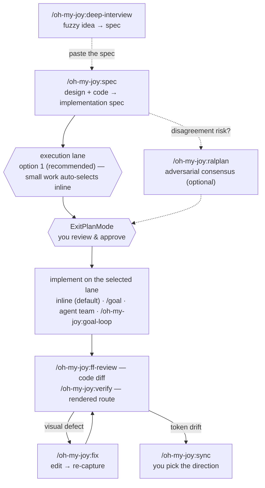

# oh-my-joy (OMJ)

English | [한국어](README.ko.md)

[](https://github.com/S-jooyoung/oh-my-joy/actions/workflows/ci.yml)
[](LICENSE)
[](package.json)

> One frontend plugin that stitches the whole code ↔ Figma loop together.

**Every frontend task starts with `/oh-my-joy:spec` — the spec it authors is the plan you approve.**
_A Plan-native primer that doesn't fight your "almost always in Plan mode" habit._

`Plan-first` · `Figma 2-track` · `interactive token sync` · `graceful degradation` · `zero runtime deps`

[Why](#why) • [Quick Start](#quick-start) • [Recommended workflow](#recommended-workflow) • [Commands](#commands) • [Design notes](#what-this-repo-demonstrates) • [Troubleshooting](#troubleshooting)

---

## Why

Handing a Figma frame to an AI agent and asking it to "build this" fails in a specific, repeatable way: the output looks close, but tokens get inlined as raw hex, responsive branches get invented, and a11y is whatever the model felt like that day. The defect is never the same twice, so you catch it in review instead of preventing it.

So OMJ inverts the obvious fix. `/oh-my-joy:spec` is **not** an implement command — it is a read-only primer that reads the design, drafts an implementation spec scored against fixed quality criteria, and **stops**. That spec *is* the native Plan you approve, and Plan mode's write block stops being an obstacle and becomes the review gate.

---

## Quick Start

```
# 1. Install (enter one line at a time)
/plugin marketplace add S-jooyoung/oh-my-joy
/plugin install oh-my-joy@omj

# 2. Check dependencies (recommended before first use)
/oh-my-joy:setup

# 3. Start — turn intent into an implementation spec (Plan), then stop → approve → implement
/oh-my-joy:spec "Search input form — React Hook Form + Zod, mobile-first" /search
```

> **Updates** ship when a release (version bump) lands on `main` — merged features don't reach existing installs until the version string changes. Pull the latest with `/plugin update oh-my-joy@omj`, then `/reload-plugins` (or a new session) to load it.

---

## Recommended workflow

First time here? Run `/oh-my-joy:setup` once — it checks the optional dependencies and scaffolds `.omj/fe-context.md`.

1. `/oh-my-joy:spec <figma-url | task> [route]` — start here for every frontend task. It reads the design and your code, authors an implementation spec, and stops. If the request or its boundaries are still fuzzy, run `/oh-my-joy:deep-interview` first and paste its result into `spec`.
2. **Approve the plan** (ExitPlanMode) — implementation starts only here, on the execution lane the spec recorded. When the design decisions carry disagreement risk, run `/oh-my-joy:ralplan` on the spec before approving.
3. **Implement on the selected lane** — inline by default; the lane rules below say when `/goal` or `/oh-my-joy:goal-loop` is worth it.
4. **Verify — whole diff once, screens per route.** `/oh-my-joy:ff-review` reviews the entire code diff in one pass (no args = your uncommitted changes; `--base main` = the whole branch). Then run `/oh-my-joy:verify <route>` for each changed route — rendered screens are checked one route at a time. When a report pins a specific visual defect, `/oh-my-joy:fix <route> "complaint"` fixes just that and re-captures; when it reports token drift, `/oh-my-joy:sync` reconciles it.



_Hexagons are your decision points; the solid spine is the recommended path; dashed = optional side paths._

**What never happens on its own.** `/oh-my-joy:spec` writes no code — authoring the spec and stopping is the entire command. Nothing is implemented, built, or committed until you approve the plan (ExitPlanMode): approval is the single doorway between spec and code, and no command in this plugin crosses it for you. Verification is never implicit either — `verify`, `ff-review`, and `sync` run only when you invoke them.

**Picking an execution lane.** The spec ends with a lane selection; option 1 is always the recommendation, labeled `(recommended)`, and small concrete work skips the question entirely (`(auto)` — approval doubles as consent).

- **inline** — the default. Small, concrete work: after approval, the current session simply implements the spec. Always available.
- **`/goal`** — persistence *within* a session: keeps this session iterating until a stated condition holds. Part of Claude Code's hooks system — unavailable where hooks are disabled.
- **agent team** — work that splits into 2+ independent lanes (screens, docs, verification): fan the approved spec out to parallel Claude subagents (coordinated agent teams are an experimental Claude Code opt-in).
- **`/oh-my-joy:goal-loop`** — persistence *across* sessions: goals live on disk (`.omj/goals/`), an interrupted run resumes with `--slug`, and completion is accepted only with recorded evidence. Available everywhere; runs outside Plan mode.

The shorthand: `/goal` is a session that won't give up; `goal-loop` is work that survives the session — pick it when tomorrow-you must continue, or when "done" needs proof. The full routing rules and thresholds live in [docs/EXECUTION-HANDOFF.md](docs/EXECUTION-HANDOFF.md) — this section carries only the selection feel, never the numbers.

---

## What a Figma link turns into

Paste a section or frame link — `spec` walks the nodes one by one (past 5 nodes it proposes splitting the work) and, for each frame:

1. **Reads the design as data, not pixels** — via the official Dev Mode MCP it pulls the layout structure, the design variables behind it, and a screenshot that becomes the baseline `verify` checks against later.
2. **Maps every color, type style, radius, and shadow to your semantic tokens** — it detects your token system (fe-context → tokens.json → Tailwind config → CSS variables), and raw hex is never an option, even in projects with no tokens.json.
3. **Keeps fidelity rules on** — original text stays, variants that don't exist in Figma are never invented, fixed px gives way to `w-full` + parent padding.
4. **Scores the spec before you see it** — six uSpec sections (Anatomy / Structure / Color·Tokens / Props·Variants / A11y / Motion), each evaluated against the FF criteria plus accessibility.

That is why the output doesn't drift the way "build this frame" prompts do: the model isn't eyeballing a screenshot — it fills a fixed skeleton from structured design data, in your token vocabulary, and the baseline it recorded is what `verify` compares the build against.

---

## A session, start to finish

Task: a search input form — React Hook Form + Zod, mobile-first, mounted at `/search`.

    /oh-my-joy:spec "Search input form — React Hook Form + Zod, mobile-first" /search

`spec` peels off `/search` as the verification route, finds no Figma URL, and runs the dev primer: it reads your existing form components, hooks, and token setup, then authors the implementation spec — six uSpec sections scored against the FF criteria, plus target files and reuse candidates. The spec ends with the execution-lane section; this task is small and concrete, so the lane line reads `(auto)` — inline, no question asked.

**You decide here.** The spec is the plan on your approval screen — edit it, reject it, or approve it (ExitPlanMode). Nothing has been written yet.

On approval, the session implements the spec inline. Then:

    /oh-my-joy:ff-review

reviews the uncommitted diff against the FF criteria + a11y and reports — report only, it changes nothing.

    /oh-my-joy:verify /search

opens `/search` in a real browser and checks the rendered page against the spec (and the Figma baseline when one exists). Say it reports a defect — the submit button clips its label at 360px. That routes to the fix loop:

    /oh-my-joy:fix /search "submit button label clipped at 360px"

`fix` edits, re-captures, and confirms the defect is gone. Had the work touched design tokens, `/oh-my-joy:sync` would reconcile them with Figma — asking you the direction on each conflict.

---

## Commands

| Command | What it does | When to use | Example |
| --- | --- | --- | --- |
| **`/oh-my-joy:spec`** | Gather specs + author an implementation spec (Plan) + recommend one execution lane, then stop (read-only primer). Infers the verify route when omitted; supports multiple Figma nodes mixed with text tasks | The starting point for every FE task | `/oh-my-joy:spec https://figma.com/design/abc?node-id=1-2 /settings/profile` |
| **`/oh-my-joy:deep-interview`** | Socratic one-question-per-round interview that turns a vague idea into a spec (native Plan, not a file) gated by a weighted ambiguity score (`--threshold N`%, default 20) — topology lock, weakest-dimension targeting, ontology-convergence tracking, restate/closure double gate (read-only). Suitability gate: refuses FE-implementation signals (Figma URL → `/oh-my-joy:spec`) and exits immediately on already-concrete input | When the goal itself is still fuzzy — before `/oh-my-joy:spec` or any implementation | `/oh-my-joy:deep-interview "internal knowledge base — still fuzzy"` |
| **`/oh-my-joy:ralplan`** | Adversarial consensus review of an *existing* spec/plan (path **or paste**): planner normalization (drivers · ≥2 viable options · ADR) → independent `plan-critic` pass → at most 2 rounds → converge to pending-approval or declare PLANNING-STUCK with the open disputes (read-only). Small unambiguous plans get "skip review and proceed" and exit early | When a plan already exists and its design decisions carry disagreement risk — vague ideas go to `/oh-my-joy:deep-interview` instead | `/oh-my-joy:ralplan ./approved-spec.md` |
| **`/oh-my-joy:ff-review`** | Review the changed FE diff against FF 4-criteria + a11y · Figma fidelity · vercel · Next.js (report only). No args = uncommitted + staged changes vs HEAD; `--base <ref>` = the whole branch since `<ref>` | Right after implementing, before a PR | `/oh-my-joy:ff-review --base main` |
| **`/oh-my-joy:verify`** | Open a route in a real browser (playwright-cli, falls back to playwright MCP) and check visuals/structure against the Figma baseline (`.omj/baselines/`); always asserts the captured page actually reached the requested route (auth redirects are reported as failures, never compared). `--base <url>` sets the dev server | Visual-regression check before a PR | `/oh-my-joy:verify /settings/profile` |
| **`/oh-my-joy:fix`** | Fix defects from a pasted screenshot + route, then re-capture to confirm (active loop). Supports `--base <url>` (dev server) and `--commit` (commit the confirmed fix) | Quick fixes for pixel/visual defects | `/oh-my-joy:fix /pricing "banner z-index too low"` |
| **`/oh-my-joy:sync`** | Reconcile drift between the token store (`tokens.json` **or CSS custom properties**) ↔ Figma by **asking you the direction**; `extract` bootstraps CSS tokens from Figma variables; `--tokens <path>` overrides the store path | Aligning code/Figma tokens · first extraction | `/oh-my-joy:sync` · `check` · `push` · `extract <figma-url>` |
| **`/oh-my-joy:setup`** | Dependency doctor + batch multi-select install + scaffolding for `.omj/fe-context.md` (adopts existing rule docs like `AGENTS.md`/`.claude/rules/` via `contextDocs:` instead of duplicating them) and opt-in token-guard hooks (the Story hook is offered only when Storybook is detected); optionally offers a GitHub star at the end (skipped silently if already starred, never blocks setup) | Before first use — `spec` also suggests it once when no setup trace exists | `/oh-my-joy:setup` · `--check` (report only) |
| **`/oh-my-joy:goal-loop`** | Durable single-owner execution loop: splits an approved spec (path **or paste** — paste is first-class) into goals persisted in `.omj/goals/`, works them one at a time, and can only mark completion through a validator script that demands an evidence object — invalid transitions, truncated ledgers, and evidence-free completes exit non-zero (run outside Plan mode) | Multi-turn work that must survive interruption and prove its completion | `/oh-my-joy:goal-loop ./approved-spec.md --slug search-form` · resume: `/oh-my-joy:goal-loop --slug search-form` |

> **read-only vs active op.** `/oh-my-joy:spec`, `/oh-my-joy:ff-review`, `/oh-my-joy:deep-interview`, and `/oh-my-joy:ralplan` are read-only (report/spec only) — `spec` may ask **at most one** post-spec execution-lane question (skipped with an `(auto)` record when inline is recommended — Plan approval doubles as lane consent), the interview asks one question per round under its own round cap, and none of them can Write/Edit/build/test. `/oh-my-joy:verify`, `/oh-my-joy:fix`, `/oh-my-joy:sync` (sync/push/extract), and `/oh-my-joy:goal-loop` (validator Bash + implementation) are active ops using Figma write / `Edit`/`Write` / Bash; if your environment blocks those in Plan mode, exit Plan mode first. Each command's syntax, arguments, and steps live in its `commands/<name>.md` (the source of truth).
>
> **Auto-trigger.** The command descriptions are written to match the two most frequent real-world patterns, so the agent can route to them without you typing the slash command: pasting a Figma Dev Mode link ("implement this design…") routes to `/oh-my-joy:spec`, and pasting a screenshot with a visual complaint ("misaligned", "clipped", "wrong spacing/color") routes to `/oh-my-joy:fix`.

### Bundled agents & opt-in hooks

- **`figma-implementer`** (agent) — implements an **approved OMJ spec** through a 5-step loop (Clarify→Context→Plan→Generate→Evaluate) as the inline-lane executor. Refuses bare Figma URLs without a spec and points to `/oh-my-joy:spec` first (no plan-gate bypass). A heavier selected lane always takes precedence.
- **`design-qa`** (agent) — a mechanical gate that only **checks**: typecheck, lint, hardcoded tokens, Figma fidelity, a11y basics, plus Story/i18n checks only when declared in fe-context. Declares no write tools (`Write`/`Edit` absent — fixed by invariant tests); it does run check commands via Bash, so not purely read-only.
- **`plan-critic`** (agent) — the adversarial plan reviewer that `/oh-my-joy:ralplan` runs for its consensus pass. Read-only by contract (`Read, Grep, Glob` — fixed by invariant tests); never invoked outside ralplan.
- **Token-guard hooks** — `check-design-tokens.mjs` (hardcoded-color warning) and `check-story-exists.mjs` (missing-Story warning) in `templates/hooks/`. **The plugin never fires them by itself** — they run only after `/oh-my-joy:setup` copies and registers them into a consuming project's `.claude/hooks/` (opt-in), and they no-op without an `.omj/fe-context.md` declaration.

### `/oh-my-joy:sync` — you choose the direction

`/oh-my-joy:sync` does not force "code always wins." **Code is the default source of truth**, but when drift exists it groups conflicts by class (value-mismatch / code-only / Figma-only) and asks the direction via `AskUserQuestion`. The first option of each question follows code authority — `code→Figma` for value-mismatch and code-only, and a conservative `skip` for Figma-only — so pressing enter stays safe.

- `/oh-my-joy:sync` (default `sync`) — interactive reconcile, asks the direction.
- `/oh-my-joy:sync check` — read-only drift report + a "suggested token code" block for Figma-only tokens.
- `/oh-my-joy:sync push` — apply code→Figma in bulk with no prompts (explicit code-wins).
- `/oh-my-joy:sync extract <figma-url>` — extract all Figma variables into CSS custom properties (`/`→`-` naming, primitive→semantic `var()` references preserved, mapping table in `docs/design-tokens.md`). Bootstraps projects with no token store yet.

> Both store formats are supported: `tokens.json` (DTCG) and CSS custom properties (`*.css`). Figma variable access requires **edit permission** — duplicate viewer-shared files first.

---

## Dependencies (all optional · graceful degradation)

Missing ones never crash — OMJ **skips + guides** instead.

| Dependency | Used by | When absent |
| --- | --- | --- |
| Official Figma Dev Mode MCP | `/oh-my-joy:spec` (read design), `/oh-my-joy:sync` (read/write Variables) | "Figma not connected — proceed with a manual spec", then continue |
| `playwright-cli` **or** playwright MCP | `/oh-my-joy:verify` · `/oh-my-joy:fix` (cli first, MCP fallback) | with neither: "no capture backend — skipping verify", then exit |
| Context7 | `/oh-my-joy:spec` · `/oh-my-joy:ff-review` · `/oh-my-joy:fix` (fetch latest Next.js docs) | that step is skipped |

> Figma writes (`/oh-my-joy:sync` push/pull, reading a design) require the **Figma desktop app running with the target file as the active tab**. MCP tool names vary by environment — check `/mcp`. A lane whose native support is absent (`/goal`, agent team) degrades to inline the same way.

---

## What this repo demonstrates

Each claim below is checkable in this repo — the artifact is named, and so is the alternative that was rejected.

- **Least privilege is declared in the manifest, not left to convention.** `/oh-my-joy:spec` ships with `allowed-tools: Read, Grep, Glob, Skill, AskUserQuestion` plus read-only Figma/Context7 MCP ([`commands/spec.md`](commands/spec.md)). No write tool is pre-approved, so a write attempt cannot happen silently — it surfaces as an explicit permission prompt, and in Plan mode `Write`/`Edit` are blocked outright. Rejected: "grant the tools and instruct the model not to use them" — prose is not an enforcement layer, which is exactly the bug class this repo once shipped (a `Bash(...)` wildcard quietly pre-approving every argument its prose forbade — found and fixed in the since-removed handoff command).
- **One source of truth per fact, and the doc facts are CI-checked.** Execution-lane thresholds live only in [`docs/EXECUTION-HANDOFF.md`](docs/EXECUTION-HANDOFF.md); commands link to it and carry at most a threshold-free fallback for when that file is unreachable. A dependency-free suite checks that the two READMEs declare the same command set and installation string, that no Korean leaks into the English page, that every relative link resolves, and that each CHANGELOG release link points at the right compare range ([`tests/docs-consistency.test.mjs`](tests/docs-consistency.test.mjs)). Rejected: restating the lane rules wherever they were needed — the pre-0.3.0 copies in the command bodies drifted within one release.
- **Every dependency is optional, by design.** Figma MCP, playwright, Context7 — each absence degrades to "skip + explain", never an error, so the plugin is useful on day one in any environment. Rejected: hard requirements, which turn a plugin into a setup project.
- **The plugin never fires hooks on its own.** Shipping `hooks/hooks.json` would make every repo with the plugin enabled run these checks; instead the scripts are templates that `/oh-my-joy:setup` copies into a project that opts in, and they no-op without an explicit declaration. This invariant is pinned by a test, not a comment ([`tests/plugin-manifest.test.mjs`](tests/plugin-manifest.test.mjs)).
- **Behaviour is tested even though it is written in Markdown.** The two hook scripts are exercised as real subprocesses against the PostToolUse contract, including the false-positive cases that made an earlier version report noise instead of signal ([`tests/hooks/`](tests/hooks)).

The reasoning behind each decision — problem → decision → rationale → outcome, plus the alternatives that were rejected and why — is in [`docs/PRINCIPLES.md`](docs/PRINCIPLES.md), which opens with an eleven-row decision table.

---

## Principles · Figma 2-track

- **Plan-native primer**: `/oh-my-joy:spec` is read-only — it drafts a spec, asks at most one execution-lane selector (skipped with `(auto)` when inline is recommended), and stops; implementation starts only after you approve (ExitPlanMode).
- **Spec format**: uSpec sections (Anatomy / Structure / Color·Tokens / Props·Variants / A11y / Motion) + FF 4-criteria + a11y + Figma fidelity (`figma-fidelity.md`) per item.
- **Token sync**: code is the default SoT, and you choose the direction on conflict (interactive). Both DTCG json and CSS custom-property stores.
- **Figma 2-track**: (A) app-screen design→code = official Dev Mode MCP; (B) design-system spec/tokens = figma-console-mcp + uSpec (v1.1+).
- **Minimal bundling**: externally-maintained knowledge is referenced only (vercel skills — `npx skills add/update`); OMJ bundles only what it owns (FF skill, 3 agents, hook templates). The plugin itself stays zero-hook — hooks fire only via opt-in copy-install.

The "why" behind each decision lives in **[docs/PRINCIPLES.md](docs/PRINCIPLES.md)**.

---

## Troubleshooting

- **`/oh-my-joy:spec` didn't change any code** — that's correct. It's a read-only primer: it drafts a spec, records the selected execution lane, and stops. Implementation starts after you approve (ExitPlanMode); for a heavy lane, the spec's lane section already printed the one line to run.
- **`/oh-my-joy:verify` / `/oh-my-joy:fix` does nothing** — no capture backend (neither playwright-cli nor playwright MCP), dev server not running (`yarn dev`), an auth-gated route, or your environment's Plan mode blocked Bash. For auth routes, declare `verifySetup` in `.omj/fe-context.md` (recommended) or `export JOY_TEST_EMAIL=… JOY_TEST_PASSWORD=…` before running — **use a test-only account**, and gitignore `.omj/baselines/` since post-login screenshots can contain session data or PII.
- **Figma not connected / no permission** — `This figma file could not be accessed` is handled gracefully. Open the Figma desktop app, put the target file in the active tab, and retry. **Variable/node access requires edit permission** — duplicate viewer-shared files (tutorials etc.) and use the copy's URL.
- **Baseline comparison not happening** — Figma asset URLs expire after ~7 days; re-run `/oh-my-joy:spec` to refresh the spec's baseline provenance. Cross-session comparison relies on the PNGs in `.omj/baselines/` (gitignore recommended). Note the PNG is **first created** only when `/oh-my-joy:verify` runs in the same session as `spec` (a fully separate session has no URL source — spec-based re-lookup is planned for v1.1).
- **`/oh-my-joy:deep-interview` ended immediately** — that's the suitability gate, not a failure: the input was already concrete enough, or it carried FE-implementation signals (a Figma URL) that route to `/oh-my-joy:spec` instead.
- **`/oh-my-joy:goal-loop` asks permission for every verification command** — intended. Verification commands are deliberately not pre-approved: the permission prompt is what makes the recorded evidence trustworthy. Also gitignore `.omj/goals/` (operational state — command summaries and paths accumulate there).
- **MCP tool names differ** — Figma/Context7 tool names vary by environment. Check the actual names with `/mcp`.
- **Duplicate committed skill copy** — if a project committed `frontend-fundamentals` into its own `.claude/skills/`, it may load alongside the OMJ bundle (harmless). Don't delete that copy (deleting it breaks teammates who cloned without OMJ installed) — just edit the source of truth in one place.

---

## Contributing

Issues and PRs are welcome. The repo is Markdown-first — there is no build step and nothing to install:

```bash
git clone https://github.com/S-jooyoung/oh-my-joy.git
cd oh-my-joy
npm test                 # Node 20+ built-ins only, no npm install
npm run validate-plugin  # manifest + frontmatter conformance
```

To try your change as a real plugin, `/plugin marketplace add <path to your clone>` then `/plugin install oh-my-joy@omj`.

Two things worth knowing before your first PR: a feature is incomplete until **README (both languages), CHANGELOG, and — if a principle moved — `docs/PRINCIPLES.md`** change in the same commit; and `allowed-tools` must never declare a tool the command body does not call. Both are test-enforced. The full guide is [CONTRIBUTING.md](CONTRIBUTING.md).

Found a security problem? Do not open an issue — see [SECURITY.md](SECURITY.md).

## License

[MIT](LICENSE). Methodology borrowed from other projects is credited in [NOTICE.md](NOTICE.md).
