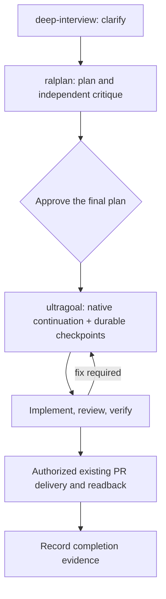

# oh-my-joy (OMJ)

English | [한국어](README.ko.md)

[](https://github.com/S-jooyoung/oh-my-joy/actions/workflows/ci.yml)
[](LICENSE)
[](package.json)

> One plugin for the whole loop — from a fuzzy idea to a pull request — with the code ↔ Figma frontend loop built in as a first-class mode.

**Enter once (`/oh-my-joy:ralplan` in Claude Code or `$oh-my-joy:ralplan` in Codex), approve the plan, and the plan's completion procedure runs review and verify for you. `ultragoal` manages execution and resume; `ship` remains explicit for new PRs.**
_A Plan-native workflow that doesn't fight your "almost always in Plan mode" habit._

| Your input | Enter with |
| --- | --- |
| Fuzzy — no file to name, no criterion you could check | `/oh-my-joy:deep-interview` — one question per round; at the end it automatically hands the requirements to `/oh-my-joy:ralplan` |
| Concrete — a Figma link, a task in words, file names | `/oh-my-joy:ralplan` — reads the code or the design, builds the plan, critiques it (an independent critic on non-trivial plans) |

Both end the same way: a `## Critique` section, the execution lane, the completion procedure. Pick the wrong one and it points you to the other.

| Surface | What it is |
| --- | --- |
| Runtime syntax | Claude Code: `/oh-my-joy:<name>` · Codex: `$oh-my-joy:<name>` |
| You type | `/oh-my-joy:deep-interview` (only when fuzzy) → `/oh-my-joy:ralplan` → approve → `/oh-my-joy:ultragoal` |
| Inside ultragoal | `/oh-my-joy:review` → `/oh-my-joy:verify` → `/oh-my-joy:fix` loop, because the plan you approved says so |
| Occasional tools | `/oh-my-joy:sync` (design tokens), `/oh-my-joy:setup` (dependencies, scaffolding) |
| Internal, never typed | `critic` (architect + critic lenses, fresh context), `implementer`, `design-qa` |

`Plan-first` · `evidence, not vibes` · `Figma section walk` · `native Agent Teams` · `graceful degradation` · `zero runtime deps`

[Why](#why) • [Quick Start](#quick-start) • [How to use OMJ](#how-to-use-omj) • [Recommended workflow](#recommended-workflow) • [Commands](#commands) • [How this plugin evolves](#how-this-plugin-evolves) • [Troubleshooting](#troubleshooting)

---

## Why

Handing a task to an AI agent and asking it to "build this" fails in a specific, repeatable way: the output looks close, tokens get inlined as raw hex, a branch nobody asked for appears, "done" is announced with no test having run, and the next stage never sees what the previous one decided. The defect is never the same twice, so you catch it in review instead of preventing it.

So OMJ inverts the obvious fix. The entry commands are **not** implement commands — they are read-only primers that read the design or the code, draft an implementation spec scored against fixed criteria, record how the work will be executed and checked, and **stop**. That spec *is* the native Plan you approve. After approval the session follows the plan's completion procedure — implement, review, verify — and nothing counts as done without evidence (a command, its exit code, a summary). Plan mode's write block stops being an obstacle and becomes the review gate.

---

## Quick Start

### Claude Code

```
# 1. Install (enter one line at a time)
/plugin marketplace add S-jooyoung/oh-my-joy
/plugin install oh-my-joy@omj

# 2. Check dependencies and opt into the extras you want (recommended before first use)
/oh-my-joy:setup

# 3. Start — a concrete task becomes an implementation spec (Plan) with its critique, then stop → approve → the plan runs
/oh-my-joy:ralplan "Search input form — React Hook Form + Zod, mobile-first" /search

#    …or start from a design — the same command takes the Figma link
/oh-my-joy:ralplan https://figma.com/design/abc?node-id=1-2 /search

#    …or from something that isn't frontend at all
/oh-my-joy:ralplan "rate-limit middleware for the public API — 100 req/min per key"

# 4. When review and verify are green, ship it
/oh-my-joy:ship "feat: search form"
```

### Codex

```bash
# 1. Install from the same public marketplace
codex plugin marketplace add S-jooyoung/oh-my-joy
codex plugin add oh-my-joy@omj

# 2. Start a new Codex thread so the plugin skills are loaded, then run setup
$oh-my-joy:setup

# 3. Create the native Plan, approve it, and let its completion procedure run
$oh-my-joy:ralplan "Search input form — React Hook Form + Zod, mobile-first" /search

# 4. Ship only when review and verification are green
$oh-my-joy:ship "feat: search form"
```

Codex exposes the same ten workflow entry points (including the `spec` compatibility alias) and three internal roles. Answer style uses project instructions, status indicators use the native Codex CLI footer, and hooks handle Codex write events. Codex App has no custom HUD slot. See the complete [host capability inventory](docs/HOST-PARITY.md).

> **Updates** ship when a release (version bump) lands on `main` — merged features don't reach existing installs until the version string changes. In Claude Code, run `/plugin update oh-my-joy@omj`, then `/reload-plugins`. In Codex, run `codex plugin marketplace upgrade omj` followed by `codex plugin add oh-my-joy@omj`. Start a new session/thread after either update.
>
> **Upgrading from v0.8?** v0.9.0 keeps every command and adds a critique gate and execution rules:
>
> | Old name | Now |
> | --- | --- |
> | `figma-implementer` (agent) | `implementer` — the same executor with a frontend mode and a general mode, now the teammate type for every Dispatch row |
>
> `/oh-my-joy:ralplan` ends with a `## Critique` section before final approval (decision record, simulated tasks against your files, a ready verdict — plus two read-only `critic` readings in fresh contexts on non-trivial plans), `/oh-my-joy:deep-interview` hands its requirements to `ralplan` through an exit bridge, and the completion procedure asks no questions between approval and the report — blockers are classified and reported. These v0.9 changes are retained under the new ralplan entry point.
>
> **Upgrading from v0.7?** v0.8.0 generalized the spine and trimmed the surface:
>
> | Old command | Now |
> | --- | --- |
> | `ff-review` | `/oh-my-joy:review` — the same frontend rubric, plus a general mode for every other file |
> | `ralplan` | restored as the planning entry point, including the former spec behavior |
> | `goal-loop` | replaced by `/oh-my-joy:ultragoal`; legacy state is preserved, not silently migrated |
>
> Everything else is unchanged: the `.omj/` state directory, the `oh-my-joy@omj` install string, and the hook output.
>
> **Upgrading from v0.6?** v0.7.0 moved every command under the single `/oh-my-joy:` namespace:
>
> | Old command | Now |
> | --- | --- |
> | `omj` (the bare root command) | `/oh-my-joy:ralplan` |
> | `omj-verify` | `/oh-my-joy:verify` |
> | `omj-fix` | `/oh-my-joy:fix` |
> | `omj-sync` | `/oh-my-joy:sync` |
> | `omj-setup` | `/oh-my-joy:setup` |
> | `omj-start` | removed — approved ralplan hands off to ultragoal automatically |
>
> One trap: the once-announced `omj-spec` (design-system spec, v1.1) is now planned as `/oh-my-joy:ds-spec`, not `ralplan`. Full mapping and rationale: [CHANGELOG](CHANGELOG.md), sections 0.8.0 and 0.7.0.

### Maintaining the OMJ repository

Inside the OMJ source checkout, use `/release` in Claude Code or `$oh-my-joy:release` in Codex. `$oh-my-joy:release-checklist` checks release and installation readiness. Both hosts follow [one release procedure](docs/RELEASING.md); these repository-local skills do not enter the consuming-project workflow list.

---

## How to use OMJ

Six situations cover most days. Each is the exact sequence you type; every spec critiques itself before you see it, and everything between approval and ship happens on its own because the approved plan says so.

**1. One Figma screen**

```
/oh-my-joy:ralplan https://figma.com/design/abc?node-id=1-2 /checkout
  → the spec ends with ## Critique → approve the plan → implement → /oh-my-joy:review → /oh-my-joy:verify /checkout → fix loop → report (automatic)
/oh-my-joy:ship "feat(checkout): summary panel"
```

**2. A large Figma frame (several sections)**

```
/oh-my-joy:ralplan https://figma.com/design/abc?node-id=1-2 /checkout
  → spec reads the frame section by section and ends with a Dispatch table and its ## Critique; the agent-team lane is recommended — the final plan records the lane
  → approve the plan
  → ultragoal automatically dispatches one implementer teammate per section (needs CLAUDE_CODE_EXPERIMENTAL_AGENT_TEAMS=1; without it the work runs sequentially)
  → teammates finish with evidence → /oh-my-joy:verify /checkout is the barrier → /oh-my-joy:review → report (automatic)
/oh-my-joy:ship "feat(checkout): all sections"
```

**3. A frontend feature described in words**

```
/oh-my-joy:ralplan "search input form — React Hook Form + Zod, mobile first" /search
  → the spec ends with ## Critique → approve → implement → review → verify /search → fix loop → report (automatic)
/oh-my-joy:ship "feat: search form"
```

**4. Anything that isn't frontend (backend, scripts, this plugin)**

```
/oh-my-joy:ralplan "rate-limit middleware for the public API — 100 req/min per key"
  → the spec lists acceptance criteria and the verification commands it found (verifyCommands or package.json scripts), then critiques itself against your files
  → approve → implement → /oh-my-joy:review (general mode) → /oh-my-joy:verify (evidence mode: runs the commands, records exit codes) → report (automatic)
/oh-my-joy:ship "feat(api): rate limiter"
```

**5. Still fuzzy about what to build**

```
/oh-my-joy:deep-interview "notification system overhaul — not sure where to start"
  → one question per round until the ambiguity score passes → the exit bridge hands the requirements to /oh-my-joy:ralplan (automatically, without another handoff question)
  → the spec, with its ## Critique, is the plan → approve → the same completion procedure
/oh-my-joy:ship
```

**6. A visual defect, or drifting design tokens**

```
/oh-my-joy:fix /pricing "banner z-index too low"        edit → re-capture → confirm
/oh-my-joy:sync                                         you pick the direction per drift class
```

Every command also works on its own — a colleague's diff (`/oh-my-joy:review --base main`), a re-check (`/oh-my-joy:verify /checkout`), tokens only (`/oh-my-joy:sync check`).

---

## Recommended workflow

First time here? Run `/oh-my-joy:setup` once — it checks the optional dependencies, offers the Agent Teams flag and the OMJ answer style, and scaffolds `.omj/fe-context.md`.

1. **Enter** — `/oh-my-joy:ralplan <figma-url | task> [route]` for anything concrete (Figma, frontend text, or general text); `/oh-my-joy:deep-interview` when the goal itself is still fuzzy. Both author a spec, critique it against the real code (decision record, simulated tasks, a ready verdict), record the execution lane and the completion procedure, and stop.
2. **Approve the plan** (ExitPlanMode) — implementation starts only here, on the lane the spec recorded. The plan records its recommended native execution lane without a separate lane approval.
3. **Ultragoal runs** — `/oh-my-joy:ultragoal` records the approved plan, then implements on the native lane (no questions asked; blockers are classified and reported), then `/oh-my-joy:review` (the diff against the rubric and the spec's acceptance criteria), then `/oh-my-joy:verify` (a route in a real browser, or the verification commands with exit codes), then the `/oh-my-joy:fix` loop for frontend defects, then a report with evidence.
4. **Ship** — `/oh-my-joy:ship "<title>"` re-runs the verification commands, commits with your conventions, pushes, and opens the PR with the evidence attached. Pass `--base develop` (or answer its one question) on teams that merge into `develop`. This step is never automatic.

**The spine at a glance.** Each stage is a gate with one job.

| Stage | Gate | What it checks |
| --- | --- | --- |
| `/oh-my-joy:deep-interview` | clarity — only when the goal is fuzzy; concrete input starts at the next row | ambiguity at or below the threshold, with a floor the score cannot dip under; ends by automatically handing the requirements to `ralplan` |
| `/oh-my-joy:ralplan` | feasibility | the critique: a self-check (decision record, simulated tasks against the real files), then two `critic` agents in fresh contexts on non-trivial plans, a ready verdict |
| approval (ExitPlanMode) | consent | you read the spec and its critique; nothing has run |
| `/oh-my-joy:ultragoal` | durable completion | native goal continuation plus per-goal verification, independent review, and recorded resume checkpoints |
| `/oh-my-joy:review` | delta ratchet | acceptance criteria against the diff, an independent `critic` pass on non-trivial diffs; a second pass reports only what changed |
| `/oh-my-joy:verify` | evidence by kind | test report · command replay · browser capture, each with an exit code |
| `/oh-my-joy:ship` | yours | verification commands, commit, push, PR |



Durable execution requires Node.js 20+ and a Git worktree. For a new folder, the plan must explicitly include local Git initialization before ultragoal can create its records.

The user enters once and approves the final plan once. `/oh-my-joy:spec` remains a compatibility alias for `/oh-my-joy:ralplan`, including Figma input. The plan chooses inline or native parallel execution; native goal support supplies continuation where exposed. OMJ does not require a second goal command, clear unrelated goals, or bypass a host permission prompt. Without a callable goal surface, the same-session loop and file-based resume remain available; background continuation is not promised.

`/oh-my-joy:ultragoal resume <slug>` (also `--resume <slug>`) continues an approved run in the same checkout, including after switching between Claude Code and Codex. `/oh-my-joy:ultragoal status <slug>` inspects it. The approved plan and acceptance criteria stay fixed; a materially different scope returns to planning. A new checkout needs a new run; copying state does not transfer authority.

For an explicit request to process an existing PR's reviews, the plan includes triage, owned fixes, verification, ordinary commits/pushes to that PR branch, and replies. One final approval authorizes those listed actions. A URL alone or a report-only review request authorizes reading only. Replies and the remote head must be read back before delivery is complete. New PRs and merges are outside this automatic flow; use `/oh-my-joy:ship` for a new PR.

The exact host mapping, fallback, and completion contract are in [docs/EXECUTION-HANDOFF.md](docs/EXECUTION-HANDOFF.md).

---

## What a Figma link turns into

Paste a section or frame link — `ralplan` reads it as data, and for each frame:

1. **Reads the design as data, not pixels** — via the official Dev Mode MCP it pulls the layout structure, the design variables behind it, and a screenshot that becomes the baseline `verify` checks against later.
2. **Walks large frames section by section** — a frame with three or more top-level sections is read one section at a time (metadata first, then one design-context call per section), because a single call over a big frame comes back flattened. The spec gets a per-section breakdown and a Dispatch table that maps each section to the files that will own it; more than eight sections and it proposes splitting the link.
3. **Maps every color, type style, radius, and shadow to your semantic tokens** — it detects your token system (fe-context → tokens.json → Tailwind config → CSS variables), and raw hex is never an option, even in projects with no tokens.json.
4. **Keeps fidelity rules on** — original text stays, variants that don't exist in Figma are never invented, fixed px gives way to `w-full` + parent padding.
5. **Scores the spec before you see it, then critiques it** — six uSpec sections (Uber's design-spec taxonomy: Anatomy / Structure / Color·Tokens / Props·Variants / A11y / Motion), each evaluated against the FF criteria (Toss frontend-fundamentals: readability, predictability, cohesion, coupling) plus accessibility; then two or three representative tasks are simulated against your files and the `## Critique` section records the decision record and the verdict.

That is why the output doesn't drift the way "build this frame" prompts do: the model isn't eyeballing a screenshot — it fills a fixed skeleton from structured design data, in your token vocabulary, at the right granularity, and the baseline it recorded is what `verify` compares the build against.

---

## A session, start to finish

Task: a search input form — React Hook Form + Zod, mobile-first, mounted at `/search`.

Starting from a design instead? The same command takes the link — `/oh-my-joy:ralplan https://figma.com/design/abc?node-id=1-2 /search` — and runs the Figma track described above; everything from the spec onward is identical. Starting from a backend task? Same command, and the spec's skeleton becomes goal / constraints / acceptance criteria / verification commands.

    /oh-my-joy:ralplan "Search input form — React Hook Form + Zod, mobile-first" /search

`ralplan` peels off `/search` as the verification route, finds no Figma URL, recognizes a frontend task, and reads your existing form components, hooks, and token setup, then authors the implementation spec — six uSpec sections scored against the FF criteria, plus target files and reuse candidates. The plan ends with goal units, acceptance checks, authorized delivery, and the automatic ultragoal handoff; a small task executes inline after approval.

**You decide here.** The spec is the plan on your approval screen — edit it, reject it, or approve it (ExitPlanMode). Nothing has been written yet.

On approval, the session invokes ultragoal automatically, implements this small plan inline, and records per-goal verification and independent review while following the approved procedure:

    /oh-my-joy:review        the diff against the FF criteria + a11y and the spec's acceptance criteria — report only
    /oh-my-joy:verify /search   opens /search in a real browser and checks it against the spec and the Figma baseline

Say verify reports a defect — the submit button clips its label at 360px. The procedure routes it to the fix loop:

    /oh-my-joy:fix /search "submit button label clipped at 360px"

`fix` edits, re-captures, and confirms the defect is gone; the session reports with the evidence. Then the one line that is yours:

    /oh-my-joy:ship "feat: search form"

`ship` re-runs the verification commands, commits with your project's conventions, pushes, and opens the PR with the evidence table in its body. Had the work touched design tokens, `/oh-my-joy:sync` would reconcile them with Figma — asking you the direction on each conflict.

---

## Commands

| Command | Tier | What it does | When to use | Example |
| --- | --- | --- | --- | --- |
| **`/oh-my-joy:spec`** | compatibility | Alias for ralplan; existing Figma and general-task calls keep working | Existing prompts | `/oh-my-joy:spec "add search"` |
| **`/oh-my-joy:ultragoal`** | after approval | Execute the approved plan, record goal evidence, review, verify, and resume; `resume <slug>` and `status <slug>` | Approved work or an interrupted run | `/oh-my-joy:ultragoal resume checkout` |
| **`/oh-my-joy:ralplan`** | you | Read the input (Figma link with a section walk for large frames, frontend text, or general text), author the implementation spec (Plan), critique it against the real code (`## Critique`: decision record, simulated tasks, ready verdict; two `critic` readings in fresh contexts on non-trivial plans), record the execution lane and the completion procedure, then stop (read-only). Also takes an interview's requirements from the session as input. Infers the verify route when omitted; sends text with no verifiable target to the interview | The starting point for every concrete task | `/oh-my-joy:ralplan https://figma.com/design/abc?node-id=1-2 /settings/profile` |
| **`/oh-my-joy:deep-interview`** | you | Socratic one-question-per-round interview that turns a vague idea into a spec (native Plan) gated by a weighted ambiguity score (`--threshold N`%, default 20) — topology lock, weakest-dimension targeting, ontology tracking, an ambiguity floor, restate/closure double gate (read-only); ends with an exit bridge — automatically hand the requirements to `ralplan`; unresolved research prerequisites stay explicit. Exits immediately on already-concrete input and routes Figma links to `ralplan` | When the goal itself is still fuzzy | `/oh-my-joy:deep-interview "internal knowledge base — still fuzzy"` |
| **`/oh-my-joy:ship`** | you | Run the verification commands (every one must exit 0), commit on a branch with your conventions and language, push, and open the PR with the evidence table in its body (your PR template when the repo has one). `--base <ref>` picks the PR base; otherwise ship reuses an unambiguous established base and asks only when the target remains unclear. Never commits on a shared branch (`main`, `develop`, …): with changes it branches off first, on a clean `develop` it opens the promotion PR. Pre-approves only git/gh/typecheck — test runners go through the permission prompt on purpose | The last step, always typed by you | `/oh-my-joy:ship "feat(checkout): summary panel"` |
| **`/oh-my-joy:review`** | the plan | Review the changed diff and report only — frontend files against the FF 4 criteria + a11y · Figma fidelity · vercel · Next.js (Context7); every other file for correctness, simplicity, consistency, and test coverage; an approved spec's acceptance criteria are checked against the diff; non-trivial diffs get an independent `critic` pass in a fresh context; a second pass on the same change reports the delta (prior findings resolved or not, then only what changed). No args = uncommitted + staged vs HEAD; `--base <ref>` = the whole branch | Right after implementing (the plan runs it), or on anyone's diff | `/oh-my-joy:review --base main` |
| **`/oh-my-joy:verify`** | the plan | Prove the work. With a route: open it in a real browser (playwright-cli, MCP fallback) and check it against the Figma baseline (`.omj/baselines/`), always asserting the page actually reached the route. Without a route: run the project's verification commands and record `command · exit code · summary` with the evidence kind. `--base <url>` sets the dev server | The plan runs it after review; also the barrier after teammates finish | `/oh-my-joy:verify /settings/profile` · `/oh-my-joy:verify` |
| **`/oh-my-joy:fix`** | the plan | Fix defects on a route (required) from a pasted screenshot and/or a complaint, then re-capture to confirm (active loop). `--base <url>`, `--commit` | Visual defects verify found | `/oh-my-joy:fix /pricing "banner z-index too low"` |
| **`/oh-my-joy:sync`** | occasional | Reconcile drift between the token store (`tokens.json` or CSS custom properties) ↔ Figma by asking you the direction; `extract` bootstraps CSS tokens from Figma variables; `--tokens <path>` overrides the store path | Aligning code/Figma tokens · first extraction | `/oh-my-joy:sync` · `check` · `push` · `extract <figma-url>` |
| **`/oh-my-joy:setup`** | occasional | Dependency doctor + one multi-select install for anything missing + scaffolding: `.omj/fe-context.md` (adopts existing rule docs via `contextDocs:`, scaffolds `verifyCommands:` from package.json as comments), opt-in token-guard hooks, host-native status indicators, available native agents, and the OMJ answer style; offers a GitHub star at the end (never blocks) | Before first use — `ralplan` suggests it once when no setup trace exists | `/oh-my-joy:setup` · `--check` (report only) |

> **Read-only and execution.** `deep-interview` and the `spec` alias have no write tools or shell pre-approvals. `ralplan` reads code, design, and PR data without modifying source. `ultragoal` runs only after approval. Verification is executed and its actual exit code is recorded; tool permission settings remain under the host's control. Each workflow's canonical contract is in `commands/<name>.md`.

>
> **Auto-trigger.** The command descriptions match the most frequent real-world patterns, so the agent can route without you typing the slash command: pasting a Figma Dev Mode link ("implement this design…") routes to `/oh-my-joy:ralplan`, and pasting a screenshot with a visual complaint ("misaligned", "clipped") routes to `/oh-my-joy:fix`.

### Bundled agents, answer style, and opt-in extras

- **`critic`** (agent) — a read-only reviewer that `ralplan` spawns for non-trivial plans (two instances: architect lens and critic lens) and `review` spawns for non-trivial diffs, in a fresh context that did not write the material. Returns a verdict and findings, edits nothing; declares exactly `Read`, `Grep`, `Glob` (pinned by tests). Never typed.
- **`implementer`** (agent) — implements an **approved OMJ spec** through a 5-step loop (Clarify → Context → Plan → Generate → Evaluate) in frontend mode (uSpec, Figma, a route) or general mode, as the inline-lane executor and as the teammate type for every Dispatch row: one instance per row, editing only that row's files, asking nothing mid-run, classifying blockers, and reporting completion with evidence. Refuses spec-less input (no plan-gate bypass).
- **`design-qa`** (agent) — a mechanical gate that only **checks**: typecheck, lint, hardcoded tokens, Figma fidelity, a11y basics, plus Story/i18n checks only when declared in fe-context. Declares no write tools (pinned by tests).
- **OMJ answer style** (`output-styles/oh-my-joy.md`, opt-in) — natural answers in your language, learner-friendly explanations, and automatic approved handoffs; Korean writing rules are adapted from [fluent-korean](https://github.com/snflkd/fluent-korean) and credited in [`NOTICE.md`](NOTICE.md). Claude Code selects it in setup or **Output style** in `/config`. Codex setup copies the same body into `.omj/answer-style.md` and links it from the effective project `AGENTS.md` or `AGENTS.override.md`, preserving existing instructions. Start a new session after selection.
- **Token-guard hooks** — `check-design-tokens.mjs` warns about hardcoded colors; `check-story-exists.mjs` warns about missing Stories. Setup copies selected checks into `.claude/hooks/` or `.codex/hooks/`; Codex also gets a command-payload adapter and `.codex/hooks.json`. Hooks require project declarations and native host trust. They remain advisory and fail-open, with no plugin-wide auto-firing. Unknown shell edits are outside the Codex adapter’s coverage.
- **OMJ HUD statusline** — Claude Code copy-installs `hud/` into `~/.claude/omj-hud/` and registers `statusLine` on selection. Codex CLI uses native `tui.status_line` for model, branch, context remaining, and usage limits. Codex App has no custom HUD slot. Attribution is in [`NOTICE.md`](NOTICE.md); host-specific settings are in [`hud/README.md`](hud/README.md).

### `/oh-my-joy:sync` — you choose the direction

`/oh-my-joy:sync` does not force "code always wins." **Code is the default source of truth**, but when drift exists it groups conflicts by class (value-mismatch / code-only / Figma-only) and asks the direction via `AskUserQuestion`. The first option of each question follows code authority — `code→Figma` for value-mismatch and code-only, and a conservative `skip` for Figma-only — so pressing enter stays safe.

- `/oh-my-joy:sync` (default `sync`) — interactive reconcile, asks the direction.
- `/oh-my-joy:sync check` — read-only drift report + a "suggested token code" block for Figma-only tokens.
- `/oh-my-joy:sync push` — apply code→Figma in bulk with no prompts (explicit code-wins).
- `/oh-my-joy:sync extract <figma-url>` — extract all Figma variables into CSS custom properties (`/`→`-` naming, primitive→semantic `var()` references preserved, mapping table written to your project's `docs/design-tokens.md`).

> Both store formats are supported: `tokens.json` (DTCG) and CSS custom properties (`*.css`). Figma variable access requires **edit permission** — duplicate viewer-shared files first.

---

## Optional integrations (graceful degradation)

Missing ones never crash — OMJ **skips + guides** instead.

| Dependency | Used by | When absent |
| --- | --- | --- |
| Official Figma Dev Mode MCP | `/oh-my-joy:ralplan` (read design), `/oh-my-joy:sync` (read/write Variables) | "Figma not connected — proceed with a manual spec", then continue |
| `playwright-cli` **or** playwright MCP | `/oh-my-joy:verify` browser mode · `/oh-my-joy:fix` (cli first, MCP fallback) | with neither: "no capture backend — skipping verify", then exit; evidence mode still works |
| Context7 | `/oh-my-joy:ralplan` · `/oh-my-joy:review` · `/oh-my-joy:fix` (fetch latest Next.js docs) | that step is skipped |
| `CLAUDE_CODE_EXPERIMENTAL_AGENT_TEAMS=1` | the agent-team lane (native Agent Teams) | the lane degrades to subagents, then to inline |

> Figma writes (`/oh-my-joy:sync` push/pull, reading a design) require the **Figma desktop app running with the target file as the active tab**. MCP tool names vary by environment — check `/mcp`.

---

## What OMJ writes into your repo

- `.omj/goals/<slug>/` — approved brief, versioned goals, append-only event ledger, and verification artifacts written by ultragoal. Keep these local; do not commit private PR feedback or command output.
- `.omj/fe-context.md` — your project's declarations (acceptance axes, token path, verify setup, `verifyCommands`). **Meant to be committed.**
- `.omj/baselines/` — capture baselines. Gitignore this directory and `.omj/goals/`; ignoring `.omj/` wholesale would also lose the committed fe-context.
- Selected hook copies in `.claude/hooks/` or `.codex/hooks/`, plus host-specific registration — only when selected in setup.
- `~/.claude/omj-hud/` (plus a `statusLine` entry), the Agent Teams `env` flag, and the `outputStyle` selection in `~/.claude/settings.json` — user-global, each only when you opt in during `/oh-my-joy:setup`.
- Codex selections: `.omj/answer-style.md` plus its project instruction link, and the CLI footer in `.codex/config.toml`. Setup records completion in `.omj/setup.json`.
- On demand: your project's `docs/design-tokens.md` (the `sync extract` mapping table) and `docs/DESIGN.md` (a setup scaffold).

Host-specific setup is defined in [`commands/setup.md`](commands/setup.md) and [`docs/CODEX-SETUP.md`](docs/CODEX-SETUP.md).

---

## What this repo demonstrates

Each claim below is checkable in this repo — the artifact is named, and so is the alternative that was rejected.

- **Least privilege is declared in the manifest, not left to convention.** `/oh-my-joy:ralplan` ships with read-only repository and PR inspection plus Figma/Context7 tools ([`commands/ralplan.md`](commands/ralplan.md)); `/oh-my-joy:ship` pre-approves only git, gh, and the typecheck, never a test runner ([`commands/ship.md`](commands/ship.md)). Read-only planning does not grant source writes; execution follows the approved scope and host permissions. Rejected: "grant the tools and instruct the model not to use them" — prose is not an enforcement layer.
- **One source of truth per fact, and the doc facts are CI-checked.** Execution-lane thresholds and the completion procedure live only in [`docs/EXECUTION-HANDOFF.md`](docs/EXECUTION-HANDOFF.md). A dependency-free suite checks that the two READMEs declare the same command set and installation string, that no Korean leaks into the English pages, that every relative link resolves, and that retired command and agent names stay in the migration tables ([`tests/docs-consistency.test.mjs`](tests/docs-consistency.test.mjs)).
- **Prompt bodies follow the prompting guide, and a test says so.** Every command, agent, skill, and style body states what to do and why, without shouted imperatives, emphasis inflation, or warning glyphs, and keeps examples in `<example>` tags ([`tests/prompt-style.test.mjs`](tests/prompt-style.test.mjs)). Rejected: a style checklist in a contributing guide — it held for exactly one release.
- **Integrations are optional.** Figma MCP, playwright, Context7, and Agent Teams each have a documented fallback. Durable execution requires Node.js 20+, a Git worktree, and independent review before completion.
- **The plugin never fires hooks or forces a style on its own.** No `hooks/hooks.json`, no `force-for-plugin` on the answer style; both are opt-in installs by `/oh-my-joy:setup`, pinned by [`tests/plugin-manifest.test.mjs`](tests/plugin-manifest.test.mjs).
- **Behaviour is tested even though it is written in Markdown.** The hook scripts run as real subprocesses against the PostToolUse contract ([`tests/hooks/`](tests/hooks)), and the commands have behavioral eval cases ([`evals/`](evals)).

The reasoning behind each decision — problem → decision → rationale → outcome, plus the alternatives that were rejected and why, and which ideas from other projects were adopted or declined — is in [`docs/PRINCIPLES.md`](docs/PRINCIPLES.md), which opens with a twelve-row decision table.

---

## Principles · Figma 2-track

- **Plan-native primers, critique before consent**: `/oh-my-joy:ralplan` and `/oh-my-joy:deep-interview` are read-only — they draft a spec, critique it against the real code (`## Critique`), record the lane and the completion procedure, and stop; implementation starts only after you approve.
- **Evidence rule**: "done" means a command, its exit code, a summary, and the evidence kind — recorded by `verify` (evidence mode), `ship`, and agent-team teammates. Verification commands are never pre-approved.
- **Execution asks nothing**: between approval and the report the session asks no questions; a blocker is `resolvable` (three approaches first) or `human-only` (stop, say what you must do), and every assumption made where the plan was silent is listed in the report.
- **Spec format**: uSpec sections + FF 4-criteria + a11y + Figma fidelity ([`figma-fidelity.md`](skills/frontend-fundamentals/references/figma-fidelity.md)) for frontend; goal / constraints / acceptance criteria / verification commands for everything else.
- **Token sync**: code is the default SoT, and you choose the direction on conflict (interactive). Both DTCG json and CSS custom-property stores.
- **Figma 2-track**: (A) app-screen design→code = official Dev Mode MCP, walked section by section on large frames; (B) design-system spec/tokens = figma-console-mcp + uSpec (v1.1+).
- **Borrow methodology, not surface**: externally maintained knowledge is referenced (vercel skills — `npx skills add/update`); OMJ bundles only what it owns (FF skill, 3 agents, hook templates, the answer style, the evals); methodologies from other projects are absorbed as credited rewrites, and declined ideas are recorded with their reasons.

The "why" behind each decision lives in **[docs/PRINCIPLES.md](docs/PRINCIPLES.md)**.

---

## How this plugin evolves

Command bodies are prompts, so "a small wording change" is a behavior change. OMJ measures them: `evals/` holds a behavioral case per command (native `claude plugin eval` when your organization has it, otherwise the `claude -p` fallback runner — same case files), `npm run eval` scores them with a threshold, and a change to a command body adds or updates the case that observes it. Every run drives a real session, so run only the case for the body you changed, once (`--case <name> --runs 1`), and keep the three-run suite for a release; the runner checks its cost ceiling before each run and saves every run's output for reading. On every PR, [`tests/token-budget.test.mjs`](tests/token-budget.test.mjs) keeps the always-on description cost under a ratcheted budget, so the surface cannot grow silently. The loop is written down in [docs/EVALS.md](docs/EVALS.md).

---

## Troubleshooting

- **`/oh-my-joy:ralplan` didn't change any code** — that's correct. It is a read-only primer: it drafts the plan and stops at final approval. After approval, the same session invokes ultragoal automatically.
- **After approval, review and verify ran without me typing them** — also correct: the plan you approved ends with a completion procedure that names them. `/oh-my-joy:ship` is never part of it.
- **`/oh-my-joy:verify` / `/oh-my-joy:fix` does nothing in browser mode** — no capture backend (neither playwright-cli nor playwright MCP), dev server not running, an auth-gated route, or your environment's Plan mode blocked Bash. The dev-server URL resolves as `--base <url>` > an exported `JOY_BASE_URL` > `http://localhost:3000`; an inline `JOY_BASE_URL=… /oh-my-joy:verify` prefix does not apply (slash commands are not a shell). For auth routes, declare `verifySetup` in `.omj/fe-context.md` or `export JOY_TEST_EMAIL=… JOY_TEST_PASSWORD=…` before running — **use a test-only account**, and gitignore `.omj/baselines/`.
- **`/oh-my-joy:verify` or `/oh-my-joy:ship` asks permission for every test command** — intended. Verification commands are deliberately not pre-approved: the permission prompt is what makes the recorded evidence trustworthy.
- **`/oh-my-joy:ship` opened the PR against the wrong branch** — pass `--base <branch>` to override an established base; ship asks only if the target is still unclear; `gh pr edit <n> --base <branch>` fixes an already-open PR. Running ship while sitting on `develop` with changes is safe: it branches off first instead of committing there.
- **`/oh-my-joy:verify` or `/oh-my-joy:ship` says "no verification command declared"** — add `verifyCommands:` to `.omj/fe-context.md` (or a `test` script to `package.json`); OMJ will not invent a command to run.
- **The agent-team lane ran sequentially** — `CLAUDE_CODE_EXPERIMENTAL_AGENT_TEAMS=1` is not set (experimental, off by default). `/oh-my-joy:setup` offers to add it; without it the lane degrades to subagents, then to inline. Teammates start with the lead's permission mode, so pre-approve routine commands before spawning.
- **The answer style did not change anything** — start a new session. In Claude Code, check **Output style** in `/config`. In Codex, check the effective project instruction file links `.omj/answer-style.md`; an existing `AGENTS.override.md` takes precedence over `AGENTS.md`.
- **Figma not connected / no permission** — `This figma file could not be accessed` is handled gracefully. Open the Figma desktop app, put the target file in the active tab, and retry. Variable/node access requires edit permission — duplicate viewer-shared files and use the copy's URL.
- **Baseline comparison not happening** — Figma asset URLs expire after ~7 days; re-run `/oh-my-joy:ralplan` to refresh the spec's baseline provenance. Cross-session comparison relies on the PNGs in `.omj/baselines/` (gitignore recommended); the PNG is first created only when `/oh-my-joy:verify` runs in the same session as `ralplan`.
- **`/oh-my-joy:ralplan` asked me a question before showing the plan** — the critique gate found items still open after two revisions (a target that does not exist, a criterion nobody can check). Answer once and the spec folds it in; after approval nothing asks.
- **The session decided something I did not expect after approval** — by design it asks nothing between approval and the report. Every such decision is listed under assumptions in the report, and a blocker only you can clear (credentials, an external approval) stops the run and says so.
- **`/oh-my-joy:deep-interview` ended immediately** — that's the suitability gate, not a failure: the input was already concrete (use `/oh-my-joy:ralplan`), or it carried a Figma URL that routes to `ralplan`.
- **Suspect a stale install?** Every release records the tagged tree's content hash in its GitHub Release notes, and CI re-verifies the tag against that hash. Recompute a local copy's hash with `node scripts/generate-inventory.mjs --dir <plugin cache dir>`.
- **MCP tool names differ** — Figma/Context7 tool names vary by environment. Check the actual names with `/mcp`.
- **Duplicate committed skill copy** — if a project committed `frontend-fundamentals` into its own `.claude/skills/`, it may load alongside the OMJ bundle (harmless). Don't delete that copy — just edit the source of truth in one place.

---

## Contributing

Issues and PRs are welcome. The repo is Markdown-first — there is no build step and nothing to install:

```bash
git clone https://github.com/S-jooyoung/oh-my-joy.git
cd oh-my-joy
npm test                 # Node 20+ built-ins only, no npm install
npm run validate-plugin  # manifest + frontmatter conformance
npm run eval             # behavioral eval cases (costs tokens; needs a logged-in claude)
```

To try your change as a real plugin, use `/plugin marketplace add <path to your clone>` then `/plugin install oh-my-joy@omj` in Claude Code, or `codex plugin marketplace add <path to your clone>` then `codex plugin add oh-my-joy@omj` in Codex. Start a new session/thread after installation.

Three things worth knowing before your first PR: a feature is incomplete until **README (both languages), CHANGELOG, and — if a principle moved — `docs/PRINCIPLES.md`** change in the same commit; `allowed-tools` must never declare a tool the command body does not call; and a change to what a command promises adds or updates its eval case. All three are test-enforced or checklist-enforced. The full guide is [CONTRIBUTING.md](CONTRIBUTING.md).

Found a security problem? Do not open an issue — see [SECURITY.md](SECURITY.md).

## License

[MIT](LICENSE). Methodology borrowed from other projects is credited in [NOTICE.md](NOTICE.md).
