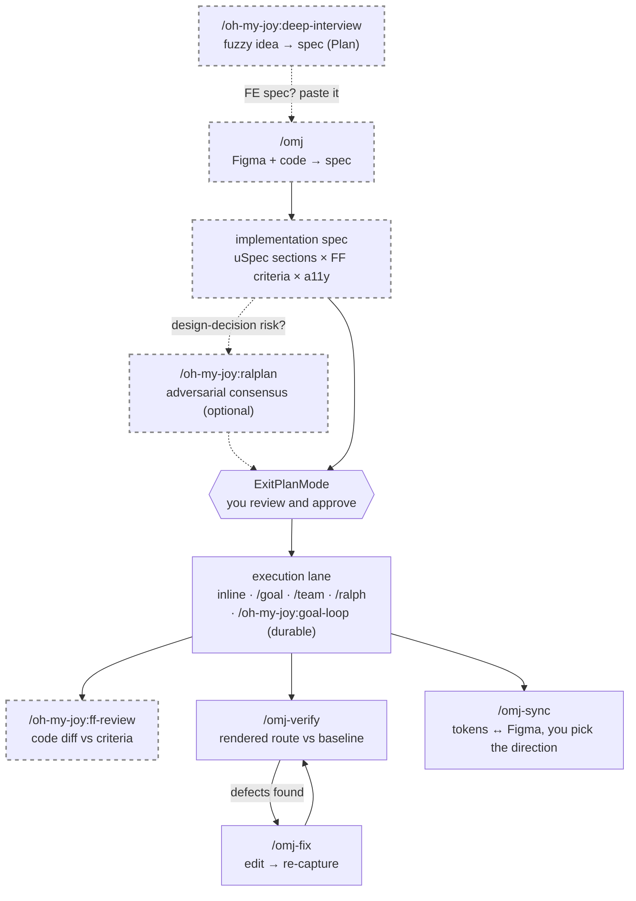

# oh-my-joy (OMJ)

English | [한국어](README.ko.md)

[](https://github.com/S-jooyoung/oh-my-joy/actions/workflows/ci.yml)
[](LICENSE)
[](package.json)

> One frontend plugin that stitches the whole code ↔ Figma loop together.

**Every frontend task starts with `/omj` — draft the spec, verify it, sync the tokens.**
_A Plan-native primer that doesn't fight your "almost always in Plan mode" habit._

`Plan-first` · `Figma 2-track` · `interactive token sync` · `graceful degradation` · `conflict-free alongside OMC/OMX`

[Why](#why) • [Quick Start](#quick-start) • [Commands](#commands) • [Design notes](#what-this-repo-demonstrates) • [OMJ × OMC/OMX](#omj--omcomx) • [Troubleshooting](#troubleshooting)

---

## Why

Handing a Figma frame to an AI agent and asking it to "build this" fails in a specific, repeatable way: the output looks close, but tokens get inlined as raw hex, responsive branches get invented, and a11y is whatever the model felt like that day. The defect is never the same twice, so you catch it in review instead of preventing it.

The obvious fix — one command that reads Figma and writes the code — collides with how Claude Code actually works. **Plan mode blocks `Write`/`Edit` by design**, and that is the mode many of us live in. (Read-only Bash such as `git diff` still runs; whether side-effecting Bash and MCP write tools are blocked depends on your environment.) A one-shot implement command would half-work exactly where it is invoked most.

So OMJ inverts it. `/omj` is **not** an implement command — it is a read-only primer that turns the tool's constraint into the design axis: it reads the design, drafts an implementation spec scored against fixed quality criteria, and **stops**. That spec *is* the native Plan you approve. Plan mode's write block stops being an obstacle and becomes the review gate.



_Dashed = read-only, no source side effects. Nothing crosses the approval gate without you._

---

## What this repo demonstrates

Each claim below is checkable in this repo — the artifact is named, and so is the alternative that was rejected.

- **Least privilege is declared in the manifest, not left to convention.** `/omj` ships with `allowed-tools: Read, Grep, Glob, Skill, AskUserQuestion` plus read-only Figma/Context7 MCP ([`commands/omj.md`](commands/omj.md)). No write tool is pre-approved, so a write attempt cannot happen silently — it surfaces as an explicit permission prompt, and in Plan mode `Write`/`Edit` are blocked outright. Rejected: "grant the tools and instruct the model not to use them" — prose is not an enforcement layer, which is exactly the bug fixed in [`commands/omj-start.md`](commands/omj-start.md), where a `Bash(...)` wildcard was quietly pre-approving every argument its prose forbade.
- **One source of truth per fact, and the doc facts are CI-checked.** Execution-lane thresholds live only in [`docs/EXECUTION-HANDOFF.md`](docs/EXECUTION-HANDOFF.md); commands link to it and carry at most a threshold-free fallback for when that file is unreachable. A dependency-free suite checks that the two READMEs declare the same command set and installation string, that no Korean leaks into the English page, that every relative link resolves, and that each CHANGELOG release link points at the right compare range ([`tests/docs-consistency.test.mjs`](tests/docs-consistency.test.mjs)). Rejected: restating the lane rules wherever they were needed — the pre-0.3.0 copies in `commands/omj.md` and `docs/OMC-INTEGRATION.md` drifted within one release.
- **Every dependency is optional, by design.** Figma MCP, playwright, Context7, OMC/OMX — each absence degrades to "skip + explain", never an error, so the plugin is useful on day one in any environment. Rejected: hard requirements, which turn a plugin into a setup project.
- **The plugin never fires hooks on its own.** Shipping `hooks/hooks.json` would make every repo with the plugin enabled run these checks; instead the scripts are templates that `/omj-setup` copies into a project that opts in, and they no-op without an explicit declaration. This invariant is pinned by a test, not a comment ([`tests/plugin-manifest.test.mjs`](tests/plugin-manifest.test.mjs)).
- **Behaviour is tested even though it is written in Markdown.** The two hook scripts are exercised as real subprocesses against the PostToolUse contract, including the false-positive cases that made an earlier version report noise instead of signal ([`tests/hooks/`](tests/hooks)).

The reasoning behind each decision — problem → decision → rationale → outcome, plus the alternatives that were rejected and why — is in [`docs/PRINCIPLES.md`](docs/PRINCIPLES.md) (Korean), summarized as an eleven-row decision table in [`docs/PRINCIPLES.en.md`](docs/PRINCIPLES.en.md) (English).

---

## Quick Start

```
# 1. Install (enter one line at a time)
/plugin marketplace add S-jooyoung/oh-my-joy
/plugin install oh-my-joy@omj

# 2. Check dependencies (recommended before first use)
/omj-setup

# 3. Start — turn intent into an implementation spec (Plan), choose execution lane, then stop → approve → implement
/omj "Search input form — React Hook Form + Zod, mobile-first" /search
```

> `/omj` is a read-only primer — it never writes code directly; it drafts a spec, recommends an execution lane by marking option 1 with the literal label `(추천)` ("recommended"), and stops. Not sure where to start? Run `/omj-setup` first.
>
> **Updates** ship when a release (version bump) lands on `main` — merged features don't reach existing installs until the version string changes. Pull the latest with `/plugin update oh-my-joy@omj`, then `/reload-plugins` (or a new session) to load it.

---

## Which command, in what order?

The full cycle as branches — routing canon is [docs/EXECUTION-HANDOFF.md](docs/EXECUTION-HANDOFF.md):

1. **Idea still fuzzy?** `/oh-my-joy:deep-interview` — one question per round until the weighted ambiguity score drops under the threshold. The spec it produces is a **native Plan, not a file**. It deliberately refuses to fire on FE-implementation signals (a Figma URL goes straight to `/omj`) and exits immediately when the input is already concrete — that is the suitability gate, not a bug.
2. **FE work?** `/omj <figma-url|task> [route]` — or **paste the interview spec into `/omj`** (paste is first-class input). It authors the uSpec implementation spec and stops.
3. **Design decisions carry disagreement risk?** Run `/oh-my-joy:ralplan` on the existing spec/plan for an adversarial consensus pass. Small unambiguous plans are told to skip review and proceed — that early exit is intended.
4. **Approve** (ExitPlanMode), then execute on the selected lane: option 1 `(추천)` ("recommended") is usually inline, or `/goal` · `/team` · `/ralph` when OMC/OMX is installed. **No runtime — or completion must be evidence-gated?** → `/oh-my-joy:goal-loop` (interrupted work resumes with `/oh-my-joy:goal-loop --slug <name>` alone).
5. **Verify**: `/oh-my-joy:ff-review` (diff vs criteria) · `/omj-verify <route>` (rendered page) → visual defects go to `/omj-fix`, token drift goes to `/omj-sync`.

---

## Commands

| Command | What it does | When to use | Example |
| --- | --- | --- | --- |
| **`/omj`** | Gather specs + author an implementation spec (Plan) + recommend one execution lane, then stop (read-only primer). Infers the verify route when omitted; supports multiple Figma nodes mixed with text tasks | The starting point for every FE task | `/omj https://figma.com/design/abc?node-id=1-2 /settings/profile` |
| **`/omj-start`** | Handoff an approved OMJ spec to the selected OMC/OMX execution lane | After approving a spec when auto-start is unavailable (not needed for `(auto)` inline specs) | `/omj-start ./omj-search-spec.md` |
| **`/oh-my-joy:ff-review`** | Review the changed FE diff against FF 4-criteria + a11y · Figma fidelity · vercel · Next.js (report only). No args = uncommitted + staged changes vs HEAD; `--base <ref>` = the whole branch since `<ref>` | Right after implementing, before a PR | `/oh-my-joy:ff-review --base main` |
| **`/omj-verify`** | Open a route in a real browser (playwright-cli, falls back to playwright MCP) and check visuals/structure against the Figma baseline (`.omj/baselines/`); always asserts the captured page actually reached the requested route (auth redirects are reported as failures, never compared) | Visual-regression check before a PR | `/omj-verify /settings/profile` |
| **`/omj-fix`** | Fix defects from a pasted screenshot + route, then re-capture to confirm (active loop) | Quick fixes for pixel/visual defects | `/omj-fix /pricing "banner z-index too low"` |
| **`/omj-sync`** | Reconcile drift between the token store (`tokens.json` **or CSS custom properties**) ↔ Figma by **asking you the direction**; `extract` bootstraps CSS tokens from Figma variables | Aligning code/Figma tokens · first extraction | `/omj-sync` · `check` · `push` · `extract <figma-url>` |
| **`/omj-setup`** | Dependency doctor + batch multi-select install + scaffolding for `.omj/fe-context.md` (adopts existing rule docs like `AGENTS.md`/`.claude/rules/` via `contextDocs:` instead of duplicating them) and opt-in token-guard hooks (the Story hook is offered only when Storybook is detected); optionally offers a GitHub star at the end (skipped silently if already starred, never blocks setup) | Before first use — `/omj` also suggests it once when no setup trace exists | `/omj-setup` |
| **`/oh-my-joy:deep-interview`** | Socratic one-question-per-round interview that turns a vague idea into a spec (native Plan, not a file) gated by a weighted ambiguity score (`--threshold N`, default 20) — topology lock, weakest-dimension targeting, ontology-convergence tracking, restate/closure double gate (read-only). Suitability gate: refuses FE-implementation signals (Figma URL → `/omj`) and exits immediately on already-concrete input | When the goal itself is still fuzzy — before `/omj` or any implementation | `/oh-my-joy:deep-interview "internal knowledge base — still fuzzy"` |
| **`/oh-my-joy:goal-loop`** | Durable single-owner execution loop: splits an approved spec (path **or paste** — paste is first-class) into goals persisted in `.omj/goals/`, works them one at a time, and can only mark completion through a validator script that demands an evidence object — invalid transitions, truncated ledgers, and evidence-free completes exit non-zero (run outside Plan mode) | Multi-turn work that must survive interruption and prove its completion — with or without OMC/OMX installed | `/oh-my-joy:goal-loop ./approved-spec.md --slug search-form` · resume: `/oh-my-joy:goal-loop --slug search-form` |
| **`/oh-my-joy:ralplan`** | Adversarial consensus review of an *existing* spec/plan (path **or paste**): planner normalization (drivers · ≥2 viable options · ADR) → independent `plan-critic` pass → at most 2 rounds → converge to pending-approval or declare PLANNING-STUCK with the open disputes (read-only). Small unambiguous plans get "skip review and proceed" and exit early | When a plan already exists and its design decisions carry disagreement risk — vague ideas go to `/oh-my-joy:deep-interview` instead | `/oh-my-joy:ralplan ./approved-spec.md` |

> **read-only vs active op.** `/omj`, `/oh-my-joy:ff-review`, `/oh-my-joy:deep-interview`, and `/oh-my-joy:ralplan` are read-only (report/spec only) — `/omj` may ask **at most one** post-spec execution-lane question (skipped with an `(auto)` record when inline/manual is recommended — Plan approval doubles as lane consent), the interview asks one question per round under its own round cap, and none of them can Write/Edit/build/test. `/omj-start` is a handoff command: it launches only when the runtime surface is explicit and safe, otherwise it prints one copyable action. `/omj-verify`, `/omj-fix`, `/omj-sync` (sync/push/extract), and `/oh-my-joy:goal-loop` (validator Bash + implementation) are active ops using Figma write / `Edit`/`Write` / Bash; if your environment blocks those in Plan mode, exit Plan mode first. Each command's syntax, arguments, and steps live in its `commands/<name>.md` (the source of truth).
>
> **Auto-trigger.** The command descriptions are written to match the two most frequent real-world patterns, so the agent can route to them without you typing the slash command: pasting a Figma Dev Mode link ("implement this design…") routes to `/omj`, and pasting a screenshot with a visual complaint ("misaligned", "clipped", "wrong spacing/color") routes to `/omj-fix`.

### Bundled agents & opt-in hooks

- **`figma-implementer`** (agent) — implements an **approved OMJ spec** through a 5-step loop (Clarify→Context→Plan→Generate→Evaluate) as the inline-lane executor. Refuses bare Figma URLs without a spec and points to `/omj` first (no plan-gate bypass). Selected OMC/OMX lanes always take precedence.
- **`design-qa`** (agent) — a mechanical gate that only **checks**: typecheck, lint, hardcoded tokens, Figma fidelity, a11y basics, plus Story/i18n checks only when declared in fe-context. Declares no write tools (`Write`/`Edit` absent — fixed by invariant tests); it does run check commands via Bash, so not purely read-only.
- **`plan-critic`** (agent) — the adversarial plan reviewer that `/oh-my-joy:ralplan` runs for its consensus pass. Read-only by contract (`Read, Grep, Glob` — fixed by invariant tests); never invoked outside ralplan.
- **Token-guard hooks** — `check-design-tokens.mjs` (hardcoded-color warning) and `check-story-exists.mjs` (missing-Story warning) in `templates/hooks/`. **The plugin never fires them by itself** — they run only after `/omj-setup` copies and registers them into a consuming project's `.claude/hooks/` (opt-in), and they no-op without an `.omj/fe-context.md` declaration.

### `/omj-sync` — you choose the direction

`/omj-sync` does not force "code always wins." **Code is the default source of truth**, but when drift exists it groups conflicts by class (value-mismatch / code-only / Figma-only) and asks the direction via `AskUserQuestion`. The first option of each question follows code authority — `code→Figma` for value-mismatch and code-only, and a conservative `skip` for Figma-only — so pressing enter stays safe.

- `/omj-sync` (default `sync`) — interactive reconcile, asks the direction.
- `/omj-sync check` — read-only drift report + a "suggested token code" block for Figma-only tokens.
- `/omj-sync push` — apply code→Figma in bulk with no prompts (explicit code-wins).
- `/omj-sync extract <figma-url>` — extract all Figma variables into CSS custom properties (`/`→`-` naming, primitive→semantic `var()` references preserved, mapping table in `docs/design-tokens.md`). Bootstraps projects with no token store yet.

> Both store formats are supported: `tokens.json` (DTCG) and CSS custom properties (`*.css`). Figma variable access requires **edit permission** — duplicate viewer-shared files first.

---

## Dependencies (all optional · graceful degradation)

Missing ones never crash — OMJ **skips + guides** instead.

| Dependency | Used by | When absent |
| --- | --- | --- |
| Official Figma Dev Mode MCP | `/omj` (read design), `/omj-sync` (read/write Variables) | "Figma not connected — proceed with a manual spec", then continue |
| `playwright-cli` **or** playwright MCP | `/omj-verify` · `/omj-fix` (cli first, MCP fallback) | with neither: "no capture backend — skipping verify", then exit |
| Context7 | `/omj` · `/oh-my-joy:ff-review` · `/omj-fix` (fetch latest Next.js docs) | that step is skipped |

> Figma writes (`/omj-sync` push/pull, reading a design) require the **Figma desktop app running with the target file as the active tab**. MCP tool names vary by environment — check `/mcp`.

---

## OMJ × OMC/OMX

OMJ is a **standalone plugin independent of** oh-my-claudecode (OMC) and oh-my-codex (OMX). Installing them together never conflicts: FE commands stay under the OMJ-owned `/omj*` prefix, and generic workflow commands are always addressed through the `/oh-my-joy:` namespace (e.g. `/oh-my-joy:deep-interview`), so same-named OMC skills or Claude Code native commands cannot be confused with them.

- **Mental model (one sentence)**: "Start every FE task with `/omj` — approve the spec, then take option 1 (labeled `(추천)`, i.e. the recommended lane) unless you intentionally choose another OMC/OMX execution lane."

| Stage | OMJ | OMC/OMX |
| --- | --- | --- |
| Clarify | `/oh-my-joy:deep-interview` (vague idea → spec) | `/oh-my-claudecode:deep-interview` (OMC skill) |
| Plan | `/omj` (FE spec, native Plan + execution selector) | `/oh-my-claudecode:plan` · `/oh-my-claudecode:ralplan` · `$ralplan` (OMX: plan-only) |
| Execute | `/omj-start` fallback handoff · `/oh-my-joy:goal-loop` (durable, evidence-gated — works without OMC/OMX) | `/goal` · `$ultragoal` · `/team`/`$team` · `/ralph`/`$ralph` |
| Verify | `/oh-my-joy:ff-review` · `/omj-verify` | `/verify` · `$ultraqa` |

The implementation spec `/omj` produces is exactly the input OMC/OMX execution tools consume. The routing source of truth is **[docs/EXECUTION-HANDOFF.md](docs/EXECUTION-HANDOFF.md)** (Korean); see **[docs/OMC-INTEGRATION.md](docs/OMC-INTEGRATION.md)** (Korean) for A/B/C flows, gate rules, and handoff constraints.

---

## Principles · Figma 2-track

- **Plan-native primer**: `/omj` is read-only — it drafts a spec, asks at most one execution-lane selector (skipped with `(auto)` when inline/manual is recommended), and stops; implementation starts only after you approve (ExitPlanMode).
- **Spec format**: uSpec sections (Anatomy / Structure / Color·Tokens / Props·Variants / A11y / Motion) + FF 4-criteria + a11y + Figma fidelity (`figma-fidelity.md`) per item.
- **Token sync**: code is the default SoT, and you choose the direction on conflict (interactive). Both DTCG json and CSS custom-property stores.
- **Figma 2-track**: (A) app-screen design→code = official Dev Mode MCP; (B) design-system spec/tokens = figma-console-mcp + uSpec (v1.1+).
- **Minimal bundle**: externally-maintained knowledge is referenced only (vercel skills — `npx skills add/update`); OMJ bundles only what it owns (FF skill, 3 agents, hook templates). The plugin itself stays zero-hook — hooks fire only via opt-in copy-install.

The "why" behind each decision lives in **[docs/PRINCIPLES.md](docs/PRINCIPLES.md)** (Korean).

---

## Troubleshooting

- **`/omj` didn't change any code** — that's correct. It's a read-only primer: it drafts a spec, records the selected execution lane, and stops. Implementation starts after you approve (ExitPlanMode); if auto-start is unavailable, run the one `/omj-start <approved-spec>` action it prints.
- **`/omj-verify` / `/omj-fix` does nothing** — no capture backend (neither playwright-cli nor playwright MCP), dev server not running (`yarn dev`), an auth-gated route, or your environment's Plan mode blocked Bash. For auth routes, declare `verifySetup` in `.omj/fe-context.md` (recommended) or `export JOY_TEST_EMAIL=… JOY_TEST_PASSWORD=…` before running — **use a test-only account**, and gitignore `.omj/baselines/` since post-login screenshots can contain session data or PII.
- **Figma not connected / no permission** — `This figma file could not be accessed` is handled gracefully. Open the Figma desktop app, put the target file in the active tab, and retry. **Variable/node access requires edit permission** — duplicate viewer-shared files (tutorials etc.) and use the copy's URL.
- **Baseline comparison not happening** — Figma asset URLs expire after ~7 days; re-run `/omj` to refresh the spec's baseline provenance. Cross-session comparison relies on the PNGs in `.omj/baselines/` (gitignore recommended). Note the PNG is **first created** only when `/omj-verify` runs in the same session as `/omj` (a fully separate session has no URL source — spec-based re-lookup is planned for v1.1).
- **`/oh-my-joy:deep-interview` ended immediately** — that's the suitability gate, not a failure: the input was already concrete enough, or it carried FE-implementation signals (a Figma URL) that route to `/omj` instead.
- **`/oh-my-joy:goal-loop` asks permission for every verification command** — intended. Verification commands are deliberately not pre-approved: the permission prompt is what makes the recorded evidence trustworthy. Also gitignore `.omj/goals/` (operational state — command summaries and paths accumulate there).
- **MCP tool names differ** — Figma/Context7 tool names vary by environment. Check the actual names with `/mcp`.
- **Duplicate committed skill copy** — if a project committed `frontend-fundamentals` into its own `.claude/skills/`, it may load alongside the OMJ bundle (harmless). Don't delete that copy (deleting it breaks teammates who cloned without OMJ installed) — just edit the source of truth in one place.
