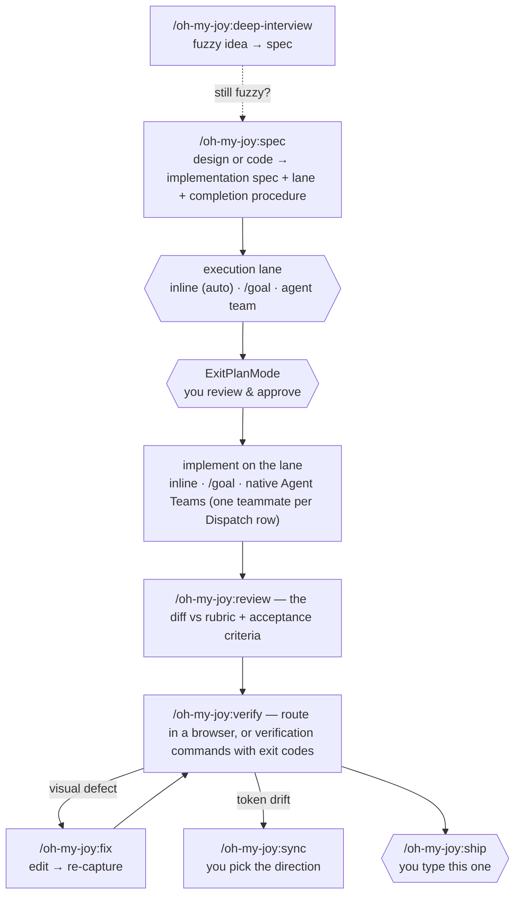

# oh-my-joy (OMJ)

English | [한국어](README.ko.md)

[](https://github.com/S-jooyoung/oh-my-joy/actions/workflows/ci.yml)
[](LICENSE)
[](package.json)

> One plugin for the whole loop — from a fuzzy idea to a pull request — with the code ↔ Figma frontend loop built in as a first-class mode.

**Enter once (`/oh-my-joy:spec` or `/oh-my-joy:deep-interview`), approve the plan, and the plan's completion procedure runs review and verify for you. `/oh-my-joy:ship` is the one step you type at the end.**
_A Plan-native workflow that doesn't fight your "almost always in Plan mode" habit._

`Plan-first` · `evidence, not vibes` · `Figma section walk` · `native Agent Teams` · `graceful degradation` · `zero runtime deps`

[Why](#why) • [Quick Start](#quick-start) • [How to use OMJ](#how-to-use-omj) • [Recommended workflow](#recommended-workflow) • [Commands](#commands) • [How this plugin evolves](#how-this-plugin-evolves) • [Troubleshooting](#troubleshooting)

---

## Why

Handing a task to an AI agent and asking it to "build this" fails in a specific, repeatable way: the output looks close, tokens get inlined as raw hex, a branch nobody asked for appears, "done" is announced with no test having run, and the next stage never sees what the previous one decided. The defect is never the same twice, so you catch it in review instead of preventing it.

So OMJ inverts the obvious fix. The entry commands are **not** implement commands — they are read-only primers that read the design or the code, draft an implementation spec scored against fixed criteria, record how the work will be executed and checked, and **stop**. That spec *is* the native Plan you approve. After approval the session follows the plan's completion procedure — implement, review, verify — and nothing counts as done without evidence (a command, its exit code, a summary). Plan mode's write block stops being an obstacle and becomes the review gate.

---

## Quick Start

```
# 1. Install (enter one line at a time)
/plugin marketplace add S-jooyoung/oh-my-joy
/plugin install oh-my-joy@omj

# 2. Check dependencies and opt into the extras you want (recommended before first use)
/oh-my-joy:setup

# 3. Start — a concrete task becomes an implementation spec (Plan), then stop → approve → the plan runs
/oh-my-joy:spec "Search input form — React Hook Form + Zod, mobile-first" /search

#    …or start from a design — the same command takes the Figma link
/oh-my-joy:spec https://figma.com/design/abc?node-id=1-2 /search

#    …or from something that isn't frontend at all
/oh-my-joy:spec "rate-limit middleware for the public API — 100 req/min per key"

# 4. When review and verify are green, ship it
/oh-my-joy:ship "feat: search form"
```

> **Updates** ship when a release (version bump) lands on `main` — merged features don't reach existing installs until the version string changes. Pull the latest with `/plugin update oh-my-joy@omj`, then `/reload-plugins` (or a new session) to load it.
>
> **Upgrading from v0.7?** v0.8.0 generalized the spine and trimmed the surface:
>
> | Old command | Now |
> | --- | --- |
> | `ff-review` | `/oh-my-joy:review` — the same frontend rubric, plus a general mode for every other file |
> | `ralplan` | removed — when the requirement is fuzzy, run `/oh-my-joy:deep-interview` before the spec |
> | `goal-loop` | removed — its evidence rule now lives in `/oh-my-joy:verify` (evidence mode) and `/oh-my-joy:ship`; `.omj/goals/` is no longer written |
>
> Everything else is unchanged: the `.omj/` state directory, the `oh-my-joy@omj` install string, and the hook output.
>
> **Upgrading from v0.6?** v0.7.0 moved every command under the single `/oh-my-joy:` namespace:
>
> | Old command | Now |
> | --- | --- |
> | `omj` (the bare root command) | `/oh-my-joy:spec` |
> | `omj-verify` | `/oh-my-joy:verify` |
> | `omj-fix` | `/oh-my-joy:fix` |
> | `omj-sync` | `/oh-my-joy:sync` |
> | `omj-setup` | `/oh-my-joy:setup` |
> | `omj-start` | removed — the spec's execution-lane section prints the one line to run |
>
> One trap: the once-announced `omj-spec` (design-system spec, v1.1) is now planned as `/oh-my-joy:ds-spec`, not `spec`. Full mapping and rationale: [CHANGELOG](CHANGELOG.md), sections 0.8.0 and 0.7.0.

---

## How to use OMJ

Six situations cover most days. Each is the exact sequence you type; everything between approval and ship happens on its own because the approved plan says so.

**1. One Figma screen**

```
/oh-my-joy:spec https://figma.com/design/abc?node-id=1-2 /checkout
  → approve the plan  → implement → /oh-my-joy:review → /oh-my-joy:verify /checkout → fix loop → report (automatic)
/oh-my-joy:ship "feat(checkout): summary panel"
```

**2. A large Figma frame (several sections)**

```
/oh-my-joy:spec https://figma.com/design/abc?node-id=1-2 /checkout
  → spec reads the frame section by section and ends with a Dispatch table; the agent-team lane is recommended — answer the one lane question
  → approve the plan
  → paste the one line the spec printed: it spawns one figma-implementer teammate per section (needs CLAUDE_CODE_EXPERIMENTAL_AGENT_TEAMS=1; without it the work runs sequentially)
  → teammates finish with evidence → /oh-my-joy:verify /checkout is the barrier → /oh-my-joy:review → report (automatic)
/oh-my-joy:ship "feat(checkout): all sections"
```

**3. A frontend feature described in words**

```
/oh-my-joy:spec "search input form — React Hook Form + Zod, mobile first" /search
  → approve → implement → review → verify /search → fix loop → report (automatic)
/oh-my-joy:ship "feat: search form"
```

**4. Anything that isn't frontend (backend, scripts, this plugin)**

```
/oh-my-joy:spec "rate-limit middleware for the public API — 100 req/min per key"
  → the spec lists acceptance criteria and the verification commands it found (verifyCommands or package.json scripts)
  → approve → implement → /oh-my-joy:review (general mode) → /oh-my-joy:verify (evidence mode: runs the commands, records exit codes) → report (automatic)
/oh-my-joy:ship "feat(api): rate limiter"
```

**5. Still fuzzy about what to build**

```
/oh-my-joy:deep-interview "notification system overhaul — not sure where to start"
  → one question per round until the ambiguity score passes → the spec is the plan → approve → the same completion procedure
/oh-my-joy:ship
```

**6. A visual defect, or drifting design tokens**

```
/oh-my-joy:fix /pricing "banner z-index too low"        edit → re-capture → confirm
/oh-my-joy:sync                                         you pick the direction per drift class
```

Every command also works on its own — a colleague's diff (`/oh-my-joy:review --base main`), a re-check (`/oh-my-joy:verify /checkout`), tokens only (`/oh-my-joy:sync check`).

---

## Recommended workflow

First time here? Run `/oh-my-joy:setup` once — it checks the optional dependencies, offers the Agent Teams flag and the OMJ answer style, and scaffolds `.omj/fe-context.md`.

1. **Enter** — `/oh-my-joy:spec <figma-url | task> [route]` for anything concrete (Figma, frontend text, or general text); `/oh-my-joy:deep-interview` when the goal itself is still fuzzy. Both author a spec, record the execution lane and the completion procedure, and stop.
2. **Approve the plan** (ExitPlanMode) — implementation starts only here, on the lane the spec recorded. Small work auto-selects inline; a heavier lane is asked about exactly once.
3. **The plan runs** — implement on the lane, then `/oh-my-joy:review` (the diff against the rubric and the spec's acceptance criteria), then `/oh-my-joy:verify` (a route in a real browser, or the verification commands with exit codes), then the `/oh-my-joy:fix` loop for frontend defects, then a report with evidence.
4. **Ship** — `/oh-my-joy:ship "<title>"` re-runs the verification commands, commits with your conventions, pushes, and opens the PR with the evidence attached. This step is never automatic.



_Hexagons are the three human decision points — the lane (auto-resolved for small work), approval, and ship; the solid spine runs on its own after approval; dashed = side paths._

**What never happens on its own.** Nothing is implemented, built, or committed until you approve the plan: approval is the single doorway between spec and code. After approval, the review and verify steps run because the plan you approved says they do — not implicitly. Shipping (push, PR) is always your keystroke.

**Picking an execution lane.** The spec ends with a lane selection; option 1 is always the recommendation, labeled `(recommended)`, and small concrete work skips the question entirely (`(auto)`).

- **inline** — the default. After approval, the current session implements the spec; `figma-implementer` is the frontend executor. Always available.
- **`/goal`** — persistence *within* a session: keeps this session iterating until a stated condition holds. Part of Claude Code's hooks system — unavailable where hooks are disabled.
- **agent team** — three or more independent units with disjoint files (sections of a large frame, separate modules): the spec's Dispatch table becomes the shared task list, one `figma-implementer` teammate per row, and `verify` is the barrier. Runs on Claude Code's native Agent Teams (`CLAUDE_CODE_EXPERIMENTAL_AGENT_TEAMS=1`, experimental); without the flag it degrades to subagents, then to inline.

The full routing rules, the dispatch contract, and the completion procedure live in [docs/EXECUTION-HANDOFF.md](docs/EXECUTION-HANDOFF.md) — this section carries only the selection feel, never the numbers.

---

## What a Figma link turns into

Paste a section or frame link — `spec` reads it as data, and for each frame:

1. **Reads the design as data, not pixels** — via the official Dev Mode MCP it pulls the layout structure, the design variables behind it, and a screenshot that becomes the baseline `verify` checks against later.
2. **Walks large frames section by section** — a frame with three or more top-level sections is read one section at a time (metadata first, then one design-context call per section), because a single call over a big frame comes back flattened. The spec gets a per-section breakdown and a Dispatch table that maps each section to the files that will own it; more than eight sections and it proposes splitting the link.
3. **Maps every color, type style, radius, and shadow to your semantic tokens** — it detects your token system (fe-context → tokens.json → Tailwind config → CSS variables), and raw hex is never an option, even in projects with no tokens.json.
4. **Keeps fidelity rules on** — original text stays, variants that don't exist in Figma are never invented, fixed px gives way to `w-full` + parent padding.
5. **Scores the spec before you see it** — six uSpec sections (Uber's design-spec taxonomy: Anatomy / Structure / Color·Tokens / Props·Variants / A11y / Motion), each evaluated against the FF criteria (Toss frontend-fundamentals: readability, predictability, cohesion, coupling) plus accessibility.

That is why the output doesn't drift the way "build this frame" prompts do: the model isn't eyeballing a screenshot — it fills a fixed skeleton from structured design data, in your token vocabulary, at the right granularity, and the baseline it recorded is what `verify` compares the build against.

---

## A session, start to finish

Task: a search input form — React Hook Form + Zod, mobile-first, mounted at `/search`.

Starting from a design instead? The same command takes the link — `/oh-my-joy:spec https://figma.com/design/abc?node-id=1-2 /search` — and runs the Figma track described above; everything from the spec onward is identical. Starting from a backend task? Same command, and the spec's skeleton becomes goal / constraints / acceptance criteria / verification commands.

    /oh-my-joy:spec "Search input form — React Hook Form + Zod, mobile-first" /search

`spec` peels off `/search` as the verification route, finds no Figma URL, recognizes a frontend task, and reads your existing form components, hooks, and token setup, then authors the implementation spec — six uSpec sections scored against the FF criteria, plus target files and reuse candidates. The spec ends with the execution-lane section (this task is small, so the lane line reads `(auto)` — inline, no question asked) and the completion procedure.

**You decide here.** The spec is the plan on your approval screen — edit it, reject it, or approve it (ExitPlanMode). Nothing has been written yet.

On approval, the session implements the spec inline, then runs the procedure it approved:

    /oh-my-joy:review        the diff against the FF criteria + a11y and the spec's acceptance criteria — report only
    /oh-my-joy:verify /search   opens /search in a real browser and checks it against the spec and the Figma baseline

Say verify reports a defect — the submit button clips its label at 360px. The procedure routes it to the fix loop:

    /oh-my-joy:fix /search "submit button label clipped at 360px"

`fix` edits, re-captures, and confirms the defect is gone; the session reports with the evidence. Then the one line that is yours:

    /oh-my-joy:ship "feat: search form"

`ship` re-runs the verification commands, commits with your project's conventions, pushes, and opens the PR with the evidence table in its body. Had the work touched design tokens, `/oh-my-joy:sync` would reconcile them with Figma — asking you the direction on each conflict.

---

## Commands

| Command | What it does | When to use | Example |
| --- | --- | --- | --- |
| **`/oh-my-joy:spec`** | Read the input (Figma link with a section walk for large frames, frontend text, or general text), author the implementation spec (Plan) with the execution lane and the completion procedure, then stop (read-only). Infers the verify route when omitted; sends text with no verifiable target to the interview | The starting point for every concrete task | `/oh-my-joy:spec https://figma.com/design/abc?node-id=1-2 /settings/profile` |
| **`/oh-my-joy:deep-interview`** | Socratic one-question-per-round interview that turns a vague idea into a spec (native Plan) gated by a weighted ambiguity score (`--threshold N`%, default 20) — topology lock, weakest-dimension targeting, ontology tracking, restate/closure double gate (read-only); closes with the same lane and completion sections as `spec`. Exits immediately on already-concrete input and routes Figma links to `spec` | When the goal itself is still fuzzy | `/oh-my-joy:deep-interview "internal knowledge base — still fuzzy"` |
| **`/oh-my-joy:review`** | Review the changed diff and report only — frontend files against the FF 4 criteria + a11y · Figma fidelity · vercel · Next.js (Context7); every other file for correctness, simplicity, consistency, and test coverage; an approved spec's acceptance criteria are checked against the diff. No args = uncommitted + staged vs HEAD; `--base <ref>` = the whole branch | Right after implementing (the plan runs it), or on anyone's diff | `/oh-my-joy:review --base main` |
| **`/oh-my-joy:verify`** | Prove the work. With a route: open it in a real browser (playwright-cli, MCP fallback) and check it against the Figma baseline (`.omj/baselines/`), always asserting the page actually reached the route. Without a route: run the project's verification commands and record `command · exit code · summary`. `--base <url>` sets the dev server | The plan runs it after review; also the barrier after teammates finish | `/oh-my-joy:verify /settings/profile` · `/oh-my-joy:verify` |
| **`/oh-my-joy:fix`** | Fix defects on a route (required) from a pasted screenshot and/or a complaint, then re-capture to confirm (active loop). `--base <url>`, `--commit` | Visual defects verify found | `/oh-my-joy:fix /pricing "banner z-index too low"` |
| **`/oh-my-joy:sync`** | Reconcile drift between the token store (`tokens.json` or CSS custom properties) ↔ Figma by asking you the direction; `extract` bootstraps CSS tokens from Figma variables; `--tokens <path>` overrides the store path | Aligning code/Figma tokens · first extraction | `/oh-my-joy:sync` · `check` · `push` · `extract <figma-url>` |
| **`/oh-my-joy:ship`** | Run the verification commands (every one must exit 0), commit on a branch with your conventions, push, and open the PR with the evidence table in its body. `--base <ref>` picks the PR base. Pre-approves only git/gh/typecheck — test runners go through the permission prompt on purpose | The last step, always typed by you | `/oh-my-joy:ship "feat(checkout): summary panel"` |
| **`/oh-my-joy:setup`** | Dependency doctor + one multi-select install for anything missing + scaffolding: `.omj/fe-context.md` (adopts existing rule docs via `contextDocs:`, scaffolds `verifyCommands:` from package.json as comments), opt-in token-guard hooks, the opt-in OMJ HUD, the Agent Teams flag, and the OMJ answer style; offers a GitHub star at the end (never blocks) | Before first use — `spec` suggests it once when no setup trace exists | `/oh-my-joy:setup` · `--check` (report only) |

> **read-only vs active op.** `/oh-my-joy:spec` and `/oh-my-joy:deep-interview` declare no write tools and no Bash: they author the Plan and stop (`spec` asks at most one lane question, skipped when inline is recommended). `/oh-my-joy:review` and `/oh-my-joy:verify` are report-only (observation-scoped Bash, no write tools). `/oh-my-joy:fix`, `/oh-my-joy:sync` (sync/push/extract), and `/oh-my-joy:ship` are active ops; if your environment blocks those in Plan mode, exit Plan mode first. Verification commands (`npm test`, …) are never pre-approved by any command — the permission prompt is what makes the recorded evidence trustworthy. Each command's syntax and steps live in its `commands/<name>.md` (the source of truth).
>
> **Auto-trigger.** The command descriptions match the most frequent real-world patterns, so the agent can route without you typing the slash command: pasting a Figma Dev Mode link ("implement this design…") routes to `/oh-my-joy:spec`, and pasting a screenshot with a visual complaint ("misaligned", "clipped") routes to `/oh-my-joy:fix`.

### Bundled agents, answer style, and opt-in extras

- **`figma-implementer`** (agent) — implements an **approved OMJ spec** through a 5-step loop (Clarify → Context → Plan → Generate → Evaluate) as the inline-lane executor, and doubles as the teammate type on the agent-team lane: one instance per Dispatch row, editing only that row's files and reporting completion with evidence. Refuses bare Figma URLs without a spec (no plan-gate bypass).
- **`design-qa`** (agent) — a mechanical gate that only **checks**: typecheck, lint, hardcoded tokens, Figma fidelity, a11y basics, plus Story/i18n checks only when declared in fe-context. Declares no write tools (pinned by tests).
- **OMJ answer style** (`output-styles/oh-my-joy.md`, opt-in) — answers composed in your language rather than translated into it (for Korean: complete particles and endings, one polite register, English technical terms left as they are — rules adapted from [fluent-korean](https://github.com/snflkd/fluent-korean), credited in [`NOTICE.md`](NOTICE.md)), explained so a junior developer can follow, ending with the next step in the flow. Keeps Claude Code's coding instructions and never forces itself on: pick it in `/oh-my-joy:setup` or under **Output style** in `/config`; it applies to the main conversation from the next session (subagents keep their own prompts).
- **Token-guard hooks** — `check-design-tokens.mjs` (hardcoded-color warning) and `check-story-exists.mjs` (missing-Story warning) in `templates/hooks/`. **The plugin never fires them by itself** — they run only after `/oh-my-joy:setup` copies and registers them into a consuming project's `.claude/hooks/` (opt-in), and they no-op without an `.omj/fe-context.md` declaration. Both are advisory and fail-open (pinned by [`tests/hooks/hook-conventions.test.mjs`](tests/hooks/hook-conventions.test.mjs)).
- **OMJ HUD statusline** — a vendored statusLine HUD in `hud/` (attribution and license in [`NOTICE.md`](NOTICE.md); details in [`hud/README.md`](hud/README.md)). Opt-in like the hooks: `/oh-my-joy:setup` copies `hud/` to `~/.claude/omj-hud/` and registers the `statusLine` only on consent.

### `/oh-my-joy:sync` — you choose the direction

`/oh-my-joy:sync` does not force "code always wins." **Code is the default source of truth**, but when drift exists it groups conflicts by class (value-mismatch / code-only / Figma-only) and asks the direction via `AskUserQuestion`. The first option of each question follows code authority — `code→Figma` for value-mismatch and code-only, and a conservative `skip` for Figma-only — so pressing enter stays safe.

- `/oh-my-joy:sync` (default `sync`) — interactive reconcile, asks the direction.
- `/oh-my-joy:sync check` — read-only drift report + a "suggested token code" block for Figma-only tokens.
- `/oh-my-joy:sync push` — apply code→Figma in bulk with no prompts (explicit code-wins).
- `/oh-my-joy:sync extract <figma-url>` — extract all Figma variables into CSS custom properties (`/`→`-` naming, primitive→semantic `var()` references preserved, mapping table written to your project's `docs/design-tokens.md`).

> Both store formats are supported: `tokens.json` (DTCG) and CSS custom properties (`*.css`). Figma variable access requires **edit permission** — duplicate viewer-shared files first.

---

## Dependencies (all optional · graceful degradation)

Missing ones never crash — OMJ **skips + guides** instead.

| Dependency | Used by | When absent |
| --- | --- | --- |
| Official Figma Dev Mode MCP | `/oh-my-joy:spec` (read design), `/oh-my-joy:sync` (read/write Variables) | "Figma not connected — proceed with a manual spec", then continue |
| `playwright-cli` **or** playwright MCP | `/oh-my-joy:verify` browser mode · `/oh-my-joy:fix` (cli first, MCP fallback) | with neither: "no capture backend — skipping verify", then exit; evidence mode still works |
| Context7 | `/oh-my-joy:spec` · `/oh-my-joy:review` · `/oh-my-joy:fix` (fetch latest Next.js docs) | that step is skipped |
| `CLAUDE_CODE_EXPERIMENTAL_AGENT_TEAMS=1` | the agent-team lane (native Agent Teams) | the lane degrades to subagents, then to inline |

> Figma writes (`/oh-my-joy:sync` push/pull, reading a design) require the **Figma desktop app running with the target file as the active tab**. MCP tool names vary by environment — check `/mcp`.

---

## What OMJ writes into your repo

- `.omj/fe-context.md` — your project's declarations (acceptance axes, token path, verify setup, `verifyCommands`). **Meant to be committed.**
- `.omj/baselines/` — capture baselines. **Gitignore this one**: ignoring `.omj/` wholesale would also lose the committed fe-context.
- `.claude/hooks/` copies of the token-guard hooks — only when you opt in during `/oh-my-joy:setup`.
- `~/.claude/omj-hud/` (plus a `statusLine` entry), the Agent Teams `env` flag, and the `outputStyle` selection in `~/.claude/settings.json` — user-global, each only when you opt in during `/oh-my-joy:setup`.
- On demand: your project's `docs/design-tokens.md` (the `sync extract` mapping table) and `docs/DESIGN.md` (a setup scaffold).

What goes where, and why, is owned by [`commands/setup.md`](commands/setup.md).

---

## What this repo demonstrates

Each claim below is checkable in this repo — the artifact is named, and so is the alternative that was rejected.

- **Least privilege is declared in the manifest, not left to convention.** `/oh-my-joy:spec` ships with `allowed-tools: Read, Grep, Glob, Skill, AskUserQuestion` plus read-only Figma/Context7 MCP ([`commands/spec.md`](commands/spec.md)); `/oh-my-joy:ship` pre-approves only git, gh, and the typecheck, never a test runner ([`commands/ship.md`](commands/ship.md)). No write tool is pre-approved where it isn't called, so a write attempt cannot happen silently. Rejected: "grant the tools and instruct the model not to use them" — prose is not an enforcement layer.
- **One source of truth per fact, and the doc facts are CI-checked.** Execution-lane thresholds and the completion procedure live only in [`docs/EXECUTION-HANDOFF.md`](docs/EXECUTION-HANDOFF.md). A dependency-free suite checks that the two READMEs declare the same command set and installation string, that no Korean leaks into the English pages, that every relative link resolves, and that retired command names stay in the migration tables ([`tests/docs-consistency.test.mjs`](tests/docs-consistency.test.mjs)).
- **Prompt bodies follow the prompting guide, and a test says so.** Every command, agent, skill, and style body states what to do and why, without shouted imperatives, emphasis inflation, or warning glyphs, and keeps examples in `<example>` tags ([`tests/prompt-style.test.mjs`](tests/prompt-style.test.mjs)). Rejected: a style checklist in a contributing guide — it held for exactly one release.
- **Every dependency is optional, by design.** Figma MCP, playwright, Context7, the Agent Teams flag — each absence degrades to "skip + explain", never an error.
- **The plugin never fires hooks or forces a style on its own.** No `hooks/hooks.json`, no `force-for-plugin` on the answer style; both are opt-in installs by `/oh-my-joy:setup`, pinned by [`tests/plugin-manifest.test.mjs`](tests/plugin-manifest.test.mjs).
- **Behaviour is tested even though it is written in Markdown.** The hook scripts run as real subprocesses against the PostToolUse contract ([`tests/hooks/`](tests/hooks)), and the commands have behavioral eval cases ([`evals/`](evals)).

The reasoning behind each decision — problem → decision → rationale → outcome, plus the alternatives that were rejected and why, and which ideas from other projects were adopted or declined — is in [`docs/PRINCIPLES.md`](docs/PRINCIPLES.md), which opens with a twelve-row decision table.

---

## Principles · Figma 2-track

- **Plan-native primers**: `/oh-my-joy:spec` and `/oh-my-joy:deep-interview` are read-only — they draft a spec, record the lane and the completion procedure, and stop; implementation starts only after you approve.
- **Evidence rule**: "done" means a command, its exit code, and a summary — recorded by `verify` (evidence mode), `ship`, and agent-team teammates. Verification commands are never pre-approved.
- **Spec format**: uSpec sections + FF 4-criteria + a11y + Figma fidelity ([`figma-fidelity.md`](skills/frontend-fundamentals/references/figma-fidelity.md)) for frontend; goal / constraints / acceptance criteria / verification commands for everything else.
- **Token sync**: code is the default SoT, and you choose the direction on conflict (interactive). Both DTCG json and CSS custom-property stores.
- **Figma 2-track**: (A) app-screen design→code = official Dev Mode MCP, walked section by section on large frames; (B) design-system spec/tokens = figma-console-mcp + uSpec (v1.1+).
- **Borrow methodology, not surface**: externally maintained knowledge is referenced (vercel skills — `npx skills add/update`); OMJ bundles only what it owns (FF skill, 2 agents, hook templates, the answer style, the evals); methodologies from other projects are absorbed as credited rewrites, and declined ideas are recorded with their reasons.

The "why" behind each decision lives in **[docs/PRINCIPLES.md](docs/PRINCIPLES.md)**.

---

## How this plugin evolves

Command bodies are prompts, so "a small wording change" is a behavior change. OMJ measures them: `evals/` holds a behavioral case per command (native `claude plugin eval` when your organization has it, otherwise the `claude -p` fallback runner — same case files), `npm run eval` scores them with a threshold, and a change to a command body adds or updates the case that observes it. On every PR, [`tests/token-budget.test.mjs`](tests/token-budget.test.mjs) keeps the always-on description cost under a ratcheted budget, so the surface cannot grow silently. The loop is written down in [docs/EVALS.md](docs/EVALS.md).

---

## Troubleshooting

- **`/oh-my-joy:spec` didn't change any code** — that's correct. It's a read-only primer: it drafts a spec, records the lane and the completion procedure, and stops. Implementation starts after you approve (ExitPlanMode); for a heavy lane, the spec's lane section already printed the one line to run.
- **After approval, review and verify ran without me typing them** — also correct: the plan you approved ends with a completion procedure that names them. `/oh-my-joy:ship` is never part of it.
- **`/oh-my-joy:verify` / `/oh-my-joy:fix` does nothing in browser mode** — no capture backend (neither playwright-cli nor playwright MCP), dev server not running, an auth-gated route, or your environment's Plan mode blocked Bash. The dev-server URL resolves as `--base <url>` > an exported `JOY_BASE_URL` > `http://localhost:3000`; an inline `JOY_BASE_URL=… /oh-my-joy:verify` prefix does not apply (slash commands are not a shell). For auth routes, declare `verifySetup` in `.omj/fe-context.md` or `export JOY_TEST_EMAIL=… JOY_TEST_PASSWORD=…` before running — **use a test-only account**, and gitignore `.omj/baselines/`.
- **`/oh-my-joy:verify` or `/oh-my-joy:ship` asks permission for every test command** — intended. Verification commands are deliberately not pre-approved: the permission prompt is what makes the recorded evidence trustworthy.
- **`/oh-my-joy:verify` or `/oh-my-joy:ship` says "no verification command declared"** — add `verifyCommands:` to `.omj/fe-context.md` (or a `test` script to `package.json`); OMJ will not invent a command to run.
- **The agent-team lane ran sequentially** — `CLAUDE_CODE_EXPERIMENTAL_AGENT_TEAMS=1` is not set (experimental, off by default). `/oh-my-joy:setup` offers to add it; without it the lane degrades to subagents, then to inline. Teammates start with the lead's permission mode, so pre-approve routine commands before spawning.
- **The answer style didn't change anything** — it applies from the next session or after `/clear`, to the main conversation only. Check **Output style** in `/config` shows `oh-my-joy` selected.
- **Figma not connected / no permission** — `This figma file could not be accessed` is handled gracefully. Open the Figma desktop app, put the target file in the active tab, and retry. Variable/node access requires edit permission — duplicate viewer-shared files and use the copy's URL.
- **Baseline comparison not happening** — Figma asset URLs expire after ~7 days; re-run `/oh-my-joy:spec` to refresh the spec's baseline provenance. Cross-session comparison relies on the PNGs in `.omj/baselines/` (gitignore recommended); the PNG is first created only when `/oh-my-joy:verify` runs in the same session as `spec`.
- **`/oh-my-joy:deep-interview` ended immediately** — that's the suitability gate, not a failure: the input was already concrete (use `/oh-my-joy:spec`), or it carried a Figma URL that routes to `spec`.
- **Suspect a stale install?** Every release records the tagged tree's content hash in its GitHub Release notes, and CI re-verifies the tag against that hash. Recompute a local copy's hash with `node scripts/generate-inventory.mjs --dir <plugin cache dir>`.
- **MCP tool names differ** — Figma/Context7 tool names vary by environment. Check the actual names with `/mcp`.
- **Duplicate committed skill copy** — if a project committed `frontend-fundamentals` into its own `.claude/skills/`, it may load alongside the OMJ bundle (harmless). Don't delete that copy — just edit the source of truth in one place.

---

## Contributing

Issues and PRs are welcome. The repo is Markdown-first — there is no build step and nothing to install:

```bash
git clone https://github.com/S-jooyoung/oh-my-joy.git
cd oh-my-joy
npm test                 # Node 20+ built-ins only, no npm install
npm run validate-plugin  # manifest + frontmatter conformance
npm run eval             # behavioral eval cases (costs tokens; needs a logged-in claude)
```

To try your change as a real plugin, `/plugin marketplace add <path to your clone>` then `/plugin install oh-my-joy@omj`.

Three things worth knowing before your first PR: a feature is incomplete until **README (both languages), CHANGELOG, and — if a principle moved — `docs/PRINCIPLES.md`** change in the same commit; `allowed-tools` must never declare a tool the command body does not call; and a change to what a command promises adds or updates its eval case. All three are test-enforced or checklist-enforced. The full guide is [CONTRIBUTING.md](CONTRIBUTING.md).

Found a security problem? Do not open an issue — see [SECURITY.md](SECURITY.md).

## License

[MIT](LICENSE). Methodology borrowed from other projects is credited in [NOTICE.md](NOTICE.md).
